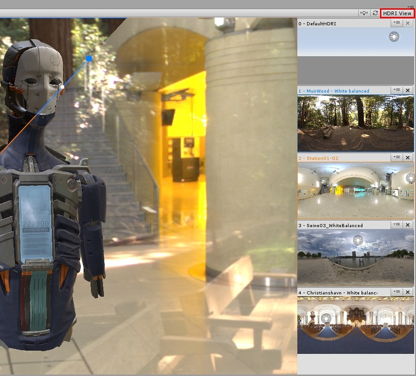
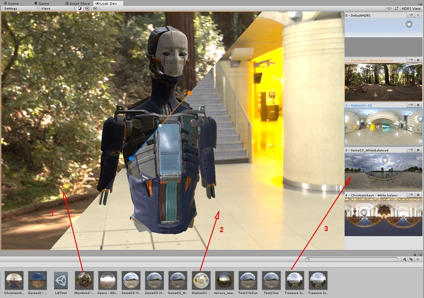
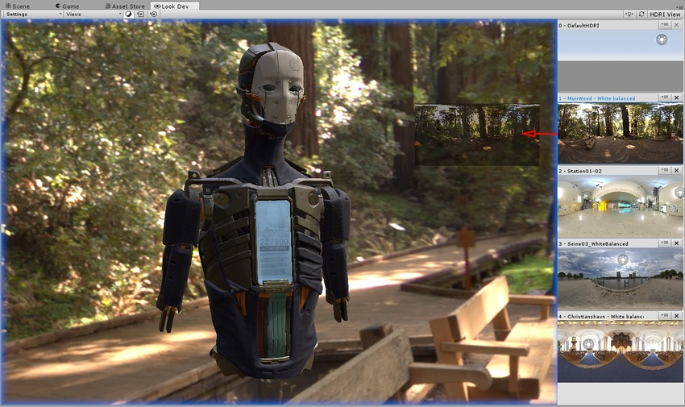
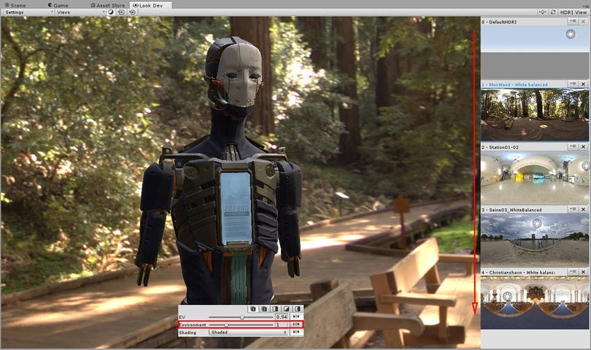
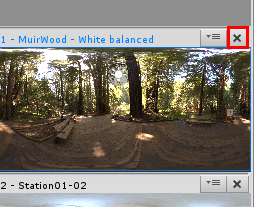
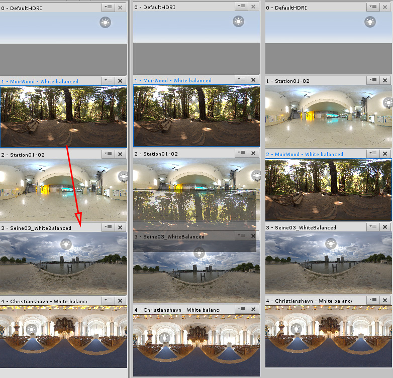

# HDRI 视图

Look Dev 中的光照由 HDRI（高动态范围图像）表示。Look Dev视图允许您在HDRI之间进行操作和轻松切换。

在 HDRI 视图中可以查看和浏览 HDRI 库 (HDRI Library) 中的所有 HDRI。默认情况下，HDRI 库保存在 Editor 中。也可使用其他名称将 HDRI 库另存为资源。在 Look Dev 中，选择 __Settings__ > __HDRI Library__ > __Save As New Library__。

要将 HDRI 导入 Unity，请将 .hdr 或 .exr 文件加载到 Unity 项目中，就像加载任何其他图像一样。在 [Texture Importer](class-TextureImporter.html) Inspector 窗口中，将 __Texture Type__ 设置为 __Default__，将 __Texture Shape__ 设置为 __Cube__，并将 __Convolution Type__ 设置为 __Specular (Glossy Reflection)__。

要浏览 HDRI 库，请选择 Look Dev 视图右上角的 __HDRI View__ 按钮。随后将打开 HDRI 视图，其中显示 HDRI 库中的所有内容，如下图所示。

需要测试 HDRI 纹理资源或天空盒立方体贴图材质时，请将其拖放到 Look Dev 视图或 HDRI 视图中以便使用。添加到 Look Dev 视图或 HDRI 视图的所有 HDRI 都会自动保存到 HDRI 库中。当您执行此操作时，视图周围会出现蓝色或橙色矩形，以指示在放下它时将哪个视图面板指定给它。

图像说明：

1.拖放到橙色视图

2.拖放到蓝色视图

3.拖放到 HDRI 视图。要一次拖放多个 HDRI，请在按住 __Shift__ 的同时选择它们。

直接从 HDRI 视图中拖放 HDRI，将它们移动到 Look Dev 视图中。

使用 [Control Panel](LookDevControlPanel.html) 中的 __Environment__ 滑动条可在 HDRI 列表中前后移动。滑动条旁边显示的数字表示当前显示的 HDRI（从 0 开始）。

要从 HDRI 库中删除 HDRI，请单击右上角 HDRI 名称旁边的 __X__。注意，不能删除 __DefaultHDRI__。

要重新组织 HDRI 视图，请在浏览器中直接拖放 HDRI。

