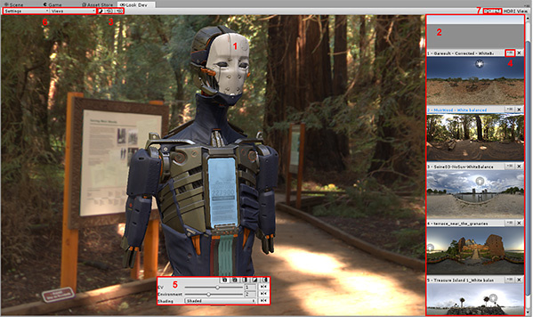

# 概述

要访问 Unity 中的 Look Dev，请选择 __Window__ > __Experimental__ > __Look Dev__。

 

1.[Look Dev 视图](LookDevView.html)

2.[HDRI 视图](LookDevHDRIView.html)

3.[环境阴影](LookDevEnvironmentShadow.html) 和 [Look Dev 视图](LookDevView.html)的快捷方式按钮

4.[HDRI 菜单](LookDevHDRIMenu.html)

5.[Control panel](LookDevControlPanel.html)

6.[Settings](LookDevControlMenus.html) 和 [Views](LookDevViewsMenus.html) 菜单

7.[HDRI 视图](LookDevHDRIView.html)的快捷方式按钮

## 控制摄像机

Look Dev 摄像机与 Scene 视图中的摄像机具有大致相同的行为：

* **绕轴心旋转**：左键单击并拖动（这与 Scene 视图中的操作相同，但 Look Dev 不需要 Alt+左键单击）

* **平移摄像机**：中键单击并拖动

* **缩放**：Alt+右键单击并拖动

* **前进/后退**：鼠标滚轮

* **FPS 模式**：右键单击 + WASD

### 键盘快捷键

在 Look Dev 视图中：

* **旋转环境**：Ctrl+左键单击并拖动

* **旋转环境阴影的方向光**：Shift+左键单击并拖动

* **交换环境**：左/右箭头键

* **操作分隔条**：按住 Shift 键以递增方式旋转它

* **将摄像机对准观察的对象**：F

在 HDRI 视图中：

* **旋转环境**：Ctrl+左键单击并拖动

