# Look Dev 视图

Look Dev 视图是主窗口。可以一次打开多个 Look Dev 视图。

默认情况下，Look Dev 视图中只有一个视图，但可以从一系列分屏视图中进行选择。请参阅下方的[多视图 (Multi-view)](#MultiView) 以了解与此相关的更多信息。

## 将预制件加载到 Look Dev 视图中

Look Dev 视图主要用于查看资源预制件。

要将预制件加载到 Look Dev 视图中，请右键单击该预制件，然后选择 __Open in Look Dev Tool__。或者，如果 Look Dev 已经打开，请将预制件从 Hierarchy 窗口直接拖放到 Look Dev 视图中。

**注意：**右键单击预制件将其加载到 Look Dev 时，它会自动加载到当前可见的 Look Dev 视图或最后一个活动视图中。

 
## 多视图

默认情况下，Look Dev 视图显示单个面板，包含正在处理的预制件。使用[控制面板（Control Panel）](LookDevControlPanel.html)中的按钮在其旁边显示一个分屏复制面板，可以比较和对比不同的设置。

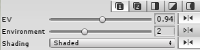

选择包含数字 __1__ 或 __2__ 的按钮时，Look Dev 视图处于单面板模式。每个按钮对应于 Look Dev 中的相应视图。选择按钮 __1__ 可将设置应用于视图 1，而选择按钮 __2__ 可将设置应用于视图 2。

__Side-by-side__：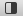

并排显示的重复视图。

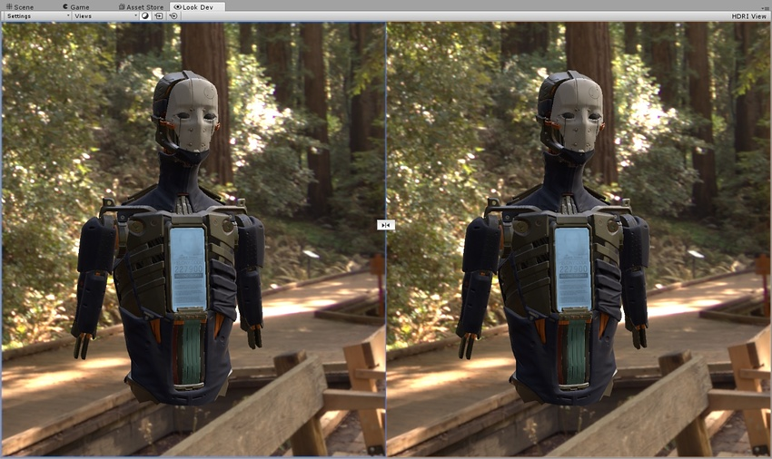

默认情况下，两个视图使用相同的摄像机。中间的锁定按钮  可解除这种行为，允许您独立操作两个视图中的摄像机。

__Split-screen__：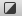

将视图水平拆分为两个，橙色/蓝色操作辅助图标表示两个视图之间的分离平面（请参阅下面的[使用操作辅助图标](#UsingGizmo)获取有关使用此辅助图标的指导）。

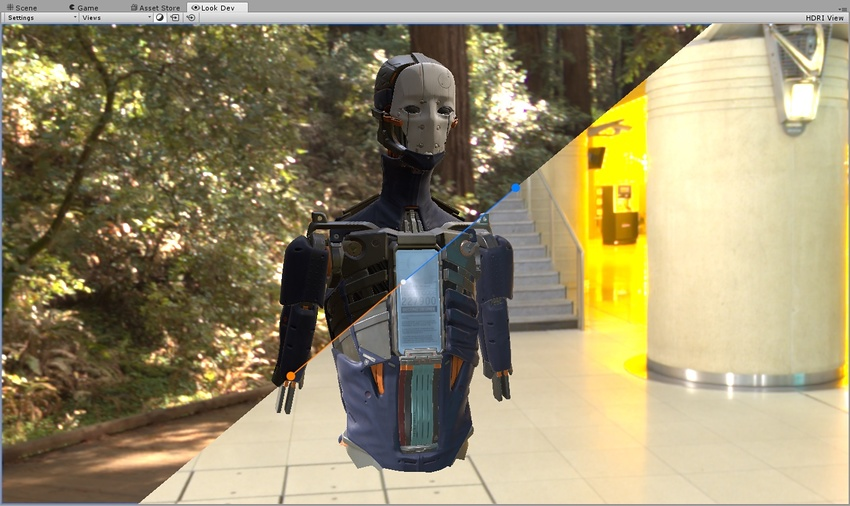

__Zone__：

此视图拆分为两个，通过橙色/蓝色操作辅助图标的位置来定义圆形拆分结果：

要将不同的预制件加载到每个分屏视图中，请选择 __Settings__ 并启用 __Allow Different Objects__，然后将每个预制件拖放到其目标视图中。

请注意，在多视图模式下，只有在需要查看同一资源的两个不同版本时，这样做才有意义。比较完全不同的资源无助于了解光照或视觉效果的差异。

 
## 使用操作辅助图标

操作辅助图标在 Split-screen 和 Zone 模式下具有不同的行为，但在这两种模式下的使用方式是相同的。

###移动分隔条
要移动分隔条，请单击辅助图标较短的部分，然后将其拖放到所需的位置。

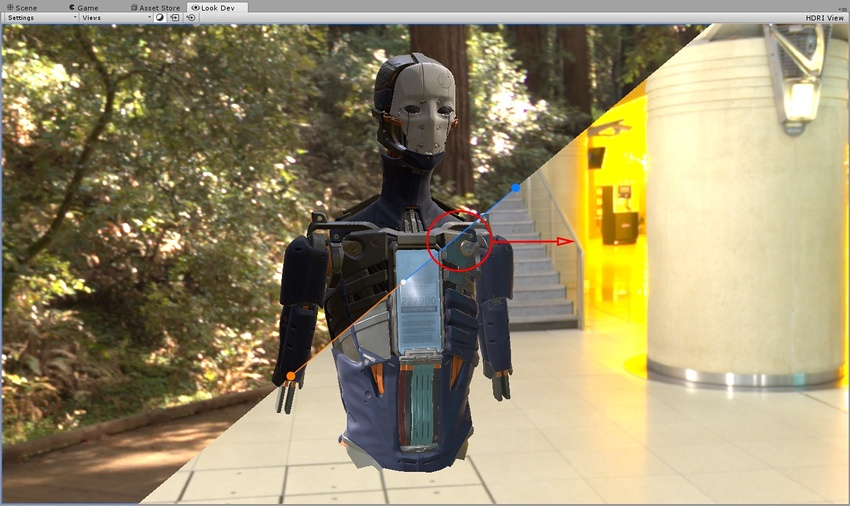

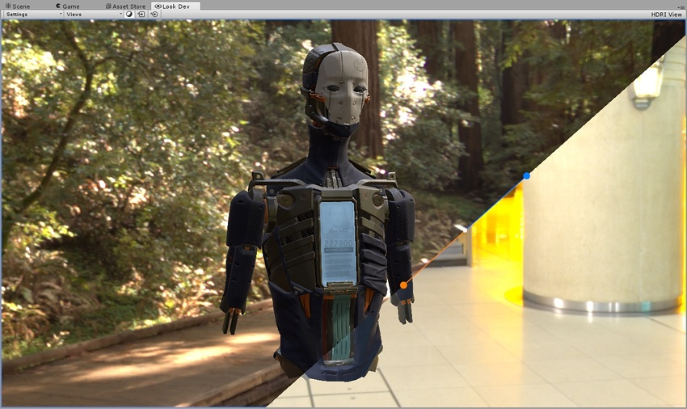

###改变方向和长度
要更改操作辅助图标的方向和长度，请单击并拖动操作辅助图标任一端的圆形。

在 Zone 模式下，移动操作辅助图标上的圆圈会改变视图圆圈的半径。

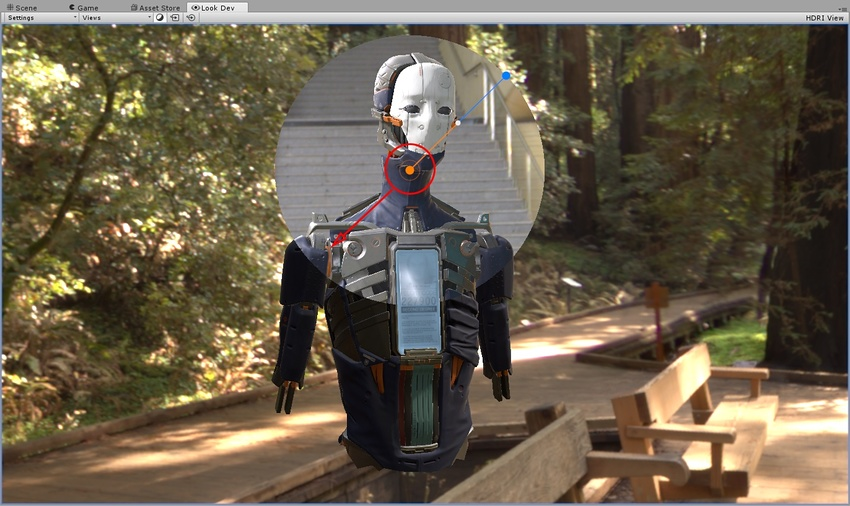

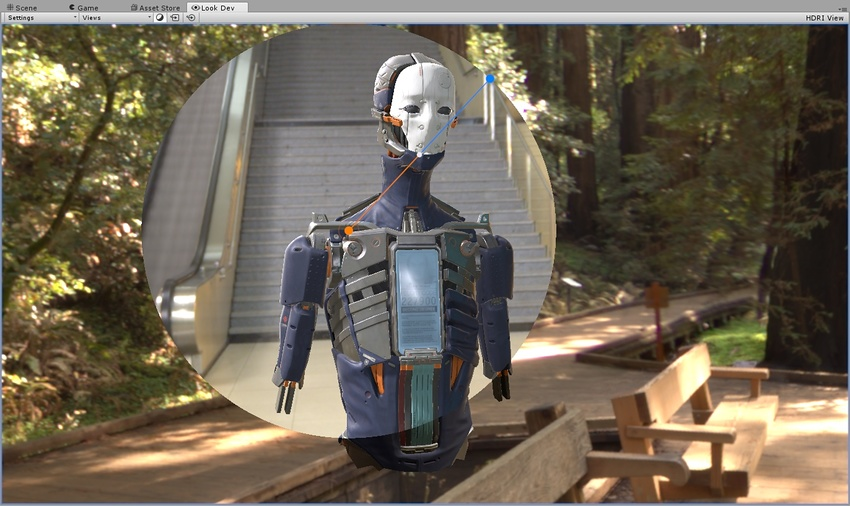

###以递增方式改变分隔
要以递增方式改变分隔，请单击并按住操作辅助图标尾端的圆圈，然后在按住 __Shift__ 的同时移动鼠标。这样会将操作辅助图标对齐到设定角度，这对于设置完美的水平、垂直或对角线角度非常有用。

分隔条上的中央白色圆圈可用于在两个视图之间进行混合。左键单击它并沿着橙色线拖动它即可将左侧视图与右侧视图混合（如下面的图 A 所示）。拖动到蓝色线可将右侧视图与左侧视图混合（如下面的图 B 所示）。

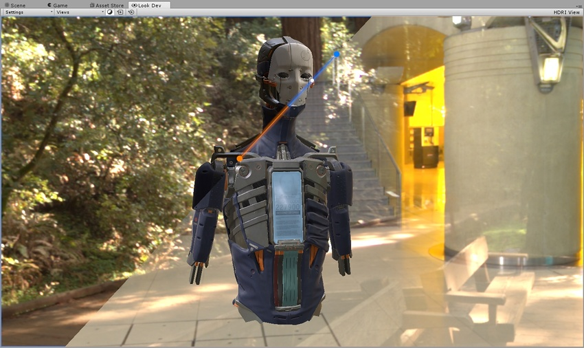

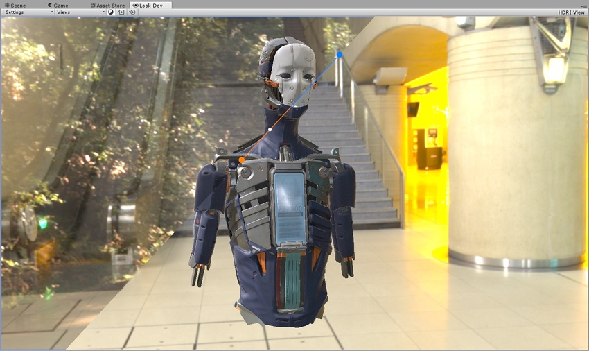

往回拖动白色圆圈时，白色圆圈会自动弹回到中心位置。这有助于快速恢复到默认的混合值。

##每个选项的用途

* __Side-by-side__：比较同一资源上的两个不同光照条件，检查其行为是否正确。

* __Split-screen/Zone__：使用调试着色器模式调查纹理问题（例如，使用一个视图查看正常着色或反照率着色，而在另一个视图中查看环境光照模式）。

* __Side-by-side/Split-screen/Zone__：使用相同的光照条件比较同一资源的两个不同版本，了解哪些更改可提高资源的质量。

* __Side-by-side/Split-screen/Zone__：使用相同的光照条件比较两个不同的[资源 LOD](LevelOfDetail.html)，从而测试 LOD 的质量。
