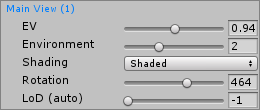
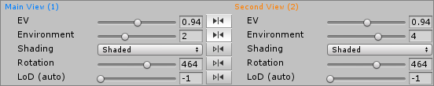

# Views 菜单

__Views__ 菜单位于 Look Dev 视图的左上角，在 __Settings__ 菜单的旁边。在此处可控制特定于每个单独视图的所有选项。

|**属性** |**功能** |
|:---|:---|
| __Shading__ |	从下拉菜单中选择着色模式。默认值为 Shaded。此处还提供 Unity 支持的调试模式（例如，__Normal__ 和 __Albedo__）。|
| __EV (Exposure Value)__ |在色调映射之前，使用滑动条在 HDRI 缓冲区上定义曝光值 (Exposure Value)。|
| __Environment__ |	使用滑动条从 [HDRI 视图](LookDevHDRIView.html)的列表中选择视图应使用的环境。|
| __Rotation__ |	使用滑动条绕游戏对象旋转环境。此旋转将添加到每个环境特有的偏移。|
| __LoD 或 LoD (auto)__ |	仅当预制件支持 LOD 的情况下才可用。使用此滑动条可控制游戏对象的细节级别 (LOD)。将其设置为 -1 可实现自动的 LOD (auto) 选择。|

如果启用了多视图模式，则两个视图都有自己的设置。通过橙色或蓝色（与它们代表的视图颜色一致）来指示这一点。

