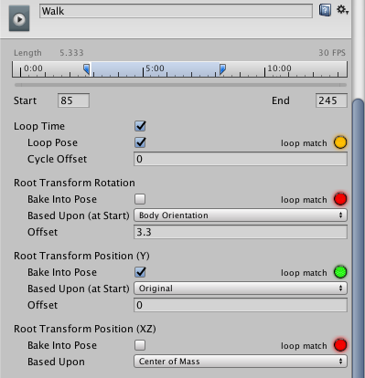
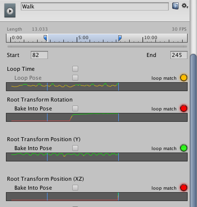
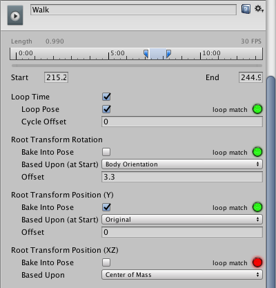
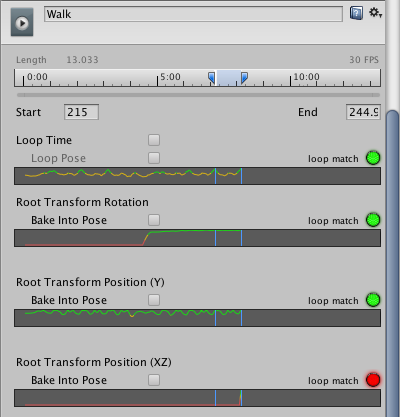

# 动画剪辑上的循环优化

动画处理人员经常执行的一种操作是确保动画正确循环。例如，角色沿着一条路径行走，行走动作来自动画剪辑。动作可能仅持续 10 帧，但该动作以连续循环方式播放。为了使行走动作无缝衔接，它必须以类似的姿势开始和结束。这样可确保没有脚滑动作或奇怪的颠簸动作。

动画剪辑可根据姿势、旋转和位置进行循环。根据行走周期的示例，希望根变换旋转 (Root Transform Rotation) 和 Y 方向根变换位置 (Root Transform Position) 的起点和终点匹配。不希望 XZ 方向根变换位置的起点和终点匹配，因为如果角色的双脚持续恢复水平姿势，角色将永远到不了任何地方。

Unity 在 Animation 选项卡上的剪辑特定导入设置下提供了一些匹配标记和一组特殊的循环优化图。它们提供了视觉提示，可帮助对动作每个值进行剪辑优化。

要优化循环动作是否以最佳方式开始和结束，可以[查看](#ViewLoopCurves)和[编辑](#EditLoopCurves)循环匹配曲线。

 
## 查看循环优化图

在以下示例中，循环动作显示剪辑范围内的匹配不佳（由红色和黄色标记显示）：

要查看循环优化图，请单击并按住时间轴上的开始或结束标记。随后，__Based Upon__ 和 __Offset__ 值将消失，而每个循环基础位置将显示一条曲线：

 
## 优化循环匹配

单击并拖动动画剪辑的起点或终点，直到该点显示在图上属性为绿色的位置。Unity 将图绘制为绿色的情况下，剪辑更有可能正确循环。

松开鼠标按钮时，图会消失，但标记仍然存在：

---

*  2018-04-25  Page amended with limited [editorial review](DocumentationEditorialReview.html)

