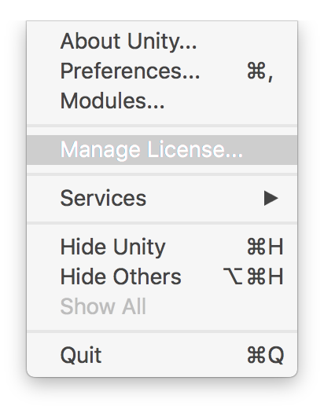
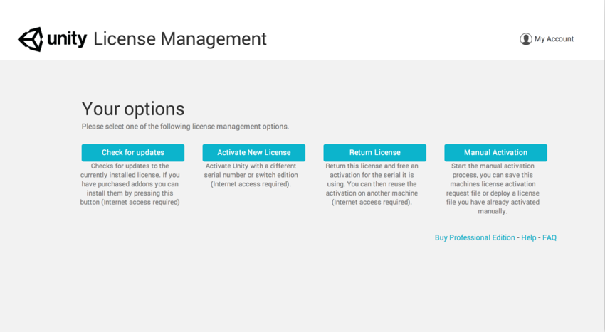

# 管理许可证

### 如果计算机不再可访问：

可通过添加到网上商店帐户的序列号取消激活。

1.访问网上商店帐户的 [License Management 部分](https://store.unity3d.com/account/licenses)。
2.如果尚未添加序列号，请将其添加到帐户。
3.单击序列号右侧的 __Activations__。
4.单击 __Disable all Activations__。

_遗憾的是，无法取消单个激活，此操作只会重置这些激活。_

### 如果计算机仍可访问：

现在可从 Editor 中管理许可证。以下是该系统如何工作和执行的指南。

  
1.单击工具栏上的 __Unity__ 下拉选单（Windows 操作系统上的 __Help__）。
2.单击 __Manage License__ 选项。（这是 Editor 中用于执行所有许可操作的统一位置）。

 

随后将显示 __License Management__ 窗口。然后可看到四个选项，如下所述：

|||
|:---|:---|
| **Check for updates** |  对服务器进行交叉引用，从而查询序列号以获取自上次激活以来可能进行的任何更改。此选项可用于方便更新许可证，通过 Unity Store 购买了新的附加组件并添加到现有许可证之后，可安装这些附加组件。|
| **Activate New License：** | 在正在使用的计算机上激活新的序列号。 |
| **Return License** | 退回相关计算机上的许可证，这样才能在另一台计算机上使用的新激活。单击此选项后，Editor 将关闭，然后允许在其他位置激活序列号。有关单个许可证适用的计算机数量的更多信息，请参阅我们的 [EULA](http://unity3d.com/company/legal/eula)。 |
| **Manual Activation** | 允许离线激活 Unity 的副本。[此处](ManualActivationGuide.html)对此进行了更深入介绍。 |

如需进一步帮助，请联系 **support@unity3d.com**。

---

* 2017-09-06  Page amended with limited [editorial review](DocumentationEditorialReview.html)

* 在 Unity 2017.2 中更新了许可证激活方法
