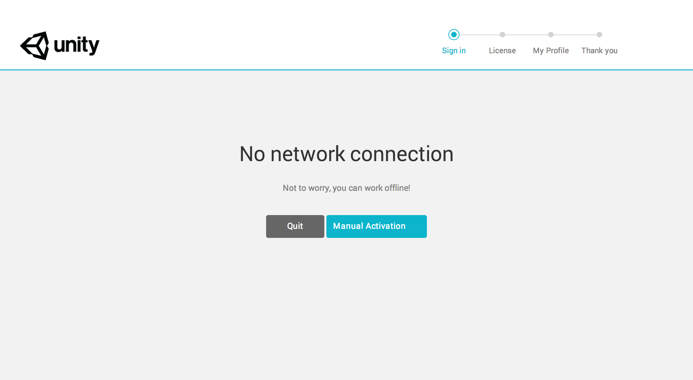
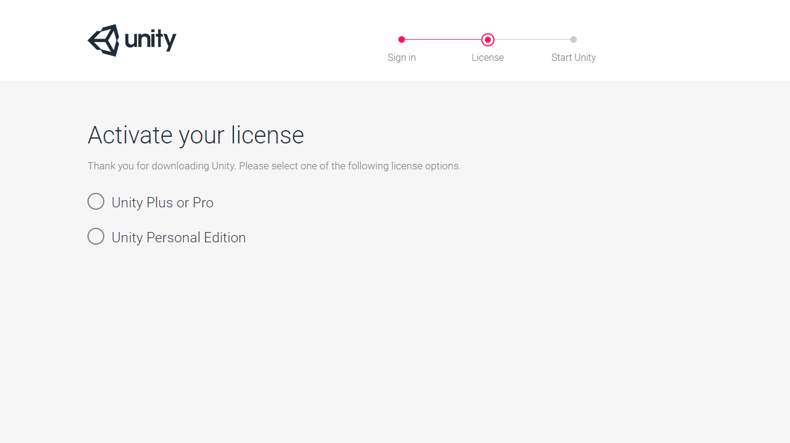

#离线/手动激活

如果在线激活失败，可能是因为：
 
- 没有接入互联网
- 位于防火墙、代理或反病毒软件的后方

如果上述任何一种情况属实，Unity 将无法联系许可证服务器，Editor 将自动尝试执行手动激活。

请按照以下步骤在计算机上手动激活 Unity：

（请注意，在此过程中，需要能够访问一台已接入互联网的计算机，但这不一定是尝试激活 Unity 的计算机。）

1.打开 Unity。如果 Unity 无法联系许可证服务器，则将显示以下窗口。

2.单击 __Manual Activation__ 按钮。

3.单击 __Save License Request__ 按钮以保存许可证请求文件。

4.选择 __Save License Request__ 按钮以保存许可证请求文件。将文件保存在自选的目录中。（务必记住保存文件的位置。在此示例中，许可证文件保存在 __Documents__ 文件夹中）。

*按 __Save__ 按钮后将会保存文件，此时应该会在窗口顶部看到以下通知。*

 

刚创建的许可证请求文件将与生成该文件的计算机相关联。此许可证文件不适用于任何其他计算机。许可证文件将无法识别已重新格式化或已更换硬件的计算机。

接下来的步骤需要接入互联网。如果您的计算机未接入互联网，则可以在已联网的计算机上激活许可证，方法是将文件复制到另一台计算机，按照以下步骤激活许可证，然后将文件复制回您的计算机即可使用 Unity。

5.访问 [__Manual Activation__ 页面](https://license.unity3d.com/)。此时将显示一个新窗口：

 

6.单击 __Browse__ 按钮以选择保存到 __Documents__ 文件夹的文件，然后单击 __Next__ 按钮。此时将显示以下窗口。

 

在此示例中，我们要授权 Unity 的 Plus 或 Pro 版本。

7.输入序列号。

注意：此窗口已隐藏序列号。单击 __Next__ 按钮。

8.单击 __Download license file__。这会将许可证文件保存到选择的位置。

 

9.返回到 Unity。单击 __Load License__ 按钮以加载先前下载的序列号文件。

 

此时将打开硬盘驱动器上的目录。

10.现在，选择刚下载的文件，然后单击 __OK__。此时将显示一个“Thank you!”窗口。按 __Start Using Unity__ 按钮继续。

**注意：**有些浏览器可能会在许可证文件名后面附加“.xml”。如果是这种情况，则在尝试加载许可证文件之前，您需要删除此扩展名。

如果已激活 Unity 并需要进行其他操作，例如需要更新许可证，请参阅[管理您的 Unity 许可证](ManagingYourUnityLicense.html)页面。

如需进一步帮助，请联系 **support@unity3d.com**。

---

* 2017-09-06  Page amended with limited [editorial review](DocumentationEditorialReview.html)

* 在 Unity 2017.2 中更新了许可证激活方法
