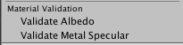
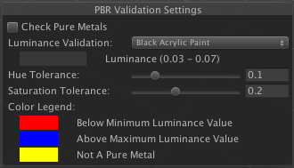
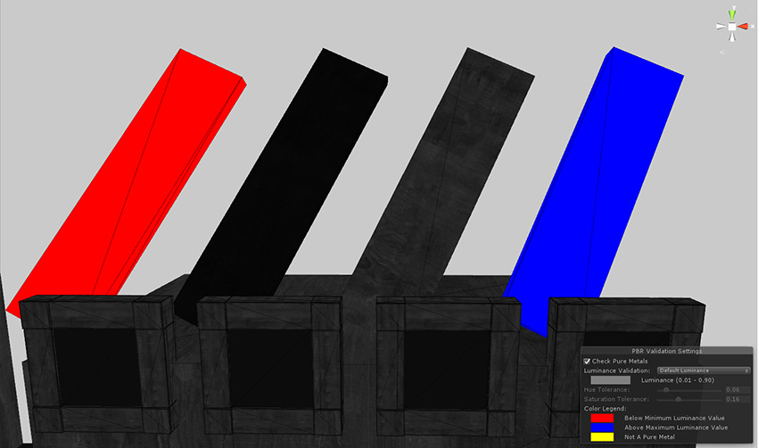
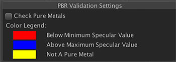
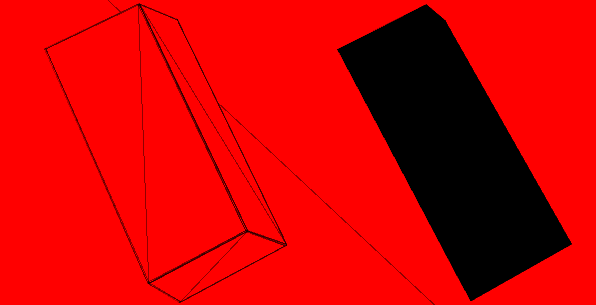
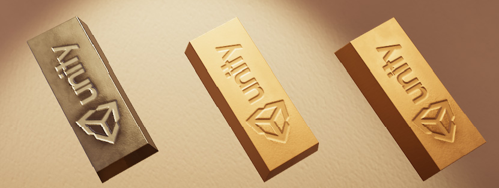

# 基于物理的渲染材质验证器

基于物理的渲染材质验证器 (Physically Based Rendering Material Validator) 是 Scene 视图中的一种绘制模式，它可以确保材质使用的值处于基于物理的着色器的建议参考值范围内。如果特定材质中的像素值落在参考范围之外，则材质验证器会突出显示不同颜色的像素以指示失败状态。

要使用材质验证器，请选择 Scene 视图的__绘制模式 (Draw Mode)__ 下拉菜单，默认情况下该菜单通常设置为 __Shaded__。


导航到 __Material Validation__ 部分。材质验证器有两种模式：__Validate Albedo__ 和 __Validate Metal Specular__。



**注意**：还可以使用 [Unity 的材质图表](StandardShaderMaterialCharts.html)来检查建议值。在创作材质时，您仍需要使用这些图表来决定__反照率__和__金属镜面反射__值。但是，材质验证器提供了一种可视化的编辑器内部验证方式，可让您在资源处于场景中时快速检查材质的值是否有效。

**另请注意**：验证器仅适用于线性颜色空间。基于物理的渲染不适用于伽马颜色空间，因此如果您要使用基于物理的渲染 (PBR) 和 PBR 材质验证器，那么同时还应使用[线性颜色空间](LinearRendering-LinearOrGammaWorkflow.html)。

##Validate Albedo 模式



将 Material Validation 设置为 Validate Albedo 时，在 Scene 视图中显示的 PBR 验证设置 (PBR Validation Settings) 如下。

|__属性：__ ||__功能：__ |
|:---|:---|:---|
|__Check Pure Metals__||如果希望材质验证器以黄色突出显示所发现的由 Unity 定义为金属性但具有非零反照率值的像素，请启用此复选框。有关更多详细信息，请参阅下面的[纯金属](#pureMetals)。默认情况下未启用此选项。|
|__Luminance Validation__||使用下拉选单选择材质验证器的预设配置。如果选择 __Default Luminance__ 以外的任何选项，还可以调整 Hue Tolerance 和 Saturation Tolerance。此属性名称下方的色带表示该配置的反照率颜色。下拉选单下方的 Luminance 值表示最小和最大亮度值。材质验证器会突出显示亮度值超出这些值的所有像素。默认情况下，此选项设置为 __Default Luminance__。|
|__Hue Tolerance__||检查材质的反照率颜色值时，此滑动条允许您控制材质色调与验证配置中的色调之间允许的误差量。 |
|Saturation Tolerance||检查材质的反照率颜色值时，此滑动条允许您控制材质饱和度与验证配置中的饱和度之间允许的误差量。 |
|__Color Legend__||这些颜色对应于材质验证器在材质像素超出定义值时将会显示在 Scene 视图中的颜色。|
||__Red__ Below Minimum Luminance Value|材质验证器以红色突出显示低于 __Luminance Validation__ 中定义的最小亮度值的任何像素（表示它们太暗）。|
||__Blue__ Above Maximum Luminance Value|材质验证器以蓝色突出显示高于 __Luminance Validation__ 中定义的最大亮度值的任何像素（表示它们太亮）。|
||__Yellow__ Not A Pure Metal|如果启用了 Check Pure Metals 选项，则材质验证器会以黄色突出显示由 Unity 定义为金属性但具有非零反照率值的像素。有关更多详细信息，请参阅下面的“纯金属”。|

Unity 的[材质图表](StandardShaderMaterialCharts.html)定义了非金属的标准亮度范围为 50-243 sRGB，而金属的标准亮度范围为 186-255 sRGB。__Validate Albedo__ 模式会使用不同颜色显示处于这些范围之外的任何像素，以指示该值太低或太高。

在下面的示例中，第一个纹理低于最小亮度值，因此太暗。第四个纹理高于最小亮度值，因此太亮。




[材质图表](StandardShaderMaterialCharts.html)提供常见材质的反照率值。反照率值的亮度对产生的漫射光量有巨大影响，因此[全局光照](GIIntro.html)烘焙必须确保不同的材质类型位于正确的亮度范围内（彼此成比例），这一点十分重要。为了方便正确设置这些值，可从 Luminance Validation 下拉选单的预设选项中进行选择，该下拉选单提供了常用的材质反照率值以便验证特定材质类型的亮度范围。

###覆盖默认亮度值

根据项目的美术风格，您可能希望材质的亮度值与预设的亮度范围不同。在这种情况下，可使用自己的值覆盖材质验证器使用的内置反照率值。要覆盖预设亮度范围，请将每种所需材质类型的 [AlbedoSwatchInfo](../ScriptReference/Rendering.AlbedoSwatchInfo.html) 值数组分配给属性 [EditorGraphicsSettings.albedoSwatches](../ScriptReference/Rendering.EditorGraphicsSettings-albedoSwatches.html)。

## Validate Metal Specular 模式



将 __Material Validation__ 设置为 __Validate Metal Specular__ 时，在 Scene 视图中显示的 PBR 验证设置 (PBR Validation Settings) 如下。

|**_属性：_** ||**_功能：_** |
|:---|:---|:---|
|__Check Pure Metals__||如果希望材质验证器以黄色突出显示所发现的由 Unity 定义为金属性但具有非零反照率值的像素，请启用此复选框。有关更多详细信息，请参阅下面的“纯金属”。默认情况下未启用此选项。|
|__Color Legend__||这些颜色对应于材质验证器在材质像素无效时（这意味着它们的镜面反射值超出了该材质类型（金属性或非金属性）的有效范围）在 Scene 视图中显示的颜色。有效范围见下表。|
||__Blue__ Below Minimum Specular Value|材质验证器以红色突出显示低于最小镜面反射值的所有像素。（40 表示非金属性，155 表示金属性）。|
||__Red__ Above Maximum Specular Value|材质验证器以蓝色突出显示高于最大镜面反射值的所有像素。（75 表示非金属性，255 表示金属性）。|
||__Yellow__ Not A Pure Metal|如果启用了 __Check Pure Metals__ 选项，则材质验证器会以黄色突出显示由 Unity 定义为金属性但具有非零反照率值的像素。有关更多详细信息，请参阅下面的“纯金属”。|

Unity 的[材质图表](StandardShaderMaterialCharts.html)定义了两个独立的镜面反射颜色范围：

* __非金属性材质__：40-75 sRGB
* __金属性材质__：155 - 255 sRGB

在 Unity 中，所有非金属性材质都具有始终处于正确范围内的恒定镜面反射颜色。然而，金属性材质通常具有太低的镜面反射值。为了帮助您识别存在此问题的金属性材质，材质验证器的 __Validate Metal Specular__ 模式使用颜色来标示镜面反射颜色值太低的所有像素。根据定义，这包括所有非金属性材质。

在下面的示例中，左侧材质低于最小镜面反射值，因此太暗。这也适用于场景的背景。右侧材质的镜面反射值处于有效范围内。




<a name="pureMetals"></a> 
### 纯金属

Unity 将镜面反射颜色大于 155 sRGB 的基于物理的着色材质定义为金属性材质。Unity 将金属性材质定义为__纯金属__

如果非金属性表面的镜面反射颜色值太高，但反照率值为非零，则通常是由于创作错误导致的。材质验证器还有一个名为 __Check Pure Metals__ 的选项。启用此选项后，材质验证器会以黄色显示由 Unity 定义为金属性但具有非零反照率值的所有材质。在下面的图像中可以看到这方面的一个例子。此处显示了三种材质，左侧和右侧材质为纯金属，但中间的材质不是，因此材质验证器将其显示为黄色：




在上面的第二张图中，背景为红色，这是因为背景中的材质低于材质验证器的 __Validate Metal Specular__ 模式下的最小镜面反射值。

对于金属性和非金属性属性相结合的复杂材质，纯金属检查器可能会拾取一些无效像素，但如果材质完全无效，则通常表示存在创作错误。

##实现

只要材质使用 Unity [标准着色器](shader-StandardShader.html)或[表面着色器](SL-SurfaceShaders.html)，即可采用材质验证器。但是，自定义着色器需要一个名为 `“META”` 的 pass。大多数支持光照贴图的自定义着色器已经定义了此 pass。请参阅有关 [Meta pass](MetaPass.html) 的文档以了解更多详细信息。

执行以下步骤，使自定义着色器与材质验证器兼容：

1.将以下 pragma 添加到 Meta pass：`#pragma shader_feature EDITOR_VISUALIZATION`
2.在 `UnityMetaInput` 结构中，将材质的镜面反射颜色分配给名为 `SpecularColor` 的字段，如下面的代码示例所示。

以下是自定义 Meta pass 的示例：


```
Pass
{
    Name "META" 
    Tags { "LightMode"="Meta" }

    Cull Off

    CGPROGRAM
    #pragma vertex vert_meta
    #pragma fragment frag_meta

    #pragma shader_feature _EMISSION
    #pragma shader_feature _METALLICGLOSSMAP
    #pragma shader_feature _ _SMOOTHNESS_TEXTURE_ALBEDO_CHANNEL_A
    #pragma shader_feature ___ _DETAIL_MULX2
    #pragma shader_feature EDITOR_VISUALIZATION

    float4 frag_meta(v2f_meta i) : SV_TARGET
    {
        UnityMetaInput input;
        UNITY_INITIALIZE_OUTPUT(UnityMetaInput, input);
        float4 materialSpecularColor = float4(1.0f, 0.0f, 0.0f, 1.0f);
        float4 materialAlbedo = float4(0.0f, 1.0f, 0.0f, 1.0f);
        input.SpecularColor = materialSpecularColor;
        input.Albedo = materialAlbedo;

        return UnityMetaFragment(input);
    }  
}
```

---

* <span class="page-edit">2018-03-28  Page published with [editorial review](DocumentationEditorialReview.html)
</span>
* <span class="page-history">在 Unity 2017.3 版中更新了材质验证器</span>
