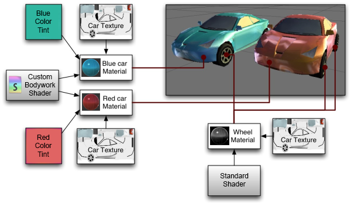

# 创建和使用材质

要创建新材质，请从主菜单或 __Project 视图__上下文菜单中选择 __Assets &gt; Create &gt; Material__。

默认情况下会为新材质指定标准着色器，并且所有贴图属性都为空，如下所示：

 

创建材质后，可将其应用于对象并在 __Inspector__ 中调整其所有属性。要将材质应用于对象，只需将其从 __Project 视图__拖到 __Scene__ 或 __Hierarchy__ 视图中的任何对象上。

## 设置材质属性

您可以选择希望特定材质使用的着色器。只需在 Inspector 中展开 __Shader__ 下拉选单，然后选择新的着色器。所选的着色器将决定可更改的属性。属性可能包括颜色、滑动条、纹理、数字或矢量。如果已将材质应用于 __Scene__ 视图中的活动对象，您将看到属性更改会实时应用于对象。

将__纹理__应用于属性时可采用两种方法。

1.将其从 Project 视图拖到纹理方块上
1.单击 __Select__ 按钮，然后从显示的下拉列表中选择纹理

## 内置着色器

除了[标准着色器](shader-StandardShader.html)，还有许多其他类别的内置着色器可用于特殊目的：

* **FX**：光照和玻璃特效。
* **GUI** 和 **UI**：用于显示用户界面图形。
* **移动端 (Mobile)**：适用于移动设备的简化高性能着色器。
* **大自然 (Nature)**：用于树木和地形。
* **粒子 (Particles)**：粒子系统特效。
* **天空盒 (Skybox)**：用于渲染所有几何体后面的背景环境
* **精灵 (Sprites)**：与 2D 精灵系统结合使用
* **卡通 (Toon)**：卡通风格的渲染。
* **无光照 (Unlit)**：用于完全绕过所有光照和阴影的渲染
* **旧版 (Legacy)**：已被标准着色器取代的大量旧着色器

## 着色器技术细节

一个着色器就是一个脚本，其中包含数学计算和算法，用于定义像素在模型表面上的显示效果。标准着色器执行复杂和逼真的光照计算。其他着色器可能使用更简单或不同的计算来显示不同的结果。在给定的着色器中有许多属性，可由使用该着色器的材质为它们赋值。这些属性可以是数字、颜色定义或纹理，在查看材质时会显示在检视面板中。然后，附加到游戏对象的渲染器组件将使用材质来渲染每个游戏对象的网格。

允许并且通常希望多种不同的材质引用相同的纹理。根据要求，这些材质还可使用相同或不同的着色器。

下面的示例展示了一种可能的设置组合，其中使用三种材质、两种着色器和一种纹理。

 

图中有一辆红色汽车和一辆蓝色汽车。两个模型对车身使用不同的材质，分别为“Red car material”（红色汽车材质）和“Blue car material”（蓝色汽车材质）。

这两种车身材质使用同一个自定义着色器“Carbody Shader”（车身着色器）。使用自定义着色器的原因是该着色器为专门汽车添加了额外的特性（例如金属性闪光渲染），或者可能具有自定义损坏遮罩功能。

每种车身材质均引用“Car Texture”（汽车纹理），这是包含车身所有细节但没有具体油漆颜色的纹理贴图。

车身着色器还接受一种色调颜色；红色和蓝色汽车设置为不同的颜色，使每辆汽车的外观不同，但两者使用同一种纹理。

车轮模型也使用单独的材质，但这次两辆汽车共用相同的车轮材质，因为每辆汽车的车轮没有差异。车轮材质使用标准着色器，并同样引用汽车纹理。

注意汽车纹理包含的车身*和*车轮细节：这是一个*纹理图集*，意味着纹理图像的不同部分被显式映射到模型的不同部分。

即使车身材质使用的纹理也包含车轮图像，车轮细节也不会出现在车身上，因为该纹理的那部分未映射到车身几何体。

同样，车轮材质使用相同的纹理，其中也有车身细节。车轮上不会出现车身细节，因为只有显示车轮细节的纹理部分才映射到了车轮几何体。

此映射由 3D 美术师在外部 3D 应用程序中完成，称为“UV 贴图”。

更具体地说，着色器定义了：

* 对象渲染方法。此方法包括代码和数学计算，其中可能包括光源的角度、视角以及任何其他相关计算。着色器还可根据最终用户的图形硬件指定不同的方法。
* 可在材质检视面板中自定义的参数，例如纹理贴图、颜色和数值。

材质定义了：

* 用于渲染此材质的着色器。
* 着色器参数（例如要使用的纹理贴图、颜色和数值）的具体值。

自定义着色器应由图形工程师构建。为创建自定义着色器，需要使用一种十分简单的语言：__ShaderLab__。然而，让着色器在各种显卡上正常工作是一项复杂的工作，需要相当全面的显卡工作原理知识。

Unity 中直接内置了许多着色器，还有一些着色器位于[标准资源 (Standard Assets)](AssetTypes.html#Standard) 库中。

