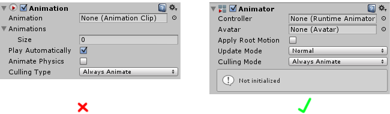

#动画常见问题解答


##一般问题

**什么是“Mecanim”？**

Mecanim 是我们集成到 Unity 中的动画软件的名称。在早期的 4.x 系列 Unity 中，它的功能与人形角色动画密切相关，并具有许多特别适合此用途的功能；并且它独立于我们旧的（旧版）集成动画系统。

Mecanim 集成了人形动画重定向、肌肉控制和状态机系统。“Mecanim”的名称源自法语词“Mec”（意思是“Guy”）。由于 Mecanim 仅用于人形角色，因此 Unity 中的非人形角色动画以及其他基于关键帧的游戏对象动画仍需要使用我们的旧版动画系统。

不过，我们此后开发并扩展了 Mecanim，并将其与动画系统的其余部分集成，以便能够在您的项目中用于动画的所有方面；因此，“Mecanim”与动画系统的其余部分之间并没有太清晰的分界线。鉴于此原因，您仍然会在我们的文档和整个社区中看到对“Mecanim”的引用，现在这些引用仅仅指的是我们的主动画系统。

**动画 (Animation) 组件和 Animator 组件之间有何差异？**

动画组件（Animation）是我们的旧版动画系统中用于动画的旧组件。它仍然保留在 Unity 中的目的是实现向后兼容，但不应将其用于新项目。而应使用最新的 Animator 组件。




**Animation 窗口和 Animator 窗口之间有何差异？**

**Animation 窗口**可让您在 Unity 内创建和编辑动画剪辑。您可以使用此窗口将 Inspector 面板中的几乎每个属性（游戏对象的位置、材质颜色、光照亮度、声音音量，甚至您自己脚本中的值）用来制作动画剪辑。

**Animator 窗口**可让您将现有动画剪辑资源组织到类似流程图（称为状态机）的系统中。

这两个窗口都是我们当前动画系统（而不是旧版系统）的一部分。

**因此动画组件是旧版，而 Animation 窗口是最新版？**

正确。

**我们正在使用旧版动画系统来处理角色动画。我们是否应该改用最新的动画系统 (Mecanim)？**

一般情况下，是的。提供旧版动画系统只是为了向后兼容旧项目，与我们最新的动画系统相比，它的功能非常有限。使用它的唯一理由应该是为了兼容使用旧系统构建的旧版项目。

##导入

**为什么导入的网格附有 Animator 组件？**
	
Unity 检测到导入的文件在其时间轴中有动画时，它将在导入时添加动画组件。您可以在资源的 Import Settings 中修改此设置，为此需要在 Rig 选项卡下的 Import Settings 中将“Animation Type”设置为 _None_。必要时，可一次选择多个文件执行此操作。


##层

**层的排序是否重要？**

是的。层的优先级是按顺序从上到下的。层设置为 _override_ 将始终覆盖先前的层（如果层有遮罩，则基于其遮罩）。

**基础层的权重值是否应始终设置为 1？或者在使用其他层时权重是否应为 0？**

基础层权重始终为 1，覆盖层将完全覆盖基础层。
 


**有没有任何办法可以从控制器获取变量值而不使用名称字符串？**

您可以使用整数来标识状态和参数。使用 [Animator.StringToHash](../ScriptReference/Animator.StringToHash.html) 函数来获取整数标识符值。例如：

````
runState = Animator.StringToHash("Base Layer.Run");
animator.SetBool(runState, false);

````

**如果同步层中的状态与基础层中的相应状态相比具有不同的长度，会发生什么情况？**

如果层具有不同长度，那么它们将变得不同步。启用 Timing 选项，从而对当前层与源层上的状态强制同步。

##Avatar 遮罩


**有没有办法创建除 LeftFoot、RightFoot、LeftHand、RightHand 之外的 AvatarIKGoal？**

有，支持膝盖和肘部 IK（反向动力学）。

**有没有办法定义 Avatar 遮罩包含的变换组件？**

有，对于通用剪辑，您可以定义是否导入某个变换动画。对于人形剪辑，始终导入所有人类变换，并可定义额外的变换。

##动画曲线


**具有曲线的动画如何与没有曲线的动画混合？**

如果一段动画具有曲线，而另一段动画没有曲线，Unity 将使用连接到曲线的参数的默认值来进行混合。
您可以为参数设置默认值，因此在具有 _Curve_ 参数的状态与没有此参数的状态之间进行混合时，将在曲线值和默认参数值之间进行混合。
要为参数设置默认值，只需在 Animator Tool 窗口中设置其值（不能在 LiveLink 中）。
