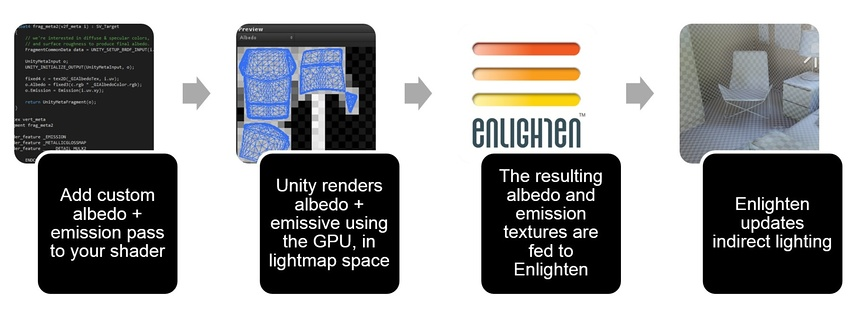

# 材质属性和 GI 系统

对象的外观由其着色器定义。

###旧版和当前着色器映射
Unity 3 和 4 中的着色器映射与 Unity 5 中的着色器映射具有不同的工作原理。Unity 5 及之后的版本仍然支持旧版着色器映射。请参阅下面的旧版材质映射。

Unity 3.x 和 4.x 使用了从材质属性到光照贴图材质属性的简单映射。此映射适用于常见情况，但是基于命名约定、标签和字符串。您无法对表面属性进行任何自定义，因为此映射实际上采用了硬编码技术定义具体的运行方式。Unity 5.0 及之后的版本具有灵活的着色器映射。

<br/> 
### Meta pass（Unity 5.0 及之后的版本）

反照率和发光是使用特殊的 Meta 着色器 pass 渲染的。光照贴图静态游戏对象是使用 GPU 在光照贴图空间中渲染的。这意味着，游戏对象在屏幕上的外观与其对于光照贴图而言的外观是分开的，因此您可以自定义着色器。

Meta pass 可解除反照率和发光之间的关联性，用于在常规着色器 pass 期间计算[全局光照](GIIntro.html) (GI)。因此，您可以在控制 GI 的同时不影响用于实时渲染的着色器。标准着色器在默认情况下包含 Meta pass。全局光照由 Unity 中的一个名为 Enlighten 的中间件进行管理。



Unity Editor 在内部处理金属性表面的反照率时需要使用 Meta pass。Enlighten 处理漫射传输并在每次反弹时使用表面反照率。具有黑色（或几乎黑色）反照率的金属性表面不会反射任何光线。着色器 pass 在渲染反照率时会让其偏向具有金属色调的更亮颜色。介电材质（木材、塑料、石材、混凝土、皮革、皮肤）具有白色镜面反射率。金属具有光谱镜面反射率。

**注意**：使用 Meta pass 不如 [DynamicGI.SetEmissive](http://docs.unity3d.com/ScriptReference/DynamicGI.SetEmissive.html) 的速度快，但灵活性更高，因为不会受限于单个颜色。

<br/> 
### 旧版材质映射

Unity 5.0 及更高版本中的内置旧版着色器已经包含 Meta pass。如果要将项目从 Unity 5.0 之前的版本进行升级，则应添加 Meta pass。请参阅下面[具有 Meta pass 的示例着色器](#ExampleMetaPass)以了解具体操作方法。


####自定义 RGB 透明度
通过向着色器添加名为 `_TransparencyLM` 的纹理属性，即可添加基于颜色的自定义 RGB 透明度。在这种情况下，标准行为将被删除，并且仅使用此纹理的值来评估材质中的传输情况。当您想要创建独立于材质颜色或反照率纹理的基于颜色的透明度时，这将非常有用。

要创建自定义传输行为，请将以下行添加到着色器并分配纹理：

``` _TransparencyLM ("Transmissive Texture", 2D) = "white" {} ```

**注意**：Unity 通过着色器的属性和路径/名称关键字（如 `Transparent`、`Tree`、`Leaf`、`Leaves` 等）来检测某些旧版着色器。


<br/>
<a name="ExampleMetaPass"></a>
### 具有 Meta pass 的示例着色器

下面的着色器允许专门为 GI 系统指定自定义反照率颜色和纹理。

````
Shader "Custom/metaPassShader"{
 
    Properties {
        _Color ("Color", Color)=(1,1,1,1)
        _MainTex ("Albedo (RGB)",2D)="white"{}
        _Glossiness ("Smoothness", Range(0,1))=0.5
        _Metallic ("Metallic", Range(0,1))=0.0
 
        _GIAlbedoColor ("Color Albedo (GI)", Color)=(1,1,1,1)
        _GIAlbedoTex ("Albedo (GI)",2D)="white"{}
    }
 
    SubShader {
    // ------------------------------------------------------------------
    // 提取光照贴图、GI（发光、反照率...）的信息
    // 在常规渲染期间不使用此 pass。
        Pass
        {
            Name "META"
            Tags {"LightMode"="Meta"}
            Cull Off
            CGPROGRAM
 
            #include"UnityStandardMeta.cginc"
 
            sampler2D _GIAlbedoTex;
            fixed4 _GIAlbedoColor;
            float4 frag_meta2 (v2f_meta i): SV_Target
            {
                // 我们对产生最终反照率的漫射和镜面反射
                // 以及表面粗糙度颜色感兴趣。
               
                FragmentCommonData data = UNITY_SETUP_BRDF_INPUT (i.uv);
                UnityMetaInput o;
                UNITY_INITIALIZE_OUTPUT(UnityMetaInput, o);
                fixed4 c = tex2D (_GIAlbedoTex, i.uv);
                o.Albedo = fixed3(c.rgb * _GIAlbedoColor.rgb);
                o.Emission = Emission(i.uv.xy);
                return UnityMetaFragment(o);
            }
           
            #pragma vertex vert_meta
            #pragma fragment frag_meta2
            #pragma shader_feature _EMISSION
            #pragma shader_feature _METALLICGLOSSMAP
            #pragma shader_feature ___ _DETAIL_MULX2
            ENDCG
        }
       
        Tags {"RenderType"="Opaque"}
        LOD 200
 
        CGPROGRAM
        // 这是基于物理的标准光照模型，并对所有光照类型启用阴影
        #pragma surface surf Standard fullforwardshadows nometa
        // 使用 Shader Model 3.0 目标以获得更美观的光照
        #pragma target 3.0
 
        sampler2D _MainTex;
 
        struct Input {
            float2 uv_MainTex;
        };
       
        half _Glossiness;
        half _Metallic;
        fixed4 _Color;
       
        void surf (Input IN,inout SurfaceOutputStandard o){
            // Albedo 来自颜色着色的纹理
            fixed4 c = tex2D (_MainTex, IN.uv_MainTex)* _Color;
            o.Albedo = c.rgb;
            // Metallic 和 Smoothness 来自滑动条变量
            o.Metallic = _Metallic;
            o.Smoothness = _Glossiness;
            o.Alpha = c.a;
        }
        ENDCG
    }
 
    FallBack "Diffuse"
}
````

<br/><br/> 

------
*  <span class="page-edit">2017-10-31  Page amended with limited [editorial review](DocumentationEditorialReview.html)
</span>


