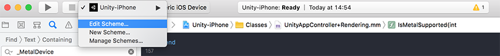
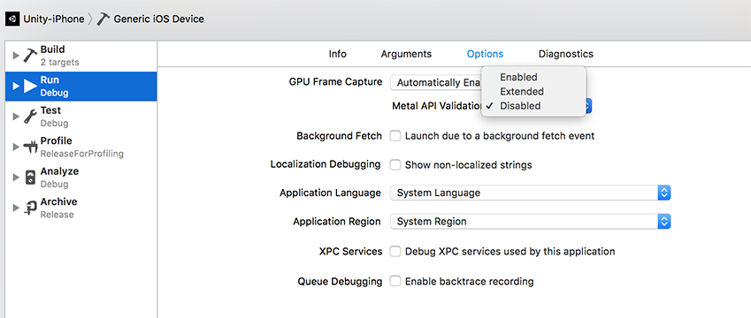
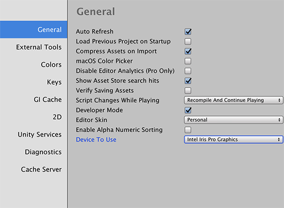
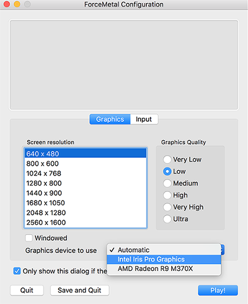

# Metal

Metal 是 Apple 设备的标准图形 API。Unity 支持 iOS、tvOS 和 macOS 上的 Metal（Standalone 和 Editor）。

Metal 在 Apple 平台上具有比 OpenGL ES 更丰富的功能集。请参阅下面关于使用 Metal 的优缺点。

**使用 Metal 的优点**

* 降低图形 API 调用的 CPU 开销
* API 级别验证层
* 在多 GPU 系统上实现更好的 GPU 控制
* 支持无内存渲染目标（在 iOS/tvOS 上）
* Apple 的新 Apple 标准
* 计算着色器
* 曲面细分着色器

**使用 Metal 的缺点**

* 不支持低端设备
* 不支持几何着色器

## 限制和要求

* iOS 和 tvOS 为 [Apple A7](https://en.wikipedia.org/wiki/Apple_A7) 或更新的 SoC 提供 Metal 支持。

* macOS 为 HD 4000 系列或更高的 Intel HD 和 Iris Graphics、AMD GCN 架构 GPU 以及 Nvidia Kepler 架构 GPU 或更新版本提供 Metal 支持。

* 最低[着色器编译目标为 3.5](SL-ShaderCompileTargets.html)。

* Metal 不支持几何着色器。

## 启用 Metal

要使 Unity Editor 和独立平台播放器将 Metal 用作默认图形 API，请执行以下操作之一：

* 在 Editor 中，选择菜单：__Edit__ &gt; __Project Settings__ &gt; __Player__ 并启用 __Metal Editor Support__。

* 如果使用 MacOS，打开 **Terminal** 并使用 `-force-gfx-metal` [命令行参数](CommandLineArguments.html)。

默认情况下，iOS、tvOS 和 macOS 独立平台播放器上均启用 Metal。

 
## 验证 Metal API

Xcode 提供 Metal API 验证功能，可用于跟踪隐蔽的问题。要在 Xcode 中启用 Metal API 验证，请执行以下操作：

1.在 Unity 中，针对 iOS 构建项目。结果将生成 Xcode 项目。

2.在 Xcode 中打开生成的 Xcode 项目，然后选择 __Edit Scheme__。

   

3.选择 __Run__ &gt; __Options__ &gt; __Metal API Validation__，然后选择 __Enabled__

   

验证错误会中断 XCode 编辑器中的代码执行，并显示在设备日志中。

__注意__：启用验证会增加 CPU 使用率，因此仅在进行调试时启用。

## 选择 GPU 设备

Metal 允许您在运行应用程序时选择 GPU 设备。因此，可使用不同的 GPU 设置来测试项目，或使用低功耗 GPU 省电。

要更改 Unity Editor 目标 GPU 设备，请选择菜单：__Unity__ &gt; __Preferences…__ &gt; __General__ 并设置 __Device To Use__：

要更改独立平台播放器目标 GPU 设备，请启动应用程序（或选择菜单：__File__ &gt; __Build and run__）并将 __Graphics device to use__ 设置为随后显示的对话框中的相关 GPU：

## 使用无内存渲染目标

Metal 允许您使用 iOS 和 tvOS 10.0 中引入的无内存渲染目标来优化移动设备上的内存。借助此功能，您在渲染场景到渲染纹理 (RenderTexture)时，无需将其备份到系统内存，内容仅在渲染期间临时存储在 on-tile 内存中。

有关更多信息，请参阅[RenderTexture.memorylessMode](../ScriptReference/RenderTexture-memorylessMode.html)。

---
* 2018-05-22 Page published with [editorial review](DocumentationEditorialReview.html)

* 在 2017.4 版中添加了关于使用 Metal 的建议

