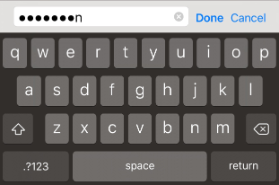

#移动键盘

在大多数情况下，Unity 将自动处理 GUI 元素的键盘输入，但也很容易通过脚本按需显示键盘。


##GUI 元素
当用户点击可编辑的 GUI 元素时，键盘将自动显示。目前，[GUI.TextField](../ScriptReference/GUI.TextField.html)、[GUI.TextArea](../ScriptReference/GUI.TextArea.html) 和 [GUI.PasswordField](../ScriptReference/GUI.PasswordField.html) 将显示键盘；有关更多详细信息，请参阅 [GUI 类](../ScriptReference/GUI.html)文档。

##手动键盘处理
使用 __[TouchScreenKeyboard.Open()](../ScriptReference/TouchScreenKeyboard.Open.html)__ 函数打开键盘。有关此函数所用的参数，请参阅 [TouchScreenKeyboard](../ScriptReference/TouchScreenKeyboard.html) 脚本参考。

##键盘布局选项

键盘支持以下选项：

|**_属性：_** |**_功能：_** |
|:---|:---|
|__[TouchScreenKeyboardType.Default](../ScriptReference/TouchScreenKeyboardType.Default.html)__ |字母键盘。可切换到具有数字和标点符号的键盘。|
|__[TouchScreenKeyboardType.ASCIICapable](../ScriptReference/TouchScreenKeyboardType.ASCIICapable.html)__ |字母键盘。可切换到具有数字和标点符号的键盘。|
|__[TouchScreenKeyboardType.NumbersAndPunctuation](../ScriptReference/TouchScreenKeyboardType.NumbersAndPunctuation.html)__ |数字和标点符号键盘。可切换到具有字母的键盘。|
|__[TouchScreenKeyboardType.URL](../ScriptReference/TouchScreenKeyboardType.URL.html)__ |带斜线和 .com 按钮的字母键盘。可切换到具有数字和标点符号的键盘。|
|__[TouchScreenKeyboardType.NumberPad](../ScriptReference/TouchScreenKeyboardType.NumberPad.html)__ |只有 0 到 9 之间的数字键盘。|
|__[TouchScreenKeyboardType.PhonePad](../ScriptReference/TouchScreenKeyboardType.PhonePad.html)__ |用于输入电话号码的键盘。|
|__[TouchScreenKeyboardType.NamePhonePad](../ScriptReference/TouchScreenKeyboardType.NamePhonePad.html)__ |字母键盘。可切换到电话号码键盘。|
|__[TouchScreenKeyboardType.EmailAddress](../ScriptReference/TouchScreenKeyboardType.EmailAddress.html)__ |具有 @ 符号的字母键盘。可切换到具有数字和标点符号的键盘。|


##文本预览

默认情况下将创建一个编辑框，并在出现后放置在键盘顶部。此编辑框用于预览用户正在键入的文本，因此文本始终对用户可见。但是，可通过将 __TouchScreenKeyboard.hideInput__ 设置为 true 来禁用文本预览。请注意，此设置仅适用于某些键盘类型和输入模式。例如，不适用于电话键盘和多行文本输入。在此类情况下将始终显示编辑框。__TouchScreenKeyboard.hideInput__ 是一个全局变量，会影响所有键盘。


##可见性和键盘大小

[TouchScreenKeyboard](../ScriptReference/TouchScreenKeyboard.html) 中有三个键盘属性可用于确定屏幕上的键盘可见性状态和大小。

|**_属性：_** |**_功能：_** |
|:---|:---|
|__visible__ |如果键盘在屏幕上完全可见并可用于输入字符，则返回 __true__。|
|__area__ |返回键盘的位置和尺寸。|
|__active__ |如果已激活键盘，则返回 __true__。此属性不是静态属性。必须具有键盘实例才能使用此属性。|

请注意，__TouchScreenKeyboard.area__ 将返回一个矩形，该矩形的位置和大小设置为 0，直到键盘在屏幕上完全可见。不应在 __TouchScreenKeyboard.Open()__ 之后立即查询此值。键盘事件的顺序如下：


* 调用 __TouchScreenKeyboard.Open()__。__TouchScreenKeyboard.active__ 返回 true。__TouchScreenKeyboard.visible__ 返回 false。__TouchScreenKeyboard.area__ 返回 (0, 0, 0, 0)。
* 键盘滑入屏幕。所有属性保持不变。
* 键盘停止滑动。__TouchScreenKeyboard.active__ 返回 true。__TouchScreenKeyboard.visible__ 返回 true。__TouchScreenKeyboard.area__ 返回键盘的实际位置和大小。


##安全文本输入

可配置键盘以使其在输入时隐藏符号。当用户需要输入敏感信息（例如密码）时，此功能非常有用。要在启用安全文本输入的情况下手动打开键盘，请使用以下代码：


````
TouchScreenKeyboard.Open("", TouchScreenKeyboardType.Default, false, false, true);


````


##警报键盘

要显示带有黑色半透明背景而不是经典不透明背景的键盘，请调用 __TouchScreenKeyboard.Open()__，如下所示：


````
TouchScreenKeyboard.Open("", TouchScreenKeyboardType.Default, false, false, true, true);


````


