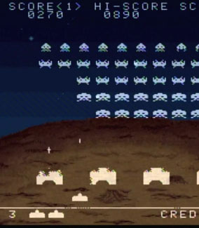

脚本和游戏方法
=============

本部分将演示移动平台开发者编写代码和构建游戏结构以便快速运行的方法。这里的核心思想是游戏设计和优化并不是真正独立的过程；在设计游戏时做出的决定可以使游戏既好玩又快速。

##一个老例子

 

您可能还记得一些老游戏：玩家一次只能在屏幕上玩一回，而再装弹速度由子弹是否击中而由非计时器进行控制。这种技术称为**对象池**，它能简化内存管理，使程序运行更流畅。

太空入侵者游戏的创作者只能使用少量的 RAM，且必须确保程序需要分配的量不得超过可用量。如果他们让玩家每秒射击一次，并提供一个能量块使再装弹时间减少到半秒，那么他们必须确保有足够的内存空间来分配大量飞弹，以防玩家以尽可能快的速度射击并需要让所有射击效果保留尽可能长的时间。这种情况可能会给他们带来问题，所以取而代之的做法是仅分配一个飞弹并就此作罢。一旦飞弹销毁，便简单地将其停用，然后再次射击时对其重新定位并激活。但是，此飞弹始终存在于内存中的相同空间内，也不必移动或不断删除和重建飞弹。

###进行优化还是寻求游戏瑰宝？

这样的游戏不太真实，但却很有趣。当外星入侵者接近地面时，紧张感在一个高潮时刻释放，类似于电影或文学中的高潮。入侵者的接近距离为熟练的玩家提供了近乎瞬时的再装弹时间，让他们在完美的时间内按压射击按键，奇迹般地保卫地球。出色的游戏设计介于交互式叙事与背景驱动技术之间的一个奇异空间中。很难规划出这样优秀、有趣、高效的游戏，因为代码逻辑和用户交互是截然不同而又非常挑剔的两个方面，将它们结合起来合成新鲜有趣的成果需要大量的思考和实验。

可能无法在交互方面和同时使用移动端硬件方面进行游戏的全方位规划。让两者和谐碰撞的“瑰宝”更有可能在您进行实验时突然闪现。但是，充分了解代码在计划部署的硬件上的运行情况将有所帮助。如果要查看为何对象池更好的详细技术说明，并了解内存分配，请参阅我们的[脚本优化](MobileOptimizationPracticalScriptingOptimizations.html)页面。

##X 会在移动设备上快速运行吗？

假设您要开始进行游戏开发，希望同时通过大量操作和华丽的外观给玩家留下深刻印象。如何规划这些东西？如何知道限制在哪里？比如在游戏方面有多少金币？多少僵尸？多少对手车辆？这一切都取决于如何对游戏进行编码。

通常情况下，如果以简单方式编写游戏代码，或者使用最常规和最通用的方式，那么很快就会遇到性能问题。越依赖特定结构和技巧来运行游戏，视野就会越开阔，您就可以在屏幕上塞入更多的东西。

###简单且通用，但速度缓慢

* 在 2D 游戏中，刚体仅限于 2 个维度。
* 飞弹上的刚体。
* 大量使用 Instantiate 和 Destroy。
* 可收集物或角色的大量单独 3D 对象。
* 每帧执行计算。
* 为 GUI 或 HUD 使用 OnGUI。

###复杂且受限，但速度更快

* 为 2D 游戏编写您自己的物理代码。
* 自己处理飞弹的碰撞检测。
* 使用对象池而不是 Instantiate 和 Destroy。
* 在粒子上使用动画精灵来表示简单对象。
* 每隔几帧执行高成本的计算并将结果缓存起来。
* 自定义 GUI 解决方案。

##示例

 

###数百个正在旋转、动态光照的可收集硬币一次性出现在屏幕上

* 不应：将每个硬币作为一个独立对象，为每个对象添加刚体和脚本来对其进行旋转并使其被拾取。
* 应当：将大量硬币作为一个具有动画纹理的粒子系统，通过单个脚本对所有硬币进行碰撞测试，并根据与光源的距离设置硬币颜色。
    * 此示例在“脚本优化”页面中实现。

###定制的软体模拟

* 不应：世界中到处都是枕头，您可以将它们乱扔并堆成一堆。
* 应当：角色是一个枕头，只有其中一个枕头，其所处的情况有一定的可预测性（仅与球体和轴对齐立方体进行碰撞）。编写的也许并非功能齐全的软体模拟，但能给人带来非常深刻的印象并且运行速度很快。

###30 个敌人角色同时向玩家射击

* 不应：每个敌人都有自己的蒙皮网格，武器为单独对象，并在每次射击时实例化基于刚体的飞弹。每个敌人都会在每帧都运行的复杂 AI 脚本中考虑所有同胞的状态。
* 应当：大多数敌人都很远，由单个精灵表示，即敌人为 2D 且无论如何仅几个精灵。每个敌人子弹都由同一个粒子系统绘制而来，并由一个只做基本物理操作的脚本进行模拟。每个敌人根据其区域内其他敌人的状态每秒更新两次其 AI 状态。

##脚本优化的方式和原因

请参阅[优化脚本](MobileOptimizationPracticalScriptingOptimizations.html)页面。
