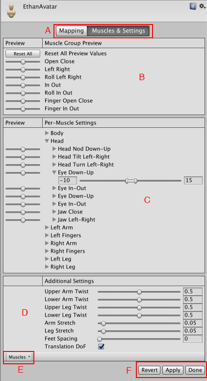

# Avatar Muscle & Settings 选项卡

Unity 的动画系统允许使用__肌肉 (Muscles)__ 控制不同骨骼的运动范围。

[正确配置](class-Avatar.html) Avatar 后，动画系统可“理解”骨骼结构，并允许使用 __Avatar__ Inspector 的 __Muscles & Settings__ 选项卡。使用 __Muscles & Settings__ 选项卡可调整角色的运动范围，并确保角色以逼真的方式变形，而不出现视觉瑕疵或自我重叠。

__Muscle &amp; Settings__ 选项卡具有以下区域：

* (A) 通过这些按钮在 __Mapping__ 和 __Muscles &amp; Settings__ 选项卡之间进行切换。在选项卡之间切换之前，必须对所做的更改执行 __Apply__ 或 __Revert__ 操作。
* (B) 通过 __Muscle Group Preview__ 区域可使用预定义的变形来操作角色。这些设置一次影响多个骨骼。
* (C) 使用 __Per-Muscle Settings__ 区域可调整身体的各个骨骼。可以展开这些肌肉设置以便更改每项设置的范围限制。例如，默认情况下，Unity 会将 Head-Nod 和 Head-Tilt 设置的范围设置为 -40 到 40 度，可以进一步减小这些范围以增加这些动作的刚度。
* (D) 使用 __Additional Settings__ 可调整身体的特定特效。
* (E) __Muscles__ 菜单提供了 __Reset__ 工具，可将所有肌肉设置恢复到默认值。
* (F) 通过这些按钮接受所做的更改 (__Accept__)、放弃更改 (__Revert__) 以及离开 Avatar 窗口 (__Done__)。在离开 __Avatar__ 窗口之前，必须对所做的更改执行 __Apply__ 或 __Revert__ 操作。

## 预览更改

对于 __Muscle Group Preview__ 和 __Per-Muscle Settings__ 区域中的设置，可直接在 __Scene__ 视图中预览所做的更改。可以拖动滑动条来查看应用于角色的每项设置的移动范围：

可以通过网格查看骨架的骨骼。

## 移动自由度 (Degree of Freedom, DoF)

可以在 __Additional Settings__ 中启用 __Translate DoF__ 选项，从而启用人形角色的移动动画。如果禁用此选项，则 Unity 仅使用旋转对骨骼进行动画化。__Translation DoF__ 可用于 Chest、UpperChest、Neck、LeftUpperLeg、RightUpperLeg、LeftShoulder 和 RightShoulder 的肌肉。

**注意：**启用 __Translate DoF__ 可能会提高性能要求，因为动画系统需要执行额外的步骤来重新定位人形动画。因此，在已知动画包含角色某些骨骼的动画式移动时，才应启用此选项。

---

*  2018-04-25  Page amended with limited [editorial review](DocumentationEditorialReview.html)

