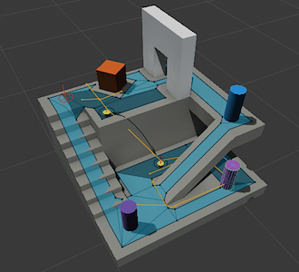

#导航和寻路

 

导航系统允许使用从场景几何体自动创建的导航网格来创建可在游戏世界中智能移动的角色。动态障碍物可让您在运行时更改角色的导航，而网格外链接 (Off-Mesh Link) 可让您构建特定动作，如打开门或从窗台跳下。本部分将详细介绍 Unity 的导航系统和寻路系统。

**相关教程：**[导航 (Navigation)](http://unity3d.com/learn/tutorials/topics/navigation)

搜索 [Unity 知识库 (Knowledge Base)](https://support.unity3d.com/hc/en-us) 了解提示、技巧和故障排除信息。
