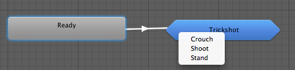

子状态机
==================

角色通常具有包含若干阶段的复杂动作。合理的做法是识别单独阶段并将单独状态用于每个阶段，而不是用单个状态来处理整个动作。例如，角色可能会有一个名为“Trickshot”（花式射击）的动作；在此动作中，角色会蹲下来稳定瞄准，射击，然后再站起来。

虽然这对于控制目的很有用，但缺点是随着添加更多的此类复杂动作，状态机将变得庞大而笨拙。在编辑器中用空白空间在视觉上对状态组进行分隔，可略微化简一下。但是，Mecanim 比这更进一步，允许您将一组状态折叠为状态机图中的单个指定项。这些折叠的状态组称为__子状态机__。

若要创建子状态机，可右键单击 __Animator Controller__ 窗口中的空白空间，并从上下文菜单中选择 __Create Sub-State Machine__。子状态机在编辑器中用细长六边形表示以区别于正常状态。

双击六边形时将清理编辑器，让您编辑子状态机，好像它本身就是一个完全独立的状态机。窗口顶栏会显示“示踪导航路径”以指示当前正在编辑的子状态机（注意，可在其他子状态机内创建子状态机，以此类推）。单击跟踪路径中的某项将使编辑器聚焦于该特定子状态机。

外部过渡
--------------------

如上所述，子状态机只是一种在编辑器中直观地折叠一组状态的方式，因此在过渡到子状态机时，必须选择要连接到子状态机的哪个状态。

您将注意到子状态机中有一个名称以 _Up_ 开头的额外状态。

_Up_ 状态表示“外部世界”，这是在视图中包含子状态机的状态机。如果添加从子状态机中的状态到 _Up_ 状态的过渡，系统将提示您选择要连接到闭包状态机的哪个状态。

