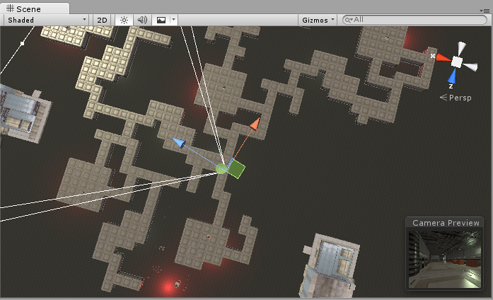
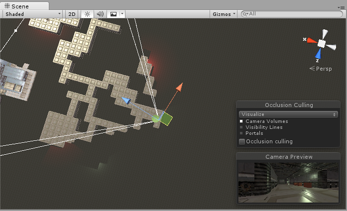
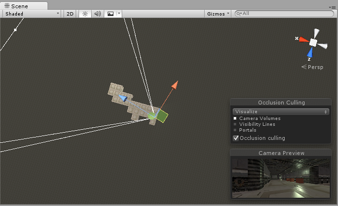
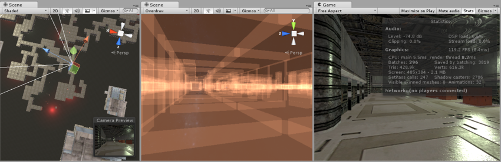
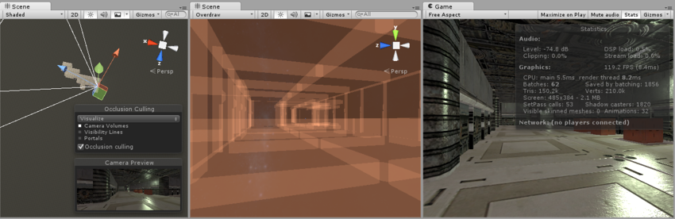
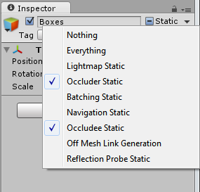
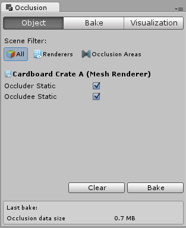

遮挡剔除
=================

当对象被其他对象阻挡（遮挡）而不能被摄像机所看到时，遮挡剔除 (Occlusion Culling) 功能会禁用对象的渲染。这种情况不会自动发生在 3D 计算机图形中，因为在大多数时间，距离摄像机最远的对象都是先绘制的，而较近的对象则在先前对象的基础上绘制（这称为“过度绘制 (Overdraw)”）。遮挡剔除与视锥体剔除 (Frustum Culling) 不同。视锥体剔除仅禁用摄像机视野之外的对象的渲染器，而不会禁用由过度绘制隐藏起来的任何对象的渲染器。请注意，使用遮挡剔除时，仍然会受益于视锥体剔除。

遮挡剔除过程将使用虚拟摄像机在场景中移动，进而构建潜在可见对象集的层级视图。每个摄像机在运行时都会使用此数据来识别可见和不可见的对象。凭借此信息，Unity 将确保只发送可见对象进行渲染。这样可减少绘制调用次数并提高游戏性能。

遮挡剔除的数据由单元格组成。每个单元格是从整个场景包围体上细分而来。具体地来说，这些单元格形成一个二叉树。遮挡剔除使用两个树，一个用于视图单元格（静态对象），另一个用于目标单元格（移动对象）。视图单元格映射到一个定义可见静态对象的索引列表，从而为静态对象提供更准确的剔除结果。

在创建对象时记住这一点很重要，因为您需要在对象大小和单元格大小之间取得良好的平衡。理想情况下，单元格与对象相比不应该太小，但同样，对象不应该覆盖大量单元格。有时，可通过将大型对象分成更小的碎片来改善剔除。但是，您仍然可以将小对象合并在一起以减少绘制调用，只要它们都属于同一个单元格，就不会影响遮挡剔除。

您可以使用“过度绘制”场景渲染模式来查看正在发生的过度绘制量，并可使用 Game 视图中的统计信息面板查看正在渲染的三角形、顶点和批次的数量。下面是应用遮挡剔除之前和之后的比较。

设置遮挡剔除
----------------------------

为了使用遮挡剔除，需要进行一些手动设置。首先，关卡几何体必须分成尺寸合理的碎片。将关卡布置到大型对象旁（例如墙壁、建筑物等）彼此遮挡且界限分明的小型区域中，也很有帮助。此处的思路是基于遮挡数据开启或关闭每个单独的网格。因此，如果您有一个包含房间所有家具的对象，则整套家具将全部剔除或全部不剔除。这种方法并不像使每件家具拥有自己的网格（因此每个家具都可以根据摄像机的视点单独剔除）那样合理。

您需要在 __Inspector__ 中把纳入遮挡计算的所有场景对象标记为 __Occluder Static__。执行此操作最快的方法是多选要包含在遮挡计算中的对象，然后将它们标记为 __Occluder Static__ 和 __Occludee Static__。

何时应使用 __Occludee Static__？不会产生遮挡的完全透明或半透明对象，以及不太可能遮挡其他对象的小型对象应标记为__被遮挡物 (Occludee)__ 而不是__遮挡物 (Occluder)__。这意味着，它们将被其他对象遮挡，但本身不会被视为遮挡物，这样将有助于减少计算。

使用 LOD 组时，只有基本级别对象 (LOD0) 可用作遮挡物。

遮挡剔除窗口
------------------------

对于大多数处理遮挡剔除的操作，都应该使用遮挡剔除窗口 (__Window &gt; Occlusion Culling__)

在遮挡剔除窗口中，可使用遮挡物网格和[遮挡区域 (Occlusion Areas)](class-OcclusionArea.html)。

如果您处于__遮挡剔除窗口__的 __Object__ 选项卡中，并在场景中选择了[网格渲染器](class-MeshRenderer.html)，您就可以修改相关的静止标记：

如果您处于__遮挡剔除窗口__的 __Object__ 选项卡中，并选择了[遮挡区域 (Occlusion Area)](class-OcclusionArea.html)，您就可以使用相关的 OcclusionArea 属性（有关更多详细信息，请转到[遮挡区域](class-OcclusionArea.html)部分）

**注意：**默认情况下，如果不创建任何遮挡区域，遮挡剔除将应用于整个场景。

**注意：**只要摄像机位于遮挡区域之外，就不会应用遮挡剔除。设置遮挡区域来覆盖摄像机可能出现的位置非常重要的，但如果将这些区域设置得过大，烘焙过程中就会产生额外成本。

遮挡剔除 - Bake
------------------------

遮挡剔除烘焙窗口有一个“Set Default Parameters”按钮，允许您将烘焙值重置为 Unity 的默认值。这些值对于许多典型场景很有用，但您可以调整这些值来适应场景的特定内容，这通常可以产生更好的效果。

属性
----------

属性                                               | 功能
-------------------------------------------------------|-----------------
__Smallest Occluder__        | 进行遮挡剔除时用于隐藏其他对象的最小尺寸。任何小于这个尺寸的对象都不会剔除它们所遮挡的对象。例如，当值为 5 时，高于或宽于 5 米的所有对象都将导致它们挡住的对象被剔除（不渲染，从而节省渲染时间）。为此属性选择一个合适的值，在遮挡数据的精度和存储大小之间取得平衡。
__Smallest Hole__            | 此值表示摄像机应该看到的几何体之间的最小间隙。此值表示可以穿过孔的对象的直径。如果场景中存在摄像机应该能够看到的小裂缝，则 Smallest Hole 值必须小于间隙的最窄尺寸。
__Backface Threshold__       | Unity 的遮挡使用数据大小优化功能，通过测试背面来减少不必要的细节。默认值 100 比较稳妥，绝不会从数据集删除背面。值 5 将基于具有可见背面的位置大幅减少数据。思路是，一般情况下，有效的摄像机位置通常不会看到太多背面；例如，地形底面的视图，或者您应该无法到达的实体对象内的视图。如果阈值低于 100，Unity 将完全从数据集删除这些区域，从而减少遮挡的数据大小。 

Bake 选项卡的底部是 Clear 和 Bake 按钮。单击 __Bake__ 按钮可开始生成遮挡剔除数据。生成数据后，可使用 Visualization 选项卡预览和测试遮挡剔除。如果对结果不满意，请单击 __Clear__ 按钮删除以前计算的数据，调整设置，并再次烘焙。

遮挡剔除 - Visualization
---------------------------------

场景中的所有对象都会影响包围体的大小，因此请尽量将它们全部保留在场景的可见边界内。

准备好生成遮挡数据后，单击 __Bake__ 按钮。请记住在 __Bake__ 选项卡中选择 __Memory Limit__。较低的值可以加快生成速度，但会降低精确度，较高的值将生成更适合发行版的质量。

请记住，构建遮挡数据所需的时间取决于单元格级别、数据大小和您所选择的质量。

处理完成后，您应该可以在查看区域中看到一些彩色立方体。彩色区域是共享相同遮挡数据的区域。

如果要删除遮挡剔除的所有预计算数据，请单击 __Clear__。

遮挡区域
==============

要将遮挡剔除应用于移动对象，必须创建__遮挡区域 (Occlusion Area)__，然后修改其大小以适合移动对象所在的空间（当然，移动对象不能标记为静态）。可通过将__遮挡区域 (Occlusion Area)__ 组件添加到空游戏对象来创建遮挡区域（菜单：__Component &gt; Rendering &gt; Occlusion Area__）。

创建__遮挡区域__后，请选中 _Is View Volume_ 复选框以遮挡移动对象。

 

|**_属性：_** |**_功能：_** |
|:---|:---|
|__Size__ |定义遮挡区域的大小。|
|__Center__ |设置遮挡区域的中心。默认情况下，此设置为 0,0,0，位于盒体的中心。|
|__Is View Volume__ |定义摄像机的位置。选中此项可遮挡该_遮挡区域_内的静态对象。|

添加遮挡区域后，需要查看它如何将盒体分成单元格。要了解如何计算遮挡区域，请在 __Occlusion Culling 预览面板__中
选择 __Edit__ 并切换 __View__ 按钮。

 

测试生成的遮挡
-------------------------------

设置遮挡后，可通过启用 _Occlusion Culling_（在 Visualize 模式下的 __Occlusion Culling 预览面板__中）并在 Scene 视图中移动__主摄像机__来测试遮挡。

当您移动主摄像机时（无论是否处于播放模式下），您将看到各种对象自行禁用。此处要寻找的是遮挡数据是否有任何错误。如果在移动摄像机时看到有对象突然弹入视图，则表示有错误。如果发生这种情况，修复错误的方法为更改分辨率（如果正在使用目标体积），或者移动对象以掩盖错误。要调试遮挡问题，可将主摄像机移动到有问题的位置进行抽样检查。

处理完成后，您应该在查看区域中看到一些彩色立方体。蓝色立方体表示__目标体积__的单元格划分。白色立方体表示__视图体积__的单元格划分。如果参数设置正确，您应该看到一些对象未被渲染。这是因为它们位于摄像机的视锥体之外，或被其他对象遮挡。

遮挡完成后，如果在场景中没有看到任何对象被遮挡，请尝试将对象分成更小的部分，以便能将它们完全包含在单元格内。
 
