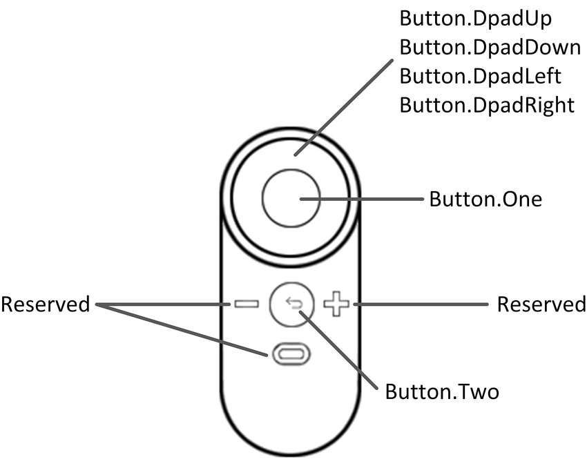
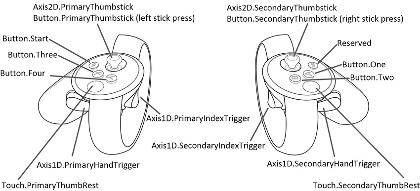

#Oculus 的输入

Oculus Rift 有三个输入设备：两个 Oculus Touch 控制器和一个 Oculus 遥控器。为了实现 Unity Editor 对 Oculus Rift 输入硬件的原生支持，Unity VR 子系统将这三个输入作为不同的摇杆：使用 [UnityEngine.Input](../ScriptReference/Input.html) 类来读取这些输入的轴和按钮值。

##命名约定和检测

正确配置并与操作系统连接后，Oculus Touch 控制器将在 UnityEngine.Input.GetJoystickNames() 返回的列表中显示为“Oculus Touch - Left”和“Oculus Touch - Right”，而 Oculus 遥控器显示为“Oculus Remote”。有关正确配置和连接 Touch 控制器和遥控器的信息，请参阅 [Oculus 开发者中心](https://developer3.oculus.com)关于如何配对 [Oculus Touch 控制器](https://developer3.oculus.com/documentation/pcsdk/latest/concepts/pairing-touch-controllers/)的文档以及 [Oculus 支持中心](https://support.oculus.com)关于 [Oculus 遥控器](https://support.oculus.com/help/oculus/835449819935261)的帮助。

Unity 脚本代码可以通过定期检查摇杆名称列表中是否存在 Touch 控制器来测试其可用性。当 Touch 控制器关闭或电池被移除时，[UnityEngine.Input.GetJoystickNames()](../ScriptReference/Input.GetJoystickNames.html) 返回的列表中的控制器名称将替换为空字符串。当 Touch 控制器再次开启时，控制器名称将再次出现在列表中。

##Unity 输入系统映射

###Oculus 遥控器

|**Hardware Feature** |**Unity Button ID** |**Unity Axis ID** |**Unity Axis Value when Pressed** |**Xbox Controller Analogue** |
|:---|:---|
|Button.DpadUp| - |6 | 1.0|D-Pad Up|
|Button.DpadDown | - |6|-1.0|D-Pad Down |
| Button.DpadLeft| -|5|-1.0|D-Pad Left |
|Button.DpadRight |- |5 |1.0|D-Pad Right |
|Button.One |0|-| - |A Button |
| Button.Two|1 |-| - |B Button |

###Oculus Touch 控制器
**注意：**两个 Touch 控制器具有一组与 Xbox 控制器类似的控件，因此 Unity 的 Oculus Touch 控制器映射对这些控件进行高度模仿。

| __硬件功能__| __交互类型__ | __Unity 按钮 ID__ | __Unity 轴 ID__ | __Unity 轴范围__ | __Xbox 控制器模拟__ |
|:---|:---|:---|:---|:---|:---| 
| Button.One| 按压 | 0 |  - |  - | A 按钮 |
| Button.One| 触控 | 10 |  - |  - |  - |
| Button.Two| 按压 | 1 |  - |  - | B 按钮 |
| Button.Two| 触控 | 11 |  - |  - |  - |
| Button.Three| 按压 | 2 |  - |  - | X 按钮 |
| Button.Three| 触控 | 12 |  - |  - |  - |
| Button.Four| 按压 | 3 |  - |  - | Y 按钮 |
| Button.Four| 触控 | 13 |  - |  - |  - |
| Button.Start| 按压 | 7 |  - |  - | 开始按钮 |
| Button.PrimaryThumbstick| 按压 | 8 |  - |  - | 左摇杆按压 |
| Button.PrimaryThumbstick| 触控 | 16 |  - |  - |  - |
| Button.PrimaryThumbstick| 近触控 |  - | 15 | 检测到近触控时为 1.0；其他情况为 0.0 |  - |
| Button.SecondaryThumbstick| 按压 | 9 |  - |  - | 右摇杆按压 |
| Button.SecondaryThumbstick| 触控 | 17 |  - |  - |  - |
| Button.SecondaryThumbstick| 近触控 |  - | 16 | 检测到近触控时为 1.0；其他情况为 0.0 |  - |
| Touch.PrimaryThumbRest| 触控 | 18 | -  |  - |  - |
| Touch.PrimaryThumbRest| 近触控 |  - | 15 | 检测到近触控时为 1.0；其他情况为 0.0 |  - |
| Touch.SecondaryThumbRest| 触控 | 19 |  - |  - |  - |
| Touch.SecondaryThumbRest| 近触控 |  - | 16 | 检测到近触控时为 1.0；其他情况为 0.0 |  - |
| Axis1D.PrimaryIndexTrigger| 触控 | 14 |  - |  - |  - |
| Axis1D.PrimaryIndexTrigger| 近触控 |  - | 13 | 检测到近触控时为 1.0；其他情况为 0.0 |  - |
| Axis1D.PrimaryIndexTrigger| 挤压 |  - | 9 | 0.0 到 1.0 | 挤压左触发器 |
| Axis1D.SecondaryIndexTrigger| 触控 | 15 |  - |  - |  - |
| Axis1D.SecondaryIndexTrigger| 近触控 |  - | 14 | 检测到近触控时为 1.0；其他情况为 0.0 |  - |
| Axis1D.SecondaryIndexTrigger| 挤压 |  - | 10 | 0.0 到 1.0 | 挤压右触发器 |
| Axis1D.PrimaryHandTrigger| 挤压 |  - | 11 | 0.0 到 1.0 |  - |
| Axis1D.SecondaryHandTrigger| 挤压 |  - | 12 | 0.0 到 1.0 |  - |
| Axis2D.PrimaryThumbstick| 水平移动 |  - | 1 | -1.0 到 1.0 | 移动左摇杆 |
| Axis2D.PrimaryThumbstick| 垂直移动 |  - | 2 | -1.0 到 1.0 | 移动左摇杆 |
| Axis2D.SecondaryThumbstick| 水平移动 |  - | 4 | -1.0 到 1.0 | 移动右摇杆 |
| Axis2D.SecondaryThumbstick| 垂直移动 |  - | 5 | -1.0 到 1.0 | 移动右摇杆 |
