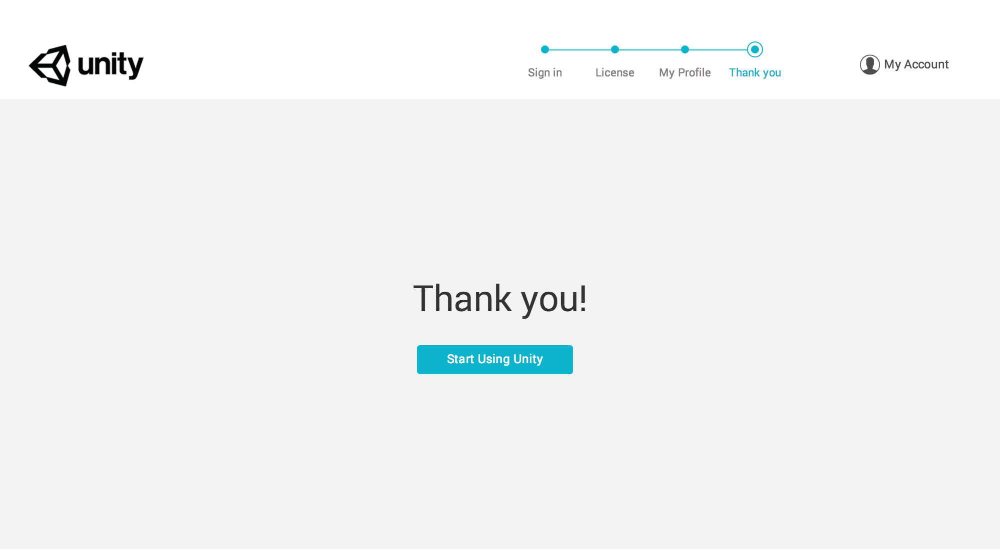

#在线激活

在线激活是 Unity 最简单、最快捷的激活方式。以下是 Unity 在线激活操作的分步指南。

1.下载并安装 Unity Editor。请在[此处](http://unity3d.com/unity/download/)查找最新版的 Unity。

1.从 OS X 上的 Applications 文件夹或 Windows 上的“开始”菜单中的快捷方式启动 Editor。

1.首先会显示“Unity Account”窗口。在此窗口中，需要输入 Unity Developer Network、Google 或 Facebook 帐户凭据。（如果没有现有的 Unity 帐户或忘记了密码，只需单击相应的“create one”和“Forgot your password?”链接即可。按照屏幕上的提示创建或检索您的帐户。）输入凭据后，可单击“Sign in”继续。

     

4.随后将显示一个标题为“License management”的窗口。选择要激活的 Unity 版本，然后单击“Next”。
    
     

5.现在，可单击“Start using Unity”按钮继续进入 Unity Editor。

如需进一步帮助，请联系 **support@unity3d.com**。

---

* 2017-09-06  Page amended with limited [editorial review](DocumentationEditorialReview.html)

* 在 Unity 2017.2 中更新了许可证激活方法
