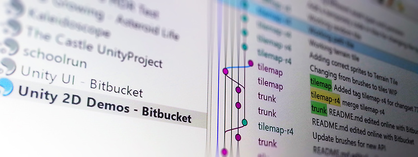

# 开源代码仓库

 

我们启动 Unity 开源组件的初衷是让我们与您、我们的客户以及用户进行互动。我们希望为您提供源代码访问权限并确保全面的安全性和灵活性。

我们始终欢迎合作参与和社区开发。我们的希望和期待是，借助这一举措，我们的社区将能够以前所未有的方式致力于 Unity 的发展。

## Unity 代码仓库

我们建议您在参与 Unity 开源项目时使用 Bitbucket，因为这是我们在内部使用的工具，并能让工作变得简单。Unity 有许多开源代码仓库可帮助开发人员使用 Unity 软件：

[http://bitbucket.org/Unity-Technologies/](http://bitbucket.org/Unity-Technologies/)

这是我们最新的代码仓库，主要由 Unity UI 团队和研发内容团队使用。一些核心研发项目最终会进驻到这里（主要是由于开发人员的偏好），例如 5.3 版内存性能分析器。

[https://github.com/Unity-Technologies](https://github.com/Unity-Technologies)

这是我们最早的代码仓库，我们的一些核心研发项目的开源工作保存在这里。主要项目包括 Unity 的 Mono 分叉（C# 运行时）和 Katana 分叉（我们的构建/CI 系统）。用于 WebGL 的大部分技术（例如 Emscripten）也在这里托管。

[https://github.com/unity3d-jp](https://github.com/unity3d-jp)

此代码仓库由 Unity 日本研发团队和传播团队使用。此代码仓库包含该办事处员工的演示项目、原型和编外项目。有趣的项目包括即将推出的用于构建 AssetBundle 的 Asset Graph 系统、一个演示如何在 Unity 中有效使用线程的演示项目，以及一个演示如何使用 Unity Ads 的示例项目。

如果您想了解更多有关参与 Unity 开发的信息，请参阅有关[参与开源项目](ContributingToUnity.html)的部分。

---
* 2018-03-19  Page amended with limited [editorial review](DocumentationEditorialReview.html)

* 从 2018.1 开始，MonoDevelop 由 Visual Studio 取代
