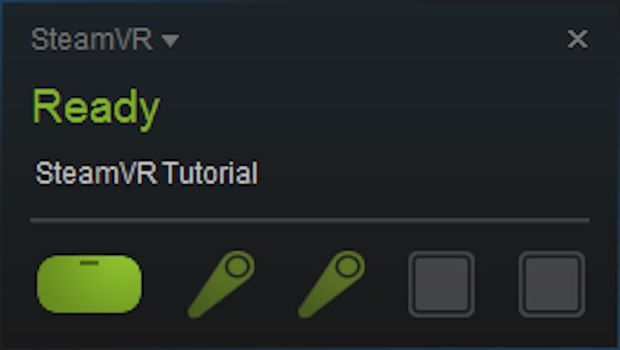
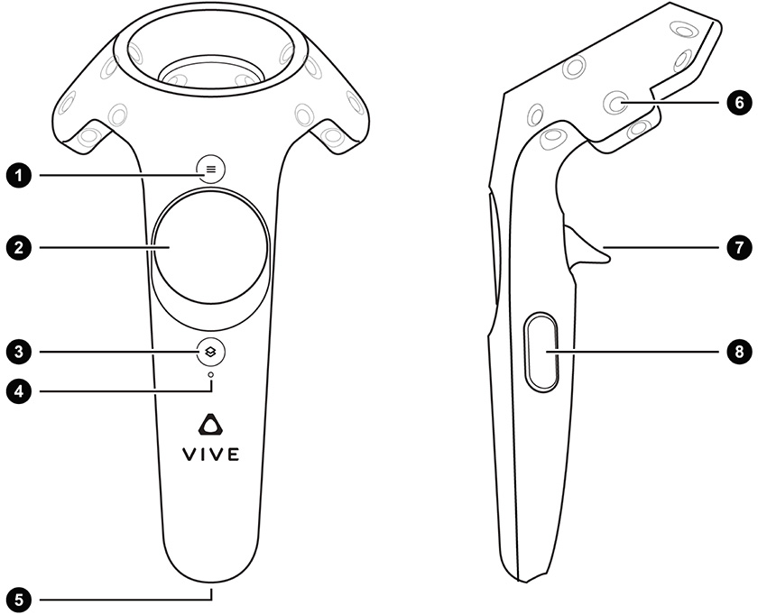
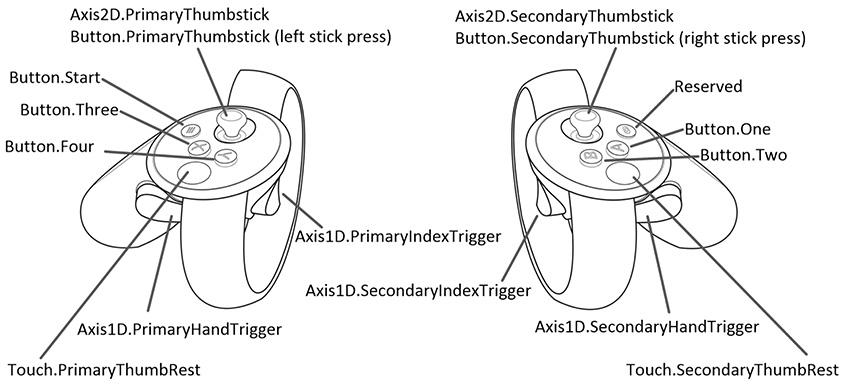
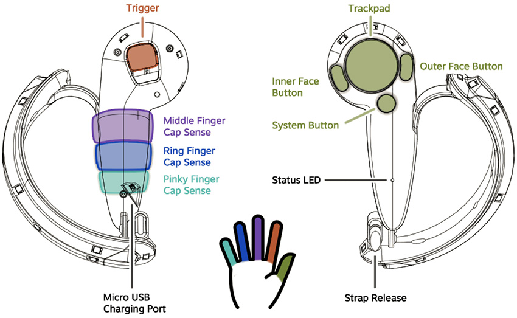

# OpenVR 控制器的输入

为了让 Unity Editor 支持 OpenVR 跟踪的控制器，Unity VR 子系统将 VR 控制器输入作为单独的摇杆。使用 [UnityEngine.Input](../ScriptReference/Input.html) 类来访问轴和按钮值。

在显示轴和按钮状态时，OpenVR 的 Unity 集成不涉及任何特定硬件。本页面提供 OpenVR 支持的三种控制器（HTC Vive、Oculus Touch 和 Valve Knuckles 控制器）的轴和按钮映射。

## 命名约定和检测

正确配置和连接后，任何兼容 OpenVR 的控制器都在内部命名为 __OpenVR Controller - Left__ 或 __OpenVR Controller - Right__。可在 [UnityEngine.Input.GetJoystickNames()](../ScriptReference/Input.GetJoystickNames.html) 返回的列表中访问此名称。使用 Steam 进行测试时，如果这些控制器可用，则会在 SteamVR 状态菜单中以绿色突出显示。要访问此菜单，必须在机器上安装并运行 Steam 和 SteamVR。

您可以通过脚本定期检查摇杆名称列表中是否存在这些控制器来测试其可用性。当控制器关闭或电池被移除时，[UnityEngine.Input.GetJoystickNames()](../ScriptReference/Input.GetJoystickNames.html) 返回的列表中的控制器名称将替换为空字符串。当控制器再次开启时，控制器名称将再次出现在返回的摇杆列表中。

## Unity 输入系统映射

本部分提供 OpenVR 设备支持的每种控制器类型的图表，以及每个控制器按钮的内部 Unity 输入映射信息。

### HTC Vive 控制器

下图显示了 HTC Vive 控制器上可用于 VR 应用程序的不同输入。

| 1| 菜单按钮 |
|:---|:---| 
| 2| 触控板 |
| 3| 系统按钮 |
| 4| 状态灯 |
| 5| Micro-USB 端口 |
| 6| 跟踪传感器 |
| 7| 触发器 |
| 8| 握把按钮 |

### Oculus Touch 控制器

下图显示了 Oculus Touch 控制器上可用于 VR 应用程序的不同输入。

### Knuckles 控制器

下图显示了在 VR 应用程序中使用 Knuckles 控制器时可用的不同输入。

下表列出了每个 OpenVR 支持的控制器的控制器输入、它们的交互类型、Unity 轴和按钮 ID 以及每个轴的值范围。

|**HTC Vive 控制器**| **Oculus Touch 控制器** | **Valve Knuckles 控制器** | **交互类型** | **Unity 按钮 ID** | **Unity 轴 ID** | **Unity 轴值范围** |
|:---|:---|:---|:---|:---|:---|:---| 
| 左控制器菜单按钮 (1)| Button.Three | 左控制器内面按钮 | 按压 | 2 |  |  |
| 右控制器菜单按钮 (1)| Button.One | 右控制器内面按钮 | 按压 | 0 |  |  |
| |  | 左控制器外面按钮 | 按压 | 3 |  |  |
| |  | 右控制器外面按钮 | 按压 | 1 |  |  |
| 左控制器触控板 (2)| Button.PrimaryThumbstick | 左控制器触控板 | 按压 | 8 |  |  |
| 右控制器触控板 (2)| Button.SecondaryThumbstick | 右控制器触控板 | 按压 | 9 |  |  |
| 左控制器触控板 (2)| Button.PrimaryThumbstick | 左控制器触控板 | 触控 | 16 |  |  |
| 右控制器触控板 (2)| Button.SecondaryThumbstick | 右控制器触控板 | 触控 | 17 |  |  |
| 左控制器触控板 (2)| Axis2D.PrimaryThumbstick | 左控制器触控板 | 水平移动 |  | 1 | –1.0 到 1.0 |
| 左控制器触控板 (2)| Axis2D.PrimaryThumbstick | 左控制器触控板 | 垂直移动 |  | 2 | –1.0 到 1.0 |
| 右控制器触控板 (2)| Axis2D.SecondaryThumbstick | 右控制器触控板 | 水平移动 |  | 4 | –1.0 到 1.0 |
| 右控制器触控板 (2)| Axis2D.SecondaryThumbstick | 右控制器触控板 | 垂直移动 |  | 5 | –1.0 到 1.0 |
| 左控制器触发器 (7)| Axis1D.PrimaryIndexTrigger | 左控制器触发器 | 触控 | 14 |  |  |
| 右控制器触发器 (7)| Axis1D.SecondaryIndexTrigger | 右控制器触发器 | 触控 | 15 |  |  |
| 左控制器触发器 (7)| Axis1D.PrimaryIndexTrigger | 左控制器触发器 | 挤压 |  | 9 | 0.0 到 1.0 |
| 右控制器触发器 (7)| Axis1D.SecondaryIndexTrigger | 右控制器触发器 | 挤压 |  | 10 | 0.0 到 1.0 |
| 左控制器握把按钮 (8)| Axis1D.PrimaryHandTrigger | 左控制器握把平均值 | 挤压 |  | 11 | 0.0 到 1.0 |
| 右控制器握把按钮 (8)| Axis1D.SecondaryHandTrigger | 右控制器握把平均值 | 挤压 |  | 12 | 0.0 到 1.0 |
| |  | 左控制器食指容性传感器 |  |  | 20 | 0.0 到 1.0 |
| |  | 右控制器食指容性传感器 |  |  | 21 | 0.0 到 1.0 |
| |  | 左控制器中指容性传感器 |  |  | 22 | 0.0 到 1.0 |
| |  | 右控制器中指容性传感器 |  |  | 23 | 0.0 到 1.0 |
| |  | 左控制器无名指容性传感器 |  |  | 24 | 0.0 到 1.0 |
| |  | 右控制器无名指容性传感器 |  |  | 25 | 0.0 到 1.0 |
| |  | 左控制器小指容性传感器 |  |  | 26 | 0.0 到 1.0 |
| |  | 右控制器小指容性传感器 |  |  | 27 | 0.0 到 1.0 |

注意：上表中未列出的任何硬件功能都不会通过 OpenVR API 公开，因此也不会通过 Unity 的输入系统公开。

## 重要的控制器差异

在开发支持 OpenVR 设备的应用程序时，必须注意所有这三种控制器上的按钮的输入事件触发器和响应速率存在某些差异，这一点很重要。

Unity 触控输入事件因平台控制器而异：

* 当用户开始挤压 HTC Vive 控制器上的触发器时，[事件系统](EventSystem.html)会为触发器生成输入触摸事件。
* 当 [Unity 输入](../ScriptReference/Input.html)检测到触控时，[事件系统](EventSystem.html)会为 Oculus Touch 和 Valve Knuckles 控制器上的触发器生成输入触摸事件 - 无需挤压触发器。

握把触发器在平台之间有所不同：

* 每个 HTC Vive 控制器都有两个握把按钮，但都映射到同一个轴。这些按钮在未按下时的值为 0.0，按下时为 1.0（不允许介于 0.0 和 1.0 之间的中间值）。

* Oculus Touch 控制器上的握把按钮是一个模拟触发器，范围从 0.0 到 1.0（可以使用中间值）。

* Valve Knuckles 控制器上的握把按钮提供每个手指触控传感器的输入值的加权平均值。

