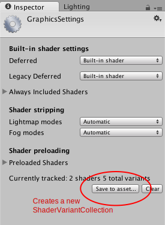

# 优化着色器加载时间

着色器是在 GPU 上执行的小程序，加载它们可能需要一些时间。每个单独的 GPU 程序通常不会花费很多时间来加载，但着色器通常在内部有很多“变体”。

例如，[标准着色器](shader-StandardShader.html)在完全编译后，最终将成为数千个略微不同的 GPU 程序。这种情况可产生两个潜在问题：

* 大量的这些着色器变体将增加游戏构建时间和游戏数据大小。
* 在游戏过程中加载大量着色器变体将很慢并占用内存。

## 着色器构建时剥离

在构建游戏时，Unity 可能检测到游戏不使用某些内部着色器变体，并从构建数据中跳过它们。构建时剥离将用于以下各项：

* 各个着色器功能（针对使用 `#pragma shader_feature` 的着色器）。如果所使用的材质都不使用特定变体，则该变体不会包含在构建中。请参阅[内部着色器变体](SL-MultipleProgramVariants.html)文档。在内置着色器中，[标准着色器](shader-StandardShader.html)会使用构建时剥离。
* 任何场景未使用的可处理雾效和光照贴图模式的着色器变体不会包含在游戏数据中。如果要重写此行为，请参阅[图形设置](class-GraphicsSettings.html)。

上述的组合通常会大大减小着色器数据大小。例如，完全编译后的标准着色器将占用几百兆字节，但在典型的项目中，通常最终仅占用几兆字节（并且通常会由应用程序打包过程进一步压缩）。

## 默认的 Unity 着色器加载行为

在所有默认设置下，Unity 将 [shaderlab 着色器](SL-Shader.html)对象加载到内存中，但在实际需要之前不会创建[内部着色器变体](SL-MultipleProgramVariants.html)。

这意味着仍然可以使用包含在游戏构建中的着色器变体，但是在需要它们之前不会有内存或加载时间成本。例如，着色器总是包含一个变体用于处理带阴影的点光源，但是如果一直未能在游戏中使用带阴影的点光源，那么加载这个特定的变体是没有意义的。

然而，这种默认行为有一个缺点，即第一次需要某个着色器变体时可能会出现暂时性中断问题，这是因为必须将新的 GPU 程序代码加载到图形驱动程序中。在游戏过程中通常不希望发生这种问题，因此 Unity 提供了 **ShaderVariantCollection** 资源来帮助解决该问题。

### 着色器变体集合

ShaderVariantCollection 资源基本上是一个[着色器](class-Shader.html)列表，对于每个着色器，都要加载一组 pass 类型和着色器关键字组合。

为了帮助根据实际使用的着色器及其变体来创建这些资源，编辑器可以跟踪实际使用的着色器及其变体。在 Graphics Settings 中，有一个按钮可基于当前跟踪的着色器创建新的 ShaderVariantCollection，或清除当前跟踪的着色器列表。

有了一些 ShaderVariantCollection 资源后，即可设置在加载应用程序时自动预加载这些变体（位于 [Graphics Settings](class-GraphicsSettings.html) 中的 Preloaded Shaders 列表下），或者也可从脚本预加载单个着色器变体集合。

Preloaded Shaders 列表列出的是常用着色器。此处列出的着色器变体将在应用程序的整个生命周期内加载到内存中。对于包含大量变体的 ShaderVariantCollections 资源，这可能会占用大量内存。为避免这种情况，应以较小的粒度创建 ShaderVariantCollection 资源并从脚本进行加载。一种策略是为每个场景记录使用过的着色器变体，将它们保存到单独的 ShaderVariantCollections 资源中，并在场景启动时加载它们。

请参阅 [ShaderVariantCollection](../ScriptReference/ShaderVariantCollection.html) 脚本类。

## 另请参阅

* [优化图形性能](OptimizingGraphicsPerformance.html)。
* [图形设置 (Graphics Settings)](class-GraphicsSettings.html)。
* [着色器参考](SL-Shader.html)。
