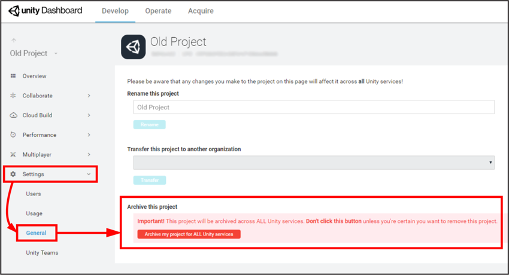
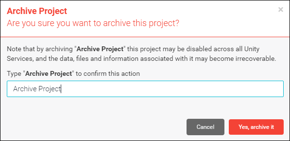
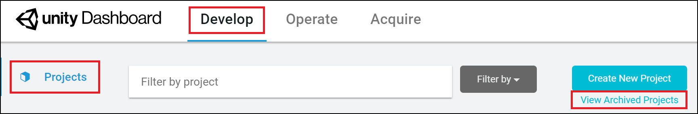
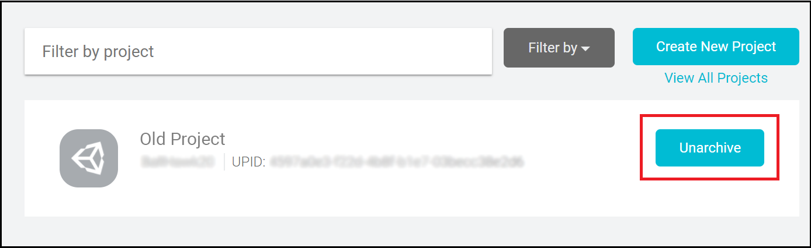

# 管理组织的项目

创建新项目时，会将其分配给组织。如果尚未创建任何其他组织，则会自动将其分配给默认组织。如果您的帐户可以使用多个组织，则可以选择使用哪个组织。因此，项目将继承其组织的角色设置。但是，如果用户需要访问某些工具或信息，您可以为他们提供每个项目独有的不同角色，而无需在整个组织的所有项目中授予可见性。有关更多信息，请参阅__管理您的组织__中的 [Members & Groups](OrgsManagingyourOrganization.html#membersandgroups)。

组织所有者还可以使用以下工具来管理项目：

* [存档和恢复项目](#archiveproject)
* [更改项目名称](#changeprojectname)
* [将项目转移到新组织](TransferringProjects.html)

## 存档和恢复项目

不能删除项目，否则可能会导致控制面板上出现混乱。为了减少混乱，可对不再使用的项目进行存档。项目存档后便不再显示在 __Projects__ 列表中。

要对项目存档，请执行以下操作：

1.登录 [Unity Dashboard](https://developer.cloud.unity3d.com/projects/)。
2.选择要存档的项目。
3.在左侧导航面板中，单击 __Settings__ > __General__。
4.在 Project 面板中，单击 __Archive my project for ALL Unity services__ 按钮。

    

5.在项目存档弹出窗口中，输入项目名称以确认要对该项目存档，然后单击 __Yes, archive it__ 按钮。

    

要查看已存档的项目并重新激活它们，请执行以下操作：

1.登录 [Unity Services Dashboard](https://developer.cloud.unity3d.com/projects/)。
2.单击页面右上角的 View Archived Projects。

    

1.找到要重新激活的项目，然后单击 __Unarchive__ 按钮。

    

## 更改项目名称

要更改项目名称，请执行以下操作：

1.登录 [Unity Services Dashboard](https://developer.cloud.unity3d.com)。
2.选择要重命名的项目。
3.在左侧导航面板中，单击 __Settings__ > __General__。
4.在 __Rename this project__ 文本框中，输入项目的新名称，然后单击 __Rename__ 按钮。

---
* 2018-04-25 Page published with [editorial review](DocumentationEditorialReview.html)

