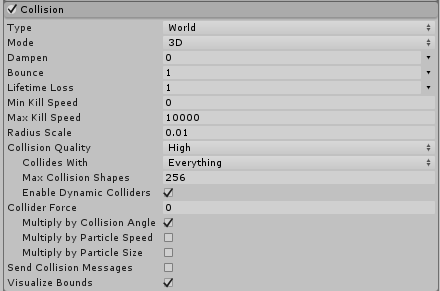

#Collision 模块
 
此模块控制[粒子](PartSysWhatIs.html)如何与[场景](CreatingScenes.html)中的[游戏对象](GameObjects.html)碰撞。使用第一个下拉选单可定义碰撞设置是应用于 __Planes__ 还是应用于 __World__。如果选择 __World__，请使用 __Collision Mode__ 下拉选单定义碰撞设置是应用于 [2D 还是 3D](2Dor3D.html) 世界。
 
##Planes 模块属性
 
 
 
|**属性** |**功能** |
|:---|:---|
|__Planes 弹出菜单__ |选择 __Planes__ 模式。 |
|__Planes__ |用于定义碰撞平面的变换的可扩展列表。 |
|__Visualization__ |选择要将 Scene 视图中的碰撞平面辅助图标显示为线框网格还是实体平面。 |
|__Scale Plane__ |用于可视化的平面大小。 |
|__Dampen__ |粒子碰撞后损失的速度比例。 |
|__Bounce__ |粒子碰撞后从表面反弹的速度比例。 |
|__Lifetime Loss__ |粒子碰撞后损失的总生命周期比例。 |
|__Min Kill Speed__ |碰撞后运动速度低于此速度的粒子将从系统中予以移除。 |
|__Max Kill Speed__ |碰撞后运动速度高于此速度的粒子将从系统中予以移除。 |
|__Radius Scale__ |允许调整粒子碰撞球体的半径，使其更贴近粒子图形的可视边缘。 |
|__Send Collision Messages__ |如果启用此属性，则可从脚本中通过 [OnParticleCollision](../ScriptReference/MonoBehaviour.OnParticleCollision.html) 函数检测粒子碰撞。 |
|__Visualize Bounds__ | 在 Scene 视图中将每个粒子的碰撞边界渲染为线框形状。 |
 
##World 模块属性
 
 
 
|**_属性_** |**_功能_** |
|:---|:---|
|__World 弹出菜单__ |选择 __World__ 模式。 |
|__Collision Mode__| 3D 或 2D。|
|__Dampen__ |粒子碰撞后损失的速度比例。 |
|__Bounce__ |粒子碰撞后从表面反弹的速度比例。 |
|__Lifetime Loss__ |粒子碰撞后损失的总生命周期比例。 |
|__Min Kill Speed__ |碰撞后运动速度低于此速度的粒子将从系统中予以移除。 |
|__Max Kill Speed__ |碰撞后运动速度高于此速度的粒子将从系统中予以移除。 |
|__Radius Scale__ | 2D 或 3D 的设置。|
|__Collision Quality__ | 使用下拉选单来设置粒子碰撞的质量。此设置会影响有多少粒子可以穿过碰撞体。在较低的质量水平下，粒子有时会穿过碰撞体，但需要的计算资源较少。|
|&nbsp;&nbsp;&nbsp;&nbsp;High | 当 __Collision Quality__ 设置为 __High__ 时，碰撞始终使用物理系统来检测碰撞结果。此设置是最耗费资源但也是最准确的选项。 |
|&nbsp;&nbsp;&nbsp;&nbsp;Medium (Static Colliders) | 当 __Collision Quality__ 设置为 __Medium (Static Colliders)__ 时，碰撞使用一组体素来缓存先前的碰撞，从而在以后的帧中更快地重用。请参阅下方的[世界碰撞](#WorldCollisions)以了解与此缓存相关的更多信息。  __Medium__ 和 __Low__ 之间的唯一区别是粒子系统在每帧查询物理系统的次数。__Medium__ 每帧的查询次数多于 __Low__。  请注意，此设置仅适用于从不移动的静态碰撞体。 |
|&nbsp;&nbsp;&nbsp;&nbsp;Low (Static Colliders) | 当 __Collision Quality__ 设置为 __Low (Static Colliders)__ 时，碰撞使用一组体素来缓存先前的碰撞，从而在以后的帧中更快地重用。请参阅下方的[世界碰撞](#WorldCollisions)以了解与此缓存相关的更多信息。  __Medium__ 和 __Low__ 之间的唯一区别是粒子系统在每帧查询物理系统的次数。__Medium__ 每帧的查询次数多于 __Low__。  请注意，此设置仅适用于从不移动的静态碰撞体。 |
|__Collides With__ |粒子只会与所选层上的对象发生碰撞。 |
|__Max Collision Shapes__ |粒子碰撞可包括的碰撞形状个数。多余的形状将被忽略，且地形优先。|
|__Enable Dynamic Colliders__ |允许粒子也与动态对象碰撞（否则仅使用静态对象）。|
| __Enable Dynamic Colliders__ | 动态碰撞体是未配置为 Kinematic 的任何碰撞体（请参阅[碰撞体](CollidersOverview.html)相关文档了解有关碰撞体类型的更多信息）。 选中此选项可将这些碰撞体类型包含在粒子发生碰撞时响应的对象组内。如果取消选中此选项，粒子仅响应与静态碰撞体的碰撞。|
| __Voxel Size__ | 体素 (voxel) 表示三维空间中的常规网格上的值。使用 __Medium__ 或 __Low__ 质量碰撞时，Unity 会在网格结构中缓存碰撞。此设置控制着网格大小。较小的值可提供更高的准确性，但会占用更多内存，效率也会降低。  **注意**：仅当 __Collision Quality__ 设置为 __Medium__ 或 __Low__ 时，才能访问此属性。 |
|__Collider Force__ |在粒子碰撞后对物理碰撞体施力。这对于用粒子推动碰撞体很有用。|
|__Multiply by Collision Angle__ |向碰撞体施力时，根据粒子与碰撞体之间的碰撞角度来缩放力的强度。掠射角将比正面碰撞产生更小的力。|
|__Multiply by Particle Speed__ |向碰撞体施力时，根据粒子的速度来缩放力的强度。快速移动的粒子会比较慢的粒子产生更大的力。|
|__Multiply by Particle Size__ |向碰撞体施力时，根据粒子的大小来缩放力的强度。较大的粒子会比较小的粒子产生更大的力。|
|__Send Collision Messages__ |如果选中此复选框，则允许从脚本中通过 [OnParticleCollision](../ScriptReference/MonoBehaviour.OnParticleCollision.html) 函数检测粒子碰撞。 |
|__Visualize Bounds__ |在 Scene 视图中预览每个粒子的碰撞球体。 |
 
##详细信息
 
当其他对象围绕粒子系统时，通常情况下，粒子与这些对象相互作用才会使效果更有说服力。例如，水或碎片应该被坚固的墙壁阻挡而非直接穿过墙壁。启用 __Collision__ 模块后，粒子可与场景中的对象发生碰撞。
 
通过从弹出菜单中选择 __World__ 模式，可设置粒子系统来使其粒子与场景中的任何碰撞体碰撞。此外，也可使用 __Collides With__ 属性根据碰撞体所在的层来禁用碰撞体。弹出菜单还有一个 __Planes__ 模式选项，可用于向场景中添加一组不需要碰撞体的平面。此选项对于简单的地板、墙壁和类似对象非常有用，并且处理器开销低于 __World__ 模式。
 
启用 __Planes__ 模式后，可通过 __Planes__ 属性添加一组变换（通常为空游戏对象）。平面在对象的局部 XZ 平面中无限延伸，其中以正 Y 轴表示平面的法线矢量。为了协助开发，无论对象本身是否具有任何可见的网格，平面都将在场景中显示为辅助图标。辅助图标可显示为线框网格或实体平面，也可进行缩放。但是，缩放仅适用于可视化；碰撞平面本身在场景中无限延伸。
 
启用碰撞后，粒子的大小有时会成为问题，因为它的图形在与表面接触时可能被裁剪。这种情况可能导致粒子在停止或反弹之前在一定程度上“下沉”到表面中。__Radius Scale__ 属性通过定义粒子的近似圆形半径（以其实际大小的百分比形式）来解决此问题。此大小信息用于防止裁剪并避免下沉效应。
 
当粒子表示实体对象时，__Dampen__ 和 __Bounce__ 属性非常有用。例如，砾石在抛出时往往会在坚硬的表面上反弹，但是雪球粒子在碰撞时可能会失去速度。__Lifetime Loss__ 和 __Min Kill Speed__ 有助于减少碰撞后残留颗粒的影响。例如，火球在空中飞行时可能会持续几秒钟，但在碰撞后，单独的火焰粒子应该快速消散。
 
如果启用了 __Send Collision Messages__，还可从脚本中检测粒子碰撞。脚本可附加到带有粒子系统的对象，也可附加到带有碰撞体的对象。通过检测碰撞，可将粒子用作游戏中的活动对象，例如飞弹、魔法和能量块 (power-up)。请参阅 [MonoBehaviour.OnParticleCollision](../ScriptReference/MonoBehaviour.OnParticleCollision.html) 脚本参考页面以了解更多详细信息和示例。
 
 
##World Collision Quality
 
World Collision 模块具有 __Collision Quality__ 属性，可将其设置为 __High__、__Medium__ 或 __Low__。当 __Collision Quality__ 设置为 __Medium (Static Colliders__) 或 __Low (Static Colliders)__ 时，碰撞使用一组体素（3D 网格上的值）来缓存先前的碰撞，从而在以后的帧中快速重用。
 
该缓存由每个体素中的平面组成，其中的平面表示该位置处的碰撞表面。在每个帧上，Unity 都会检查缓存中是否有该粒子位置的平面，如果有，则 Unity 将其用于碰撞检测。否则会查询物理系统。如果返回了碰撞，则会将其添加到缓存中，以便在后续帧上快速进行查询。
 
这是近似算法，因此可能存在一些缺失的碰撞。可通过减小 Voxel Size 值来帮助解决这个问题；但是，这样做会占用额外的内存，效率也会降低。
 
__Medium__ 和 __Low__ 之间的唯一区别是允许系统在每帧查询物理系统的次数。Low 每帧的查询次数少于 Medium。一旦超出每帧预算，只能将缓存用于所有其余粒子。这样一来可能导致缺失的碰撞增加，直到更全面填充缓存为止。

---

*  2017-05-30  Page amended with limited [editorial review](DocumentationEditorialReview.html)

* 在 Unity [2017.1](../Manual/30_search.html?q=newin20171) 中更改了 Collision 模块的功能 NewIn20171
