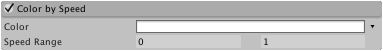

#Color By Speed 模块

在此模块中可设置粒子的颜色根据粒子速度（每秒的距离单位）变化。

 

##属性

|**_属性_** |**_功能_** |
|:---|:---|
|__Color__ |在速度范围内定义的粒子的颜色渐变。 |
|__Speed Range__ |颜色渐变映射到的速度范围的下限和上限（超出范围的速度将映射到渐变的端点）。 |

##详细信息
燃烧或发光的粒子（如火花）在空气中快速移动时会更明亮地燃烧（例如，当火花接触到更多氧气时），但随着它们减速时会略微变暗。要模拟这一点，可使用 _Color By Speed_ 模块，使渐变在速度范围的上限为白色，而在下限为红色（在火花示例中，较快的粒子将显示为白色，而较慢的粒子为红色）。
