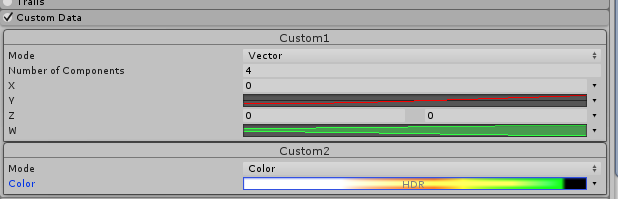

# Custom Data 模块

Custom Data 模块允许您在 Editor 中定义要附加到粒子的自定义数据格式。您也可以在脚本中进行此设置。有关如何在脚本中设置自定义数据并将该数据发送到着色器的更多信息，请参阅[粒子系统顶点流](PartSysVertexStreams.html)的相关文档。

数据可以是__矢量 (Vector)__ 的形式，包含最多 4 个 [MinMaxCurve](../ScriptReference/ParticleSystem.MinMaxCurve.html) 组件或__颜色 (Color)__，此颜色是支持 HDR 的 [MinMaxGradient](../ScriptReference/ParticleSystem.MinMaxGradient.html)。使用此数据可在脚本和着色器中驱动自定义逻辑。

可自定义每个曲线/渐变的默认标签，只需单击它们并输入上下文名称即可。将自定义数据传递给着色器时，了解如何在着色器中使用该数据非常有用。例如，曲线可用于自定义的 Alpha 测试，或者可使用渐变向粒子添加辅助颜色。通过编辑标签，很容易在 UI 中保留每个自定义数据条目的记录。

 

* 2017-09-04  Page amended with limited [editorial review](DocumentationEditorialReview.html)

*  在 Unity [2017.2](https://docs.unity3d.com/2017.2/Documentation/Manual/30_search.html?q=newin20172) 中添加了可编辑的自定义数据标签 NewIn20172
