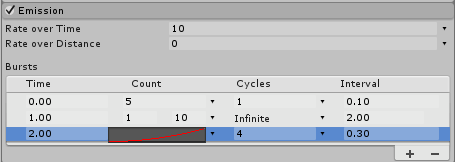

# Emission 模块

此模块中的属性会影响[粒子系统](PartSysWhatIs.html)发射的速率和时间。

 

## 属性

| **属性**| **功能** |
|:---|:---| 
| __Rate over Time__| 每个时间单位发射的粒子数。 |
| __Rate over Distance__| 每个移动距离单位发射的粒子数。 |
| __Bursts__| 爆发是指生成粒子的事件。通过这些设置可允许在指定时间发射粒子。 |
|&nbsp;&nbsp;&nbsp;&nbsp;*Time*| 设置发射爆发粒子的时间（粒子系统开始播放后的秒数）。 |
|&nbsp;&nbsp;&nbsp;&nbsp;*Count*| 设置可能发射的粒子数的值。 |
|&nbsp;&nbsp;&nbsp;&nbsp;*Cycles*| 设置播放爆发次数的值。 |
|&nbsp;&nbsp;&nbsp;&nbsp;*Interval*| 设置触发每个爆发周期的间隔时间（以秒为单位）的值。 |

## 详细信息

根据曲线，发射速率可以是恒定的，也可以在系统的生命周期内变化。如果激活 __Rate over Distance__ 模式，则父对象移动的每个距离单位将释放一定数量的粒子。此模式对于模拟实际由对象运动产生的粒子非常有用（例如，泥路上车轮留下的尘土）。

如果激活 __Rate over Time__ 模式，则无论父对象如何移动，每秒都会发射所需数量的粒子。此外，还可添加在特定时间出现的额外粒子爆发（例如，蒸汽火车烟囱产生一股股的烟雾）。
