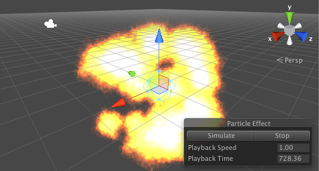

#简单爆炸

可使用粒子系统来创建令人信服的爆炸效果，但动态性可能比最初看起来要复杂一些。爆炸的核心就是向外爆发的大量粒子，可以应用一些简单的修改使效果显得更真实。




##粒子的时间轴

一次简单爆炸会产生在各个方向迅速向外扩展的一团火焰。最初爆发有很多能量，因此温度非常高（即亮度高）并且移动得非常快。此能量迅速消散，导致火焰膨胀速度减慢并且温度降低（即亮度降低）。最后，随着所有燃料燃尽，火焰将消失并很快完全消失。

爆炸粒子的生命周期通常较短，可以在该生命周期内改变几种不同的属性来模拟效果。粒子将以非常快的速度开始移动，但随着从爆炸中心移开，其速度应该会大大降低。此外，颜色应该从最开始的明亮逐渐变暗，并最终淡化为透明状态。最后，在粒子的生命周期内逐渐减小其大小将产生火焰随着燃料耗尽而消散的效果。


##实现

从默认粒子系统对象（菜单：__GameObject &gt; Effects &gt; Particle System__）开始，选择 _Shape_ 模块，并将发射器形状设置为小型_球体 (Sphere)_，比如半径约为 0.5 个单位。标准资源中的粒子包括一种名为 __ParticleFireball__ 的材质，这种材质非常适合用于爆炸（菜单：__Assets > Import Package > ParticleSystems__）。可以使用 _Renderer_ 模块为系统设置此材质。
在打开 _Renderer_ 后，还应禁用 _Cast Shadows_ 和 _Receive Shadows_，因为爆炸火焰应该发出光而不是接受光。

在此阶段，系统看起来像是从中心点抛出的许多小火球。当然，爆炸应该同时产生大量粒子爆发的效果。在 _Emission_ 模块中，可将 _Rate_ 值设置为零，并在时间为零的位置添加一个粒子 _Burst_ 状态。爆发中的粒子数量取决于需要的爆炸规模和强度，但一般在开始时使用大约五十个粒子是一种不错的选择。设置好爆发后，系统现在开始看起来很像爆炸了，但速度相当缓慢，火焰似乎长时间停留不动。在粒子系统模块（名称与游戏对象相同，例如“Explosion”）中，请将系统的 _Duration_ 和粒子的 _Start Lifetime_ 均设置为两秒。

此外还可以使用 _Size Over Lifetime_ 模块来创建随着燃料耗尽而变化的火焰效果。应使用“斜降”(ramp down) 预设来设置大小曲线（即，大小从 100% 开始并减小到零）。要使火焰变暗和淡化，请启用 _Color Over Lifetime_ 模块，并将渐变设置为在左侧以白色开始，然后在右侧以黑色结束。_Fire Add_ 材质使用附加着色器进行渲染，因此颜色属性的暗度也控制着粒子的透明度；随着颜色逐渐变黑，火焰将变得完全透明。而且，附加材质允许粒子的亮度在粒子彼此重叠产生时“加”在一起。当粒子全部靠近到一起时，这种功能有助于进一步增强在爆炸开始时出现的明亮闪光效果。

到目前为止，爆炸初步成形，但看起来好像是在太空中发生爆炸。粒子首先被发射出来，然后在消失之前以恒定速度长距离行进。如果游戏设定是在太空中，那么这种效果是很贴切的。但是，在大气中发生的爆炸会被周围的空气减缓和减弱。启用 _Limit Velocity Over Lifetime_ 模块，然后将 _Speed_ 设置为大约 3.0 并将 _Dampen_ 分数设置为大约 0.4，这样应该会看到爆炸发生后逐渐失去一些能量。

最后要注意的是，当粒子从爆炸中心移开时，它们各自的形状变得更容易识别。也就是说，此时会看到所有粒子具有相同的大小和相同旋转，感觉很明显每个粒子重复使用了相同的图形。为了避免这种情况，一种简单方法是在粒子生成时为粒子的大小和旋转添加一些随机变化。在检视面板顶部的粒子系统模块中，单击 _Start Size_ 和 _Start Rotation_ 属性右侧的小箭头，并将这两者均设置为 _Random Between Two Constants_。对于旋转，请将两个值设置为 0 和 360（即完全随机旋转）。对于大小，请将值设置为 0.5 和 1.5 以便呈现一些变化，而不会有太多巨大或微小粒子的风险。现在将会看到，粒子图形的重复问题现在已经不显示。


##用途

在测试过程中，开启 _Looping_ 属性很有用，这样可以反复看到爆炸，但在已完成的游戏中，应关闭该属性，使爆炸只发生一次。为有可能爆炸的对象（例如油箱）设计爆炸时，需要将粒子系统组件添加到该对象并禁用 _Play On Awake_ 属性。然后，可根据需要从脚本中启用爆炸。

````
	void Explode() {
			var exp = GetComponent<ParticleSystem>();
			exp.Play();
			Destroy(gameObject, exp.duration);
		}
````

在其他一些情况下，爆炸发生在撞击点。如果爆炸来自对象（例如手榴弹），则可在延迟一段时间后或在与目标接触时调用上述 `Explode` 函数。

````
	// 手榴弹经过一段延迟时间后爆炸。
		public float fuseTime;

		void Start() {
			Invoke("Explode", fuseTime);
		}


		// 手榴弹在撞击时爆炸。
		void OnCollisionEnter(Collision coll) {
			Explode();
		}
````

如果爆炸来自实际上并未在游戏中表示出来的对象（例如，飞行速度太快而无法看到的飞弹），可在适当的位置实例化爆炸。例如，可以确定[射线投射](../ScriptReference/Physics.Raycast.html)的接触点。

````
	// 在爆炸对象上。
		void Start() {
			var exp = GetComponent<ParticleSystem>();
			exp.Play();
			Destroy(gameObject, exp.duration);
		}

	
		//可能的飞弹脚本。
		public GameObject explosionPrefab;

		void Update() {
			RaycastHit hit;

			if (Physics.Raycast (Camera.main.ScreenPointToRay (Input.mousePosition), out hit)) {
				Instantiate (explosionPrefab, hit.point, Quaternion.identity);
			}
		}
````

##思路拓展

此处介绍的爆炸是非常基本的，但可对其进行各方面的修改，从而在游戏中获得所需的确切效果。

使用的粒子图形将在很大程度上影响玩家对爆炸的“解读”。出现大量可独立识别的小型火焰表明抛出了燃烧碎片。不完全分离的较大粒子看起来更像是被破坏的油箱激发的火球。通常，需要一起更改多个属性才能达到效果。例如，火球会在消失之前持续更长时间并且膨胀更少，而剧烈的爆发可能会使燃烧碎片散开相当远的距离。

此处一些属性设置为随机值，但是其他许多属性有 _Random Between Two Constants/Curves_ 选项，因此可通过各种方式添加变化。改变大小和旋转有助于避免最明显的粒子重复效果，但也可以考虑在 _Start Delay_、_Start Lifetime_ 和 _Start Speed_ 属性中添加一些随机性。少量的变化有助于使爆炸看起来更像是一种“自然”和不可预测的效果，而非受控的机械过程。较大的变化表明是“脏”爆炸。例如，改变 _Start Delay_ 将产生不再剧烈而爆发速度更慢的爆炸，比如可能是因为车辆中的油箱被单独点燃。

---

* <span class="page-edit">2017-09-19  Page amended with limited [editorial review](DocumentationEditorialReview.html)
</span>

* <span class="page-history">在 Unity 4.6 中更改了 GameObject 菜单</span>
