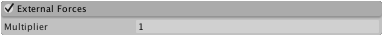

#External Forces 模块

此属性可修改__风区__对系统发射的粒子的影响。

 

##属性

|**_属性_** |**_功能_** |
|:---|:---|
|__Multiplier__ |应用于风区外力的比例值。 |

##详细信息

__地形__可添加_风区_来影响树在景观中的运动。启用此部分的功能允许风区吹动系统发射的粒子。通过 _Multiplier_ 值可调整风对粒子的影响，因为风对粒子的吹动作用通常比树枝更强烈。
