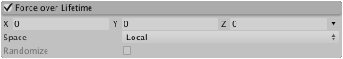

#Force Over Lifetime 模块

通过此模块中指定的力（例如风或吸力）可对粒子加速。

 

##属性

|**_属性_** |**_功能_** |
|:---|:---|
|__X, Y, Z__ |在 X、Y 和 Z 轴上施加到每个粒子的力。 |
|__Space__ |选择是在局部空间还是在世界空间中施力。 |
|__Randomize__ |使用 Two Constants 或 Two Curves 模式时，此属性会导致在每个帧上在定义的范围内选择新的作用力方向。因此会产生更动荡、更不稳定的运动。 |

##详细信息

流体在移动时经常受到力的影响。例如，烟雾从火中升起时因周围热空气的拉升作用而略微加速。使用曲线在粒子生命周期内进行力的控制，可实现微妙的效果。根据前面的例子，烟雾最初会向上加速，但随着上升的空气逐渐冷却，力会减弱。从火焰冒出的浓烟可能最初会加速，然后随着烟雾的蔓延而减速，如果持续很长时间，甚至可能开始落到地上。
