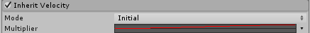

# Inherit Velocity 模块

此模块控制粒子的速度如何随时间推移而受到其父对象移动的影响。

 

## 属性

| **属性**| **功能** |
|:---|:---| 
| __Mode__| 指定如何将发射器速度应用于粒子 |
| &nbsp;&nbsp;&nbsp;&nbsp;Current| 发射器的当前速度将应用于每一帧上的所有粒子。例如，如果发射器减速，所有粒子也将减速。 |
| &nbsp;&nbsp;&nbsp;&nbsp;Initial| 每个粒子出生时将施加一次发射器的速度。粒子出生后对发射器速度的任何改变都不会影响该粒子。 |
| __Multiplier__| 粒子应该继承的发射器速度的比例。 |

## 详细信息

这种效果对于从移动对象发射粒子非常有用，例如汽车产生的尘云、火箭产生的烟雾、蒸汽火车烟囱产生的蒸汽，或者粒子最初应以所在对象的速度百分比移动的任何情况。仅当 __Simulation Space__ 在[主模块](PartSysMainModule.html)中设置为 __World__ 时，此模块才对粒子有影响。

此外也可以使用曲线来影响随时间变化的效果。例如，可对新创建的粒子施加强烈的吸力，使吸力随时间推移而减少。这对于蒸汽火车烟雾可能有用，因为蒸汽火车烟雾会随着时间的推移而缓慢漂移并在发出后停止跟随火车。
