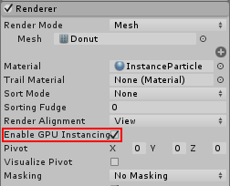
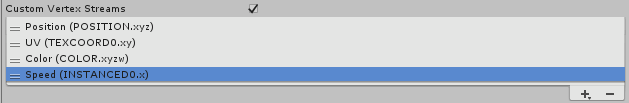

# 粒子系统 GPU 实例化

与 CPU 渲染相比，GPU 实例化可带来巨大的性能提升。如果希望粒子系统渲染__网格__粒子（而不是使用渲染__公告牌__粒子的默认[渲染模式](PartSysRendererModule.html)），则可使用实例化功能。

为了能够对粒子系统使用 GPU 实例化，请执行以下操作：

* 将粒子系统的[渲染器](PartSysRendererModule.html)模式设置为 __Mesh__

* 对支持 GPU 实例化的[渲染器](PartSysRendererModule.html)材质使用一个着色器

* 在支持 GPU 实例化的平台上运行项目

要为粒子系统启用 GPU 实例化，必须在粒子系统的 __Renderer__ 模块中启用 __Enable GPU Instancing__ 复选框。



Unity 带有一个支持 GPU 实例化的内置粒子着色器，但默认的粒子材质不使用该着色器，因此必须更改此设置以使用 GPU 实例化。支持 GPU 实例化的粒子着色器名为 __Particles/Standard Surface__。要使用它，必须创建自己的新__材质__，并将材质的着色器设置为 __Particles/Standard Surface__。然后，必须将此新材质分配给粒子系统[渲染器](PartSysRendererModule.html)模块中的材质字段。


如果要为粒子使用其他不同的着色器，必须使用“#pragma 目标 4.5”或更高版本。有关更多详细信息，请参阅[着色器编译目标](SL-ShaderCompileTargets.html)。此要求高于 Unity 中的常规 GPU 实例化，因为粒子系统将其所有实例数据写入单个大缓冲区，而不是将实例化分解为多个绘制调用。

## 自定义着色器示例

也可以编写使用 GPU 实例化的自定义着色器。有关更多信息，请参阅以下部分：

* [表面着色器中的粒子系统 GPU 实例化](#SurfaceShader)
* [自定义着色器中的粒子系统 GPU 实例化](#CustomShader)
* [自定义粒子系统使用的实例数据](#CustomVertexStreams)（与自定义顶点流一起使用）

<a name="SurfaceShader"></a> 

### 表面着色器中的粒子系统 GPU 实例化

以下是使用粒子系统 GPU 实例化的表面着色器的完整运行示例：

````

Shader "Instanced/ParticleMeshesSurface" {
	Properties {
		_Color ("Color", Color) = (1,1,1,1)
		_MainTex ("Albedo (RGB)", 2D) = "white" {}
		_Glossiness ("Smoothness", Range(0,1)) = 0.5
		_Metallic ("Metallic", Range(0,1)) = 0.0
	}
	SubShader {
		Tags { "RenderType"="Opaque" }
		LOD 200

		CGPROGRAM
		// 基于物理的标准光照模型，并对所有光照类型启用阴影
		// 并通过实例化支持来生成阴影 pass
		#pragma surface surf Standard fullforwardshadows addshadow vertex:vert
		// 启用此着色器的实例化
		#pragma multi_compile_instancing
		#pragma instancing_options procedural:vertInstancingSetup
		#pragma exclude_renderers gles
		#include "UnityStandardParticleInstancing.cginc"
		sampler2D _MainTex;
		struct Input {
			float2 uv_MainTex;
			fixed4 vertexColor;
		};
		fixed4 _Color;
		half _Glossiness;
		half _Metallic;
		void vert (inout appdata_full v, out Input o)
		{
			UNITY_INITIALIZE_OUTPUT(Input, o);
            vertInstancingColor(o.vertexColor);
            vertInstancingUVs(v.texcoord, o.uv_MainTex);
		}

		void surf (Input IN, inout SurfaceOutputStandard o) {
			// Albedo 来自颜色着色的纹理
			fixed4 c = tex2D (_MainTex, IN.uv_MainTex) * IN.vertexColor * _Color;
			o.Albedo = c.rgb;
			// Metallic 和 Smoothness 来自滑动条变量
			o.Metallic = _Metallic;
			o.Smoothness = _Glossiness;
			o.Alpha = c.a;
		}
		ENDCG
	}
	FallBack "Diffuse"
}
````

上面的示例与常规[表面着色器](SL-SurfaceShaders.html)之间存在许多微小差异，正是这些不同之处使得表面着色器可以使用粒子实例化。

首先，必须添加以下两行以启用程序实例化 (Procedural Instancing)，并指定内置顶点设置函数。此函数位于 UnityStandardParticleInstancing.cginc 中，用于加载每个实例（每个粒子）的位置数据：

````
		#pragma instancing_options procedural:vertInstancingSetup
				#include "UnityStandardParticleInstancing.cginc"
````

此示例中的其他修改是对顶点函数的修改，此函数增加了两行来应用每个实例的属性，具体而言就是粒子颜色和[纹理帧动画](PartSysTexSheetAnimModule.html)纹理坐标：

````
            vertInstancingColor(o.vertexColor);
                        vertInstancingUVs(v.texcoord, o.uv_MainTex);
````

<a name="CustomShader"></a> 

### 自定义着色器中的粒子系统 GPU 实例化

以下是使用粒子系统 GPU 实例化的自定义着色器的完整运行示例。此自定义着色器添加了标准粒子着色器所不具备的功能：[纹理帧动画](PartSysTexSheetAnimModule.html)的各个帧之间的淡入淡出。

````
Shader "Instanced/ParticleMeshesCustom"
{
    Properties
    {
        _MainTex("Albedo", 2D) = "white" {}
        [Toggle(_TSANIM_BLENDING)] _TSAnimBlending("Texture Sheet Animation Blending", Int) = 0
    }
    SubShader
    {
        Tags{ "RenderType" = "Opaque" }
        LOD 100
        Pass
        {
            CGPROGRAM
            #pragma vertex vert
            #pragma fragment frag
            #pragma multi_compile __ _TSANIM_BLENDING
            #pragma multi_compile_instancing
            #pragma instancing_options procedural:vertInstancingSetup
            #include "UnityCG.cginc"
            #include "UnityStandardParticleInstancing.cginc"
            struct appdata
            {
                float4 vertex : POSITION;
                fixed4 color : COLOR;
                float2 texcoord : TEXCOORD0;
                UNITY_VERTEX_INPUT_INSTANCE_ID
            };
            struct v2f
            {
                float4 vertex : SV_POSITION;
                fixed4 color : COLOR;
                float2 texcoord : TEXCOORD0;
# ifdef _TSANIM_BLENDING
                float3 texcoord2AndBlend : TEXCOORD1;   
# endif
            };
            sampler2D _MainTex;
            float4 _MainTex_ST;
            fixed4 readTexture(sampler2D tex, v2f IN)
            {
                fixed4 color = tex2D(tex, IN.texcoord);
# ifdef _TSANIM_BLENDING
                fixed4 color2 = tex2D(tex, IN.texcoord2AndBlend.xy);
                color = lerp(color, color2, IN.texcoord2AndBlend.z);
# endif
                return color;
            }
            v2f vert(appdata v)
            {
                v2f o;
                UNITY_SETUP_INSTANCE_ID(v);
                o.color = v.color;
                o.texcoord = v.texcoord;
                vertInstancingColor(o.color);
# ifdef _TSANIM_BLENDING
                vertInstancingUVs(v.texcoord, o.texcoord, o.texcoord2AndBlend);
# else
                vertInstancingUVs(v.texcoord, o.texcoord);
# endif
                o.vertex = UnityObjectToClipPos(v.vertex);
                return o;
            }
            fixed4 frag(v2f i) : SV_Target
            {
                half4 albedo = readTexture(_MainTex, i);
                return i.color * albedo;
            }
            ENDCG
        }
    }
}
````

此示例包含与表面着色器相同的用于加载位置数据的设置代码：

````
		#pragma instancing_options procedural:vertInstancingSetup
				#include "UnityStandardParticleInstancing.cginc"
````

对顶点函数的修改也与表面着色器非常相似：

````
                vertInstancingColor(o.color);
                # ifdef _TSANIM_BLENDING
                                vertInstancingUVs(v.texcoord, o.texcoord, o.texcoord2AndBlend);
                # else
                                vertInstancingUVs(v.texcoord, o.texcoord);
                # endif
````

与上面的第一个示例相比，这里唯一的区别是纹理帧动画混合。这意味着，着色器需要一组额外的纹理坐标来读取纹理帧动画的两个帧而不是一个帧，然后将它们混合在一起。

最后，片元着色器读取纹理并计算最终颜色。

<a name="CustomVertexStreams"></a> 

### 粒子系统 GPU 实例化与自定义顶点流

上面的示例仅使用粒子的默认顶点流设置。这包括位置、法线、颜色和一个 UV。但是，通过使用[自定义顶点流](PartSysVertexStreams.html)，可以将其他数据发送到着色器，例如速度、旋转和大小。

在接下来这一个示例中，着色器用于显示特殊效果，使速度更快的粒子看起来更亮，更慢的粒子更暗。有一些额外的代码用于根据速度来提高粒子的亮度（使用速度顶点流）。此外，因为此着色器假定该效果不使用纹理帧动画，所以从自定义流结构中将其省略。

以下是完整的着色器：

````
Shader "Instanced/ParticleMeshesCustomStreams"
{
    Properties
    {
        _MainTex("Albedo", 2D) = "white" {}
    }
    SubShader
    {
        Tags{ "RenderType" = "Opaque" }
        LOD 100
        Pass
        {
            CGPROGRAM
# pragma exclude_renderers gles
            #pragma vertex vert
            #pragma fragment frag
            #pragma multi_compile_instancing
            #pragma instancing_options procedural:vertInstancingSetup
            #define UNITY_PARTICLE_INSTANCE_DATA MyParticleInstanceData
            #define UNITY_PARTICLE_INSTANCE_DATA_NO_ANIM_FRAME
            struct MyParticleInstanceData
            {
                float3x4 transform;
                uint color;
                float speed;
            };
            #include "UnityCG.cginc"
            #include "UnityStandardParticleInstancing.cginc"
            struct appdata
            {
                float4 vertex : POSITION;
                fixed4 color : COLOR;
                float2 texcoord : TEXCOORD0;
                UNITY_VERTEX_INPUT_INSTANCE_ID
            };
            struct v2f
            {
                float4 vertex : SV_POSITION;
                fixed4 color : COLOR;
                float2 texcoord : TEXCOORD0;
            };
            sampler2D _MainTex;
            float4 _MainTex_ST;
            v2f vert(appdata v)
            {
                v2f o;
                UNITY_SETUP_INSTANCE_ID(v);
                o.color = v.color;
                o.texcoord = v.texcoord;
                vertInstancingColor(o.color);
                vertInstancingUVs(v.texcoord, o.texcoord);
# if defined(UNITY_PARTICLE_INSTANCING_ENABLED)
                UNITY_PARTICLE_INSTANCE_DATA data = unity_ParticleInstanceData[unity_InstanceID];
                o.color.rgb += data.speed;
# endif
                o.vertex = UnityObjectToClipPos(v.vertex);
                return o;
            }
            fixed4 frag(v2f i) : SV_Target
            {
                half4 albedo = tex2D(_MainTex, i.texcoord);
                return i.color * albedo;
            }
            ENDCG
        }
    }
}

````


此着色器包含 `UnityStandardParticleInstancing.cginc`（其中含有未使用自定义顶点流时的默认实例化数据布局）。因此，在使用自定义流时，必须重载该头部中定义的某些默认值。这些重载必须位于包含 (include) **之前**。上面的示例设置了以下自定义重载：

首先，有一行代码使用 UNITY_PARTICLE_INSTANCE_DATA 宏，告诉 Unity 为自定义流数据使用名为“MyParticleInstanceData”的自定义结构：

````
            #define UNITY_PARTICLE_INSTANCE_DATA MyParticleInstanceData
````

其次，另一个 define 语句告诉实例化系统在此着色器中不需要动画帧流 (Anim Frame Stream)，因为此示例中的效果不适用于纹理帧动画：

````
            #define UNITY_PARTICLE_INSTANCE_DATA_NO_ANIM_FRAME
````

第三，声明自定义流数据的结构：

````
            struct MyParticleInstanceData
                        {
                            float3x4 transform;
                            uint color;
                            float speed;
                        };
````

这些重载全部都是在 `UnityStandardParticleInstancing.cginc` 之前包含进来的，因此着色器不会对这些定义使用自己的默认值。

编写结构时，变量必须与粒子系统渲染器模块中检视面板 (Inspector) 中列出的顶点流相匹配。这意味着必须在渲染器模块 UI 中选择要使用的流，然后以相同的顺序将它们添加到自定义流数据结构中的变量定义，从而使它们匹配：



第一项 (Position) 是必填项，因此无法将其删除。可使用加号和减号按钮自由添加/删除其他条目，从而自定义顶点流数据。

列表中以 __INSTANCED__ 结尾的条目包含实例数据，因此必须将它们包含在粒子实例数据结构中。直接附加到单词 __INSTANCED__ 后面的数字（例如 __INSTANCED0__ 中的 0 和 __INSTANCED1__ 中的 1）表示变量必须在结构中的初始“transform”变量*之后*出现的顺序。尾部字母（.x、.xy、.xyz 或 .xyzw）表示变量的类型，并映射到着色器代码中的 float、float2、float3 和 float4 变量类型。

可在粒子实例数据结构中忽略在列表中显示但结尾*_没有_*单词 __INSTANCED__ 的任何其他顶点流数据，因为它不是着色器要处理的实例化数据。此数据属于源网格，例如 UV、法线和切线。

完成我们的示例的最后一步是将速度应用于顶点着色器内的粒子颜色：

````
# if defined(UNITY_PARTICLE_INSTANCING_ENABLED)
                UNITY_PARTICLE_INSTANCE_DATA data = unity_ParticleInstanceData[unity_InstanceID];
                o.color.rgb += data.speed;
# endif
````

必须将所有实例化代码包装在 UNITY_PARTICLE_INSTANCING_ENABLED 的检查中，以便在未使用实例化时进行编译。

此时，如果要将数据传递给片元着色器，可将数据写入 v2f 结构，就像对任何其他着色器数据的处理一样。

此示例描述了如何修改自定义着色器以便用于自定义顶点流，但可以对表面着色器应用完全相同的方法来实现相同的功能。


---
* <span class="page-edit">2018-03-28  Page published with [editorial review](DocumentationEditorialReview.html)
</span>

* <span class="page-history">在 Unity [2018.1](../Manual/30_search.html?q=newin20181) 版中添加了粒子系统 GPU 实例化 <span class="search-words">NewIn20181</span></span>


