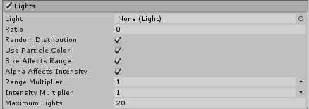

# Lights 模块

使用此模块可将实时光照添加到一部分粒子。

 

## 属性

| 属性| 功能 |
|:---|:---| 
| __Light__| 分配一个[光照](LightingInUnity.html)预制件来描述粒子光照外观。 |
| __Ratio__| 一个介于 0 和 1 之间的值，表示将接受光照的粒子的比例。 |
| __Random Distribution__| 选择是随机分配还是定期分配光照。设置为 true 时，每个粒子都有根据 Ratio 值随机接受光照的机会。较高的值可增加粒子接受光照的概率。设置为 false 时，由 Ratio 控制新创建的粒子接受光照的频率（例如，每第 N 个粒子将接受光照）。 |
| __Use Particle Color__| 设置为 True 时，光照的最终颜色将通过其附加到的粒子的颜色进行调制。如果设置为 False，则使用光照颜色而不进行任何修改。 |
| __Size Affects Range__| 启用此属性后，在光照中指定的__范围 (Range)__ 将受到粒子大小的影响。 |
| __Alpha Affects Intensity__| 启用此属性后，光照的__强度 (Intensity)__ 将受到粒子 Alpha 值的影响。 |
| __Range Multiplier__| 使用此曲线在粒子的生命周期内将一个自定义乘数应用于光照范围。 |
| __Intensity Multiplier__| 使用此曲线在粒子的生命周期内将一个自定义乘数应用于光照强度。 |
| __Maximum Lights__| 使用此设置可避免意外创建大量光照，大量光照可能会使 Editor 无响应或使应用程序运行速度非常慢。 |

## 详细信息

Lights 模块是一种为粒子效果添加实时光照的快速方法。此模块可用于使系统将光照投射到周围环境，例如可用于火、烟花或闪电。此外，还可通过该模块让光照从所附着的粒子继承各种属性。这样可以使粒子效果本身的发光更加逼真。例如，为了实现此目的，可使光照随其粒子淡出并使它们共享相同的颜色。

该模块可以非常快速地创建大量实时光照，但实时光照有很高的性能成本，尤其是在前向渲染模式下。如果光照还要投射阴影，性能成本会更高。为了防止意外调整发射速率并因此导致创建数千个实时光照，应使用 Maximum Lights 属性。创建的光照数量超过目标硬件的管理能力可能会导致速度降低和无响应的问题。
