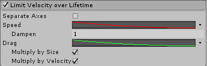

#Limit Velocity Over Lifetime 模块

此模块控制粒子的速度在其生命周期内如何降低。

 

##属性

|**属性** |**功能** |
|:---|:---|
| __Separate Axes__ | 将轴拆分为单独的 X、Y 和 Z 分量。 |
|__Speed__ |设置粒子的速度限制。 |
|__Space__ |选择速度限制是适用局部空间还是世界空间。仅当启用了 __Separate Axes__ 时，此选项才可用。 |
|__Dampen__ |当粒子速度超过速度限制时，粒子速度降低的比例。 |
|__Drag__ |对粒子速度施加线性阻力。 |
|__Multiply by Size__ |启用此属性后，较大的粒子会更大程度上受到阻力系数的影响。 |
|__Multiply by Velocity__ |启用此属性后，较快的粒子会更大程度上受到阻力系数的影响。 |

##详细信息

该模块非常适合用于模拟会减慢粒子速度的空气阻力，特别是在使用下降曲线随时间推移而降低速度限制的情况下。例如，爆炸或烟花最初以极快的速度爆发，但是发射的粒子在穿过空气的过程中会迅速减速。

__Drag__ 选项通过提供基于粒子大小和速度施加不同阻力的选项，提供在物理上更加精确的空气阻力模拟。

---

*  2017-09-05  Page amended with [editorial review](DocumentationEditorialReview.html)

*  在 Unity [2017.2](https://docs.unity3d.com/2017.2/Documentation/Manual/30_search.html?q=newin20172) 中添加了 Drag、Multiply by Size 和 Multiply by Velocity NewIn20172
