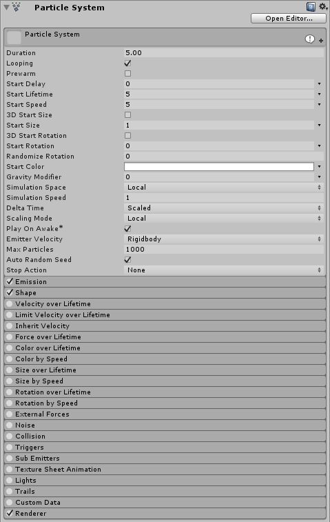

#粒子系统 (Particle System) 主模块

Particle System 模块包含影响整个系统的全局属性。大多数这些属性用于控制新创建的粒子的初始状态。要展开和折叠主模块，请单击 Inspector 窗口中的 Particle System 栏。

 

该模块的名称在 Inspector 中显示为[粒子系统 (Particle System)](class-ParticleSystem.html) 组件所附加到的游戏对象的名称。

##属性

| **属性** | **功能** |
|:---|:---| 
| __Duration__ | 系统运行的时间长度。 |
| __Looping__ | 如果启用此属性，系统将在其持续时间结束时再次启动并继续重复该循环。 |
| __Prewarm__ | 如果启用此属性，系统将初始化，就像已经完成一个完整周期一样（仅当 __Looping__ 也启用时才有效）。 |
| __Start Delay__ | 启用此属性后，系统开始发射前将延迟一段时间（以秒为单位）。 |
| __Start Lifetime__ | 粒子的初始生命周期。 |
| __Start Speed__ | 每个粒子在适当方向的初始速度。 |
| __3D Start Size__ | 如果要分别控制每个轴的大小，请启用此属性。 |
| __Start Size__ | 每个粒子的初始大小。 |
| __3D Start Rotation__ | 如果要分别控制每个轴的旋转，请启用此属性。 |
| __Start Rotation__ | 每个粒子的初始旋转角度。 |
| __Randomize Rotation Direction__ | 使一些粒子以相反的方向旋转。 |
| __Start Color__ | 每个粒子的初始颜色。 |
| __Gravity Modifier__ | 缩放 Physics Manager 中设置的重力值。值为零会关闭重力。 |
| __Simulation Space__ | 控制粒子的运动位置是在父对象的局部空间中（因此与父对象一起移动）、在世界空间中还是相对于自定义对象（与您选择的自定义对象一起移动）。 |
| __Simulation Speed__ | 调整整个系统更新的速度。 |
| __Delta Time__ | 在 __Scaled__ 和 __Unscaled__ 之间进行选择，其中的 __Scaled__ 使用时间管理器 (Time Manager) 中的 __Time Scale__ 值，而 __Unscaled__ 将忽略该值。此属性对于出现在暂停菜单 (Pause Menu) 上的粒子系统非常有用。 |
| __Scaling Mode__ | 选择如何使用变换中的缩放。设置为 __Hierarchy__、__Local__ 或 __Shape__。Local 仅应用粒子系统变换缩放，忽略任何父级。Shape 模式将缩放应用于粒子起始位置，但不影响粒子大小。 |
| __Play on Awake__ | 如果启用此属性，则粒子系统会在创建对象时自动启动。 |
| __Emitter Velocity__ | 选择粒子系统如何计算 Inherit Velocity 和 Emission 模块使用的速度。系统可使用刚体组件（如果存在）或通过跟踪变换组件的移动情况来计算速度。 |
| __Max Particles__ | 系统中同时允许的最多粒子数。如果达到限制，则移除一些粒子。 |
| __Auto Random Seed__ | 如果启用此属性，则每次播放时粒子系统看起来都会不同。设置为 false 时，每次播放时系统都完全相同。 |
| __Random Seed__ | 禁用自动随机种子时，此值用于创建唯一的可重复效果。 |
| __Stop Action__ | 当属于系统的所有粒子都已完成时，可使系统执行某种操作。当一个系统的所有粒子都已死亡，并且系统存活时间已超过 Duration 设定的值时，判定该系统已停止。对于循环系统，只有在通过脚本停止系统时才会发生这种情况。 |
|&nbsp;&nbsp;&nbsp;&nbsp;Disable | 禁用游戏对象。 |
|&nbsp;&nbsp;&nbsp;&nbsp;Destroy | 销毁游戏对象。 |
|&nbsp;&nbsp;&nbsp;&nbsp;Callback | 将 OnParticleSystemStopped 回调发送给附加到游戏对象的任何脚本。 |

##属性详细信息

系统会在特定时间内发射粒子，并可使用 __Looped__ 属性将其设置为连续发射。此设置可让您设置间歇或连续发射粒子；例如，一个对象可能以短暂间隔或以稳定流的形式发射烟雾。

__Start__ 属性（__lifetime__、__speed__、__size__、__rotation__ 和 __color__）可指定粒子发射时的状态。可使用 __3D Start Size__ 属性来独立指定粒子的宽度、高度和深度（请参阅下面的[非均匀粒子缩放](#scaling)）。

所有粒子系统都使用 __Physics__ 设置中指定的相同重力矢量。Gravity Multiplier 值可用于缩放重力，或者如果设置为零则将其关闭。

__Simulation Space__ 属性确定粒子是随粒子系统父对象移动、随自定义对象移动还是在游戏世界中独立移动。例如，像云，软管和喷火器这样的系统需要独立于其父游戏对象进行设置，因为即使生成它们的对象移动，它们往往也会留下在世界空间中持续存在的轨迹。另一方面，如果使用粒子在两个电极之间产生火花，则粒子应该随父对象一起移动。有关粒子如何跟随粒子变换的更高级控制方式，请参阅 [Inherit Velocity 模块](PartSysInheritVelocity.html)相关文档。

 
##非均匀粒子缩放

3D Start Size 属性允许您独立指定粒子的宽度、高度和深度。在粒子系统__主__模块中，选中 __3D Start Size__ 复选框，然后输入粒子的初始 x（宽度）、y（高度）和 z（深度）的值。请注意，z（深度）仅适用于 3D 网格粒子。此外，还可在两个常量或曲线之间的范围内为这些属性设置随机值。

您可以在粒子系统__主__模块中设置粒子的初始大小，并使用 __Size over Lifetime__ 模块中的 __Separate Axes__ 选项设置粒子在其生命周期内的大小。此外，还可使用 __Size by Speed__ 模块中的 __Separate Axes__ 选项设置粒子的大小与其速度的关系。

  

-----

*  2017-05-31  Page amended with [editorial review](DocumentationEditorialReview.html)

*  在 Unity [2017.1](../Manual/30_search.html?q=newin20171) 中添加了 Simulation Speed、Delta Time 和 Emitter Velocity NewIn20171

*  在 Unity [2017.2](../Manual/30_search.html?q=newin20172) 中添加了 Stop Action 粒子系统属性 NewIn20172

