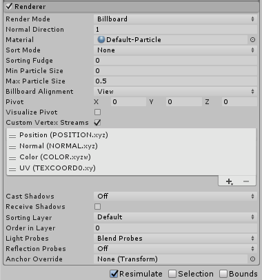

# Renderer 模块

Renderer 模块的设置决定了粒子的图像或[网格](class-Mesh.html)如何被其他粒子变换、着色和过度绘制。

 

## 属性

| **属性**| **功能** |
|:---|:---| 
| __Render Mode__| 如何从图形图像（或网格）生成渲染图像。请参阅下面的[详细信息](#Details)以了解更多信息。 |
|&nbsp;&nbsp;&nbsp;&nbsp;Billboard| 粒子始终面向摄像机。 |
|&nbsp;&nbsp;&nbsp;&nbsp;Stretched Billboard| 粒子面向摄像机，但会应用各种缩放（见下文）。 |
|&nbsp;&nbsp;&nbsp;&nbsp;&nbsp;&nbsp;&nbsp;&nbsp;Camera Scale| 根据摄像机运动拉伸粒子。将此值设置为 0 可禁用摄像机运动拉伸。 |
|&nbsp;&nbsp;&nbsp;&nbsp;&nbsp;&nbsp;&nbsp;&nbsp;Velocity Scale| 根据粒子速度按比例拉伸粒子。将此值设置为 0 可禁用基于速度的拉伸。 |
|&nbsp;&nbsp;&nbsp;&nbsp;&nbsp;&nbsp;&nbsp;&nbsp;Length Scale| 沿着粒子的速度方向根据粒子当前大小按比例拉伸粒子。将此值设置为 0 会使粒子消失，相当于 0 长度。 |
|&nbsp;&nbsp;&nbsp;&nbsp;Horizontal Billboard| 粒子平面与 XZ“地板”平面平行。 |
|&nbsp;&nbsp;&nbsp;&nbsp;Vertical Billboard| 粒子在世界 Y 轴上直立，但转向面向摄像机。 |
|&nbsp;&nbsp;&nbsp;&nbsp;Mesh| 从 3D 网格而非从纹理渲染粒子。 |
|&nbsp;&nbsp;&nbsp;&nbsp;None| 使用 [Trails](PartSysTrailsModule.html) 模块时，如果只想渲染轨迹并隐藏默认渲染，则可使用此属性。 |
| __Normal Direction__| 用于粒子图形的光照法线的偏差。值为 1.0 表示法线指向摄像机，而值为 0.0 表示法线指向屏幕中心（仅限公告牌模式）。 |
| __Material__| 用于渲染粒子的材质。 |
| __Trail Material__| 用于渲染粒子轨迹的材质。仅当启用了 __Trails__ 模块时，此选项才可用。 |
| __Sort Mode__| 绘制粒子（因此覆盖粒子）的顺序。可能的值为 __By Distance (from the Camera)__、__Oldest in Front__ 和 __Youngest in Front__。系统中的每个粒子都将根据此设置进行排序。 |
| __Sorting Fudge__| 粒子系统排序的偏差。较低的值会增加粒子系统在其他透明游戏对象（包括其他粒子系统）上绘制的相对几率。此设置仅影响整个系统在场景中的显示位置，而不会对系统中的单个粒子执行排序。 |
| __Min Particle Size__| 最小粒子大小（无论其他设置如何），表示为视口大小的一个比例。请注意，仅当 __Rendering Mode__ 设置为 __Billboard__ 时，才应用此设置。 |
| __Max Particle Size__| 最大粒子大小（无论其他设置如何），表示为视口大小的一个比例。请注意，仅当 __Rendering Mode__ 设置为 __Billboard__ 时，才应用此设置。 |
| __Render Alignment__| 使用下拉选单选择粒子公告牌面向的方向。 |
|&nbsp;&nbsp;&nbsp;&nbsp;View| 粒子面向摄像机平面。 |
|&nbsp;&nbsp;&nbsp;&nbsp;World| 粒子与世界轴对齐。 |
|&nbsp;&nbsp;&nbsp;&nbsp;Local| 粒子与游戏对象的变换组件对齐。|
|&nbsp;&nbsp;&nbsp;&nbsp;Facing| 粒子面向摄像机游戏对象的直接位置。 |
| __Enable GPU Instancing__| 控制是否要使用 GPU 实例化来渲染粒子系统。需要使用网格渲染模式并使用兼容的着色器。有关更多详细信息，请参阅[粒子网格 GPU 实例化](PartSysInstancing.html)。 |
| __Pivot__| 修改用作旋转粒子中心的轴心点。 |
| __Visualize Pivot__| 在 Scene 视图中预览粒子轴心点。 |
| __Custom Vertex Streams__| 配置材质的顶点着色器中可用的粒子属性。有关更多详细信息，请参阅[粒子顶点流](PartSysVertexStreams.html)。 |
| __Cast Shadows__| 如果启用此属性，阴影投射光源照在粒子系统上时将产生阴影。 |
|&nbsp;&nbsp;&nbsp;&nbsp;On| 选择 __On__ 启用阴影。  |
|&nbsp;&nbsp;&nbsp;&nbsp;Off| 选择 __Off__ 禁用阴影。 |
|&nbsp;&nbsp;&nbsp;&nbsp;Two-Sided| 选择 __Two Sided__ 允许从网格的任一侧投射阴影（这意味着不考虑背面剔除）。 |
|&nbsp;&nbsp;&nbsp;&nbsp;Shadows Only| 选择 __Shadows Only__ 使阴影可见，但网格本身不可见。 |
| __Receive Shadows__| 决定阴影是否可投射到粒子上。只有不透明材质才能接受阴影。 |
| __Sorting Layer__| 渲染器排序图层的名称。 |
| __Order in Layer__| 此渲染器在排序图层中的顺序。 |
| __Light Probes__| 基于探针的光照插值模式。 |
| __Reflection Probes__| 如果启用此属性，并且场景中存在反射探针，则会为此游戏对象拾取反射纹理，并将此纹理设置为内置的着色器 uniform 变量。 |
| __Anchor Override__| 使用[光照探针](LightProbes.html)或[反射探针](ReflectionProbes.html)系统时用变换来确定插值位置。 |

 
## 详细信息

__Render Mode__ 允许您在多个 2D 公告牌 (Billboard) 图形模式和网格 (Mesh) 模式之间进行选择。使用 3D 网格表示实体游戏对象（如岩石）时，它们可以为粒子提供额外的真实性，还可以改善云、火球和液体的体积感。使用 2D 公告牌图形时，不同的选项可用于不同的效果。

1.__Billboard 模式__适合用于表示从任何方向看起来大致相同的体积的粒子（例如云）。

2.__Horizontal Billboard__ 模式可在粒子覆盖地面时（例如目标指示器和魔法效果）或者是平行于地面飞行或浮动的扁平对象时（例如飞镖）使用。

3.__Vertical Billboard__ 模式使每个粒子保持直立并垂直于 XZ 平面，但允许粒子围绕其 y 轴旋转。使用正交摄像机并希望粒子大小保持一致时，此模式可能会有用。

4.__Stretched Billboard__ 模式通过与传统动画器使用的“拉伸或挤压”技术类似的方式突出粒子的表观速度。请注意，在 Stretched Billboard 模式下，粒子将看齐面向摄像机，并且还向粒子速度看齐。无论 Velocity Scale 值如何，都会发生此看齐；即使 Velocity Scale 设置为 0，此模式下的粒子仍然向速度看齐。

Normal Direction 可用于在扁平矩形公告牌上创建球形阴影。如果使用的材质将光照应用于粒子，此设置有助于创建 3D 粒子的视觉效果。此设置仅与 Billboard 渲染模式结合使用。

---
* 2018-03-28  Page published with [editorial review](DocumentationEditorialReview.html)

* 在 Unity 2018.1 中添加了 GPU 实例化
