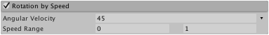

#Rotation By Speed 模块

在此模块中可设置粒子的旋转根据粒子速度（每秒的距离单位）变化。

 

##属性

|**_属性_** |**_功能_** |
|:---|:---|
|__Separate Axes__ |为每个旋转轴独立控制旋转。 |
|__Angular Velocity__ |旋转速度（以度/秒为单位）。 |
|__Speed Range__ |大小曲线映射到的速度范围的下限和上限（超出范围的速度将映射到曲线的端点）。 |

##详细信息

当粒子表示在地面上移动的固体对象（例如滑坡的岩石）时，可使用此属性。可根据速度按比例设置粒子的旋转，使粒子在表面上滚动的效果具有令人信服。

仅当速度处于其中一种曲线模式时才应用 Speed Range。快速的粒子将使用曲线右端的值旋转，而较慢的粒子将使用曲线左侧的值。
