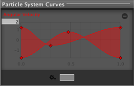

# Rotation Over Lifetime 模块

在模块中可配置粒子在移动时旋转。

 

## 属性

| 属性| 功能 |
|:---|:---| 
| __Separate Axes__| 允许根据每个轴指定旋转。启用此选项后，即可为 X、Y 和 Z 轴中的每个轴设置旋转。 |
| __Angular Velocity__| 旋转速度（以度/秒为单位）。请参阅下文以了解更多信息。 |

## 详细信息

当粒子表示小型实体对象（例如爆炸产生的碎片）时，此设置很有用。分配随机的旋转值将使效果比粒子在飞行时保持直立更加真实。随机旋转也有助于打破粒子形状相似的规律性（重复多次的相同纹理可能会非常明显）。

## 选项

角速度选项可在默认的恒定速度基础上进行更改。速度右侧的下拉选单可提供：

| 属性| 功能 |
|:---|:---| 
| __Constant__| 粒子旋转的速度，以度/秒为单位。 |
| __Curve__| 角速度可设定为在粒子的生命周期内变化。Inspector 底部会出现一个曲线编辑器，可用于控制粒子在整个生命周期内的速度变化情况（请参阅下图 A）。如果勾选了 Separate Axes 复选框，则可为每个 X、Y 和 Z 轴赋予曲线速度值。 |
| __Random Between Two Constants__| 角速度属性具有两个角度，允许在它们之间旋转。 |
| __Random Between Two Curves__| 角速度可设定为在粒子的生命周期（由曲线指定）内变化。在此模式下，两条曲线均为可编辑状态，每个粒子将在您定义的这两条曲线的范围之间选择一条随机曲线（请参阅下图 B）。 |

 

图 A：Z 轴角速度

 

图 B：两条曲线之间的角速度
