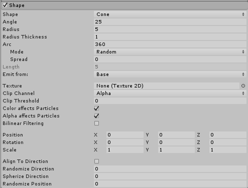
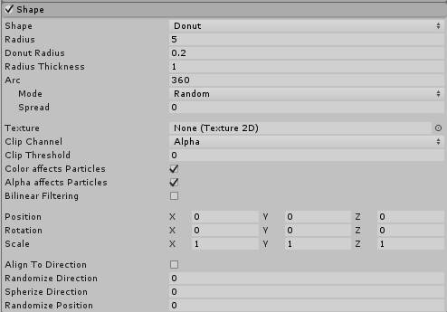

#粒子系统 Shape 模块

此模块用于定义可发射[粒子](PartSysWhatIs.html)的体积或表面以及起始速度的方向。__Shape__ 属性定义发射体积的形状，其余模块属性根据您选择的 Shape 值而变化。

所有形状（[Mesh](class-Mesh.html) 除外）都具有定义其大小的属性，例如 __Radius__ 属性。要编辑这些属性，请在 Scene 视图中拖动线框发射器形状上的控制柄。形状的选择会影响可发射粒子的区域，但也会影响粒子的初始方向。例如，__球体 (Sphere)__ 向外向各个方向发射粒子，__锥体 (Cone)__ 发射发散的粒子流，而__网格 (Mesh)__ 在垂直于表面的方向上发射粒子。

以下部分将详细介绍每种__形状__的属性。

##Shape 模块中的形状

###Sphere、Hemisphere

**注意**：Sphere 和 Hemisphere 具有相同的属性。

| __属性__| __功能__ |
|:---|:---|
| __Shape__| 发射体积的形状。 |
|     __Sphere__| 在所有方向均匀发射粒子。 |
|     __Hemisphere__| 在平面其中一面的所有方向均匀发射粒子。 |
| __Radius__| 形状的圆形半径。 |
| __Radius Thickness__| 发射粒子的体积比例。值为 0 表示从形状的外表面发射粒子。值为 1 表示从整个体积发射粒子。介于两者之间的值将使用体积的一定比例。 |
| __Texture__| 用于为粒子着色和丢弃粒子的纹理。 |
| __Clip Channel__| 纹理中用于丢弃粒子的通道。 |
| __Clip Threshold__| 将粒子映射到纹理上的位置时，丢弃像素颜色低于此阈值的所有粒子。 |
| __Color affects Particles__| 粒子颜色受纹理颜色影响。 |
| __Alpha affects Particles__| 粒子 Alpha 受纹理 Alpha 影响。 |
| __Bilinear Filtering__| 在读取纹理时，无论纹理尺寸如何，均组合 4 个相邻样本以获得更平滑的粒子颜色变化。 |
| __Position__| 将一个偏移应用于生成粒子的发射器形状。 |
| __Rotation__| 旋转生成粒子的发射器形状。 |
| __Scale__| 更改生成粒子的发射器形状的大小。 |
| __Align to Direction__| 根据粒子的初始行进方向定向粒子。如果想要模拟大块的汽车油漆在碰撞过程中飞出车身，此设置将非常有用。如果对该方向不太满意，也可通过在__主__模块中应用 __Start Rotation__ 值来覆盖该设置。 |
| __Randomize Direction__| 将粒子方向朝随机方向混合。设置为 0 时，此设置不起作用。设置为 1 时，粒子方向完全随机。 |
| __Spherize Direction__| 将粒子方向朝球面方向混合，从它们的[变换](http://mdeditor.infra.hq.unity3d.com/#class-Transform)中心向外行进。设置为 0 时，此设置不起作用。设置为 1 时，粒子方向从中心向外（与 Shape 设置为 Sphere 时的行为相同）。 |
| __Randomize Position__| 以随机量移动粒子，直至达到指定值。此属性设置为 0 时，此设置不起作用。任何其他值都会对粒子的生成位置应用一些随机性。 |

###Cone

| __属性__| __功能__ |
|:---|:---|
| __Shape__| 发射体积的形状。 |
|     __Cone__| 从锥体的底部或主体发射粒子。根据粒子与锥体中心线的距离按比例发射粒子。 |
| __Angle__| 锥体在其顶点处的角度。角度为 0 时产生圆柱体，角度为 90 度时产生圆盘。 |
| __Radius__| 形状的圆形半径。 |
| __Radius Thickness__| 发射粒子的体积比例。值为 0 表示从形状的外表面发射粒子。值为 1 表示从整个体积发射粒子。介于两者之间的值将使用体积的一定比例。 |
| __Arc__| 形成发射器形状的整圆的角部。 |
|     __Mode__| 定义 Unity 如何在形状的弧形周围生成粒子。当此选项设置为 __Random__ 时，Unity 在弧形周围随机生成粒子。如果使用 __Loop__，Unity 会在形状的弧形周围依序生成粒子，并在每个周期结束时循环回到起点。__Ping-Pong__ 与 __Loop__ 基本相同，不同之处在于每个连续循环的发生方向与上一个循环相反。最后，__Burst Spread__ 模式在形状周围均匀分布粒子生成位置。此模式可提供均匀的粒子扩散，不同于默认的随机化行为，默认情况下的粒子可能不均匀地聚集在一起。__Burst Spread__ 最适合与爆发发射一起使用。 |
|     __Spread__| 弧形周围可产生粒子的离散间隔。例如，值为 0 表示允许在弧形周围的任何位置生成粒子，值为 0.1 表示仅在形状周围以 10% 的间隔生成粒子。 |
|     __Speed__| 发射位置围绕弧形移动的速度。使用值字段旁边的小黑色下拉菜单将此属性设置为 __Constant__ 可使值始终保持不变，而设置为 __Curve__ 可使值随时间变化。仅当 __Mode__ 设置为 __Random__ 以外的其他设置时，此选项才可用 |
| __Length__| 锥体的长度。仅当 __Emit from:__ 属性设置为 __Volume__ 时，此选项才适用。 |
| __Emit from:__| 锥体发射粒子的部分：__Base__ 或 __Volume__。 |
| __Texture__| 用于为粒子着色和丢弃粒子的纹理。 |
| __Clip Channel__| 纹理中用于丢弃粒子的通道。 |
| __Clip Threshold__| 将粒子映射到纹理上的位置时，丢弃像素颜色低于此阈值的所有粒子。 |
| __Color affects Particles__| 粒子颜色受纹理颜色影响。 |
| __Alpha affects Particles__| 粒子 Alpha 受纹理 Alpha 影响。 |
| __Bilinear Filtering__| 在读取纹理时，无论纹理尺寸如何，均组合 4 个相邻样本以获得更平滑的粒子颜色变化。 |
| __Position__| 将一个偏移应用于生成粒子的发射器形状。 |
| __Rotation__| 旋转生成粒子的发射器形状。 |
| __Scale__| 更改生成粒子的发射器形状的大小。 |
| __Align to Direction__| 根据粒子的初始行进方向定向粒子。如果想要模拟大块的汽车油漆在碰撞过程中飞出车身，此设置将非常有用。如果对该方向不太满意，也可通过在主模块中应用 Start Rotation 值来覆盖该设置。 |
| __Randomize Direction__| 将粒子方向朝随机方向混合。设置为 0 时，此设置不起作用。设置为 1 时，粒子方向完全随机。 |
| __Spherize Direction__| 将粒子方向朝球面方向混合，从它们的变换中心向外行进。设置为 0 时，此设置不起作用。设置为 1 时，粒子方向从中心向外（与 Shape 设置为 Sphere 时的行为相同）。 |
| __Randomize Position__| 以随机量移动粒子，直至达到指定值。此属性设置为 0 时，此设置不起作用。任何其他值都会对粒子的生成位置应用一些随机性。 |

###Box

| __属性__| __功能__ |
|:---|:---|
| __Shape__| 发射体积的形状。 |
|     __Box__| 从盒体形状的边、表面或主体发射粒子。粒子在发射器对象的前向 (Z) 方向上移动。 |
| __Emit from:__| 选择盒体发射粒子的部分：__Edge__、__Shell__ 或 __Volume__。 |
| __Texture__| 用于为粒子着色和丢弃粒子的纹理。 |
| __Clip Channel__| 纹理中用于丢弃粒子的通道。 |
| __Clip Threshold__| 将粒子映射到纹理上的位置时，丢弃像素颜色低于此阈值的所有粒子。 |
| __Color affects Particles__| 粒子颜色受纹理颜色影响。 |
| __Alpha affects Particles__| 粒子 Alpha 受纹理 Alpha 影响。 |
| __Bilinear Filtering__| 在读取纹理时，无论纹理尺寸如何，均组合 4 个相邻样本以获得更平滑的粒子颜色变化。 |
| __Position__| 将一个偏移应用于生成粒子的发射器形状。 |
| __Rotation__| 旋转生成粒子的发射器形状。 |
| __Scale__| 更改生成粒子的发射器形状的大小。 |
| __Align to Direction__| 根据粒子的初始行进方向定向粒子。如果想要模拟大块的汽车油漆在碰撞过程中飞出车身，此设置将非常有用。如果对该方向不太满意，也可通过在主模块中应用 Start Rotation 值来覆盖该设置。 |
| __Randomize Direction__| 将粒子方向朝随机方向混合。设置为 0 时，此设置不起作用。设置为 1 时，粒子方向完全随机。 |
| __Spherize Direction__| 将粒子方向朝球面方向混合，从它们的变换中心向外行进。设置为 0 时，此设置不起作用。设置为 1 时，粒子方向从中心向外（与 Shape 设置为 Sphere 时的行为相同）。 |
| __Randomize Position__| 以随机量移动粒子，直至达到指定值。此属性设置为 0 时，此设置不起作用。任何其他值都会对粒子的生成位置应用一些随机性。 |

###Mesh、MeshRenderer、SkinnedMeshRenderer

Mesh、MeshRenderer 和 SkinnedMeshRenderer 具有相同的属性。

| __属性__| __功能__ |
|:---|:---|
| __Shape__| 发射体积的形状。 |
|     __Mesh__| 从 Inspector 中提供的任意网格形状发射粒子。 |
|     __MeshRenderer__| 从引用的游戏对象网格渲染器 (Mesh Renderer) 发射粒子。 |
|     __SkinnedMeshRenderer__| 从引用的游戏对象带蒙皮的网格渲染器 (Skinned Mesh Renderer) 发射粒子。 |
| __Emission 下拉选单__| 指定从何处发射粒子。选择 __Vertex__ 表示从顶点发射粒子，__Edge__ 表示从边发射粒子，__Triangle__ 表示从三角形发射粒子。默认情况下，此设置为 __Vertex__。 |
| __Mesh__| 提供发射器形状的网格。 |
| __Single Material__| 指定是否从特定子网格（由材质索引号标识）发射粒子。如果启用此属性，则会显示一个数字字段，您可以使用该字段指定材质索引号。 |
| __Use Mesh Colors__| 使用网格顶点颜色调整粒子颜色，或者，如果顶点颜色不存在，则使用材质中的着色器颜色属性“_Color”或“_TintColor”。 |
| __Normal Offset__| 在距离网格表面多远处发射粒子（在表面法线的方向上） |
| __Texture__| 用于为粒子着色和丢弃粒子的纹理。 |
| __Clip Channel__| 纹理中用于丢弃粒子的通道。 |
| __Clip Threshold__| 将粒子映射到纹理上的位置时，丢弃像素颜色低于此阈值的所有粒子。 |
| __Color Affects Particles__| 粒子颜色受纹理颜色影响。 |
| __Alpha Affects Particles__| 粒子 Alpha 受纹理 Alpha 影响。 |
| __Bilinear Filtering__| 在读取纹理时，无论纹理尺寸如何，均组合 4 个相邻样本以获得更平滑的粒子颜色变化。 |
| __UV Channel__| 选择将源网格上的哪个 UV 通道用于对纹理进行采样。 |
| __Position__| 将一个偏移应用于生成粒子的发射器形状。 |
| __Rotation__| 旋转生成粒子的发射器形状。 |
| __Scale__| 更改生成粒子的发射器形状的大小。 |
| __Align to Direction__| 根据粒子的初始行进方向定向粒子。如果想要模拟大块的汽车油漆在碰撞过程中飞出车身，此设置将非常有用。如果对该方向不太满意，也可通过在主模块中应用 Start Rotation 值来覆盖该设置。 |
| __Randomize Direction__| 将粒子方向朝随机方向混合。设置为 0 时，此设置不起作用。设置为 1 时，粒子方向完全随机。 |
| __Spherize Direction__| 将粒子方向朝球面方向混合，从它们的变换中心向外行进。设置为 0 时，此设置不起作用。设置为 1 时，粒子方向从中心向外（与 Shape 设置为 Sphere 时的行为相同）。 |
| __Randomize Position__| 以随机量移动粒子，直至达到指定值。此属性设置为 0 时，此设置不起作用。任何其他值都会对粒子的生成位置应用一些随机性。 |

####网格 (Mesh) 详细信息

您可以通过选中 __Single Material__ 属性来选择仅从特定材质（子网格）发射粒子，并可通过选中 __Normal Offset__ 属性来沿着网格法线偏移发射位置。

要忽略网格的颜色，请选中 __Use Mesh Colors__ 属性。要从网格读取纹理颜色，请将要读取的纹理分配给 __Texture__ 属性。

Meshes must be read/write enabled to work on the particle system. If you assign them in the Editor, Unity handles this for you. But if you want to assign different meshes at run time, you need to check the __Read/Write Enabled__ setting in the [Import Settings](FBXImporter-Model.html).

###Circle

| __属性__| __功能__ |
|:---|:---|
| __Shape__| 发射体积的形状。 |
|     __Circle__| 从圆形的中心或边缘均匀发射粒子。粒子仅在圆形的平面内移动。 |
| __Radius__| 形状的圆形半径。 |
| __Radius Thickness__| 发射粒子的体积比例。值为 0 表示从圆形的边缘发射粒子。值为 1 表示从整个面积发射粒子。介于两者之间的值将使用面积的一定比例。 |
| __Arc__| 形成发射器形状的整圆的角部。 |
|     __Mode__| 定义 Unity 如何在形状的弧形周围生成粒子。当此选项设置为 __Random__ 时，Unity 在弧形周围随机生成粒子。如果使用 __Loop__，Unity 会在形状的弧形周围依序生成粒子，并在每个周期结束时循环回到起点。__Ping-Pong__ 与 __Loop__ 基本相同，不同之处在于每个连续循环的发生方向与上一个循环相反。最后，__Burst Spread__ 模式在形状周围均匀分布粒子生成位置。此模式可用于提供均匀的粒子扩散，不同于默认的随机化行为，默认情况下的粒子可能不均匀地聚集在一起。Burst Spread 最适合与爆发发射一起使用。 |
|     __Spread__| 控制弧形周围可产生粒子的离散间隔。例如，值为 0 表示允许在弧形周围的任何位置生成粒子，值为 0.1 表示仅在形状周围以 10% 的间隔生成粒子。 |
|     __Speed__| 设置发射位置围绕弧形移动的速度值。使用值字段旁边的小黑色下拉选单将此属性设置为 __Constant__ 可使值始终保持不变，而设置为 __Curve__ 可使值随时间变化。 |
| __Texture__| 选择用于为粒子着色和丢弃粒子的纹理。 |
| __Clip Channel__| 选择纹理中用于丢弃粒子的通道。 |
| __Clip Threshold__| 将粒子映射到纹理上的位置时，丢弃像素颜色低于此阈值的所有粒子。 |
| __Color Affects Particles__| 粒子颜色受纹理颜色影响。 |
| __Alpha Affects Particles__| 粒子 Alpha 受纹理 Alpha 影响。 |
| __Bilinear Filtering__| 在读取纹理时，无论纹理尺寸如何，均组合 4 个相邻样本以获得更平滑的粒子颜色变化。 |
| __Position__| 将一个偏移应用于生成粒子的发射器形状。 |
| __Rotation__| 旋转生成粒子的发射器形状。 |
| __Scale__| 更改生成粒子的发射器形状的大小。 |
| __Align to Direction__| 使用此复选框可根据粒子的初始行进方向定向粒子。如果想要模拟大块的汽车油漆在碰撞过程中飞出车身，此设置将非常有用。如果对该方向不太满意，也可通过在主模块中应用 Start Rotation 值来覆盖该设置。 |
| __Randomize Direction__| 将粒子方向朝随机方向混合。设置为 0 时，此设置不起作用。设置为 1 时，粒子方向完全随机。 |
| __Spherize Direction__| 将粒子方向朝球面方向混合，从它们的变换中心向外行进。设置为 0 时，此设置不起作用。设置为 1 时，粒子方向从中心向外（与 Shape 设置为 Sphere 时的行为相同）。 |
| __Randomize Position__| 以随机量移动粒子，直至达到指定值。此属性设置为 0 时，此设置不起作用。任何其他值都会对粒子的生成位置应用一些随机性。 |

###Edge

| __属性__| __功能__ |
|:---|:---|
| __Shape__| 发射体积的形状。 |
|     __Edge__| 从线段发射粒子。粒子在发射器对象的向上 (Y) 方向上移动。 |
| __Radius__| 此 Radius 属性用于定义边的长度。 |
|     __Mode__| 定义 Unity 如何沿着形状的半径生成粒子。当此选项设置为 __Random__ 时，Unity 沿着半径随机生成粒子。如果使用 __Loop__，Unity 会沿着形状的半径依序生成粒子，并在每个周期结束时循环回到起点。__Ping-Pong__ 与 __Loop__ 基本相同，不同之处在于每个连续循环的发生方向与上一个循环相反。最后，__Burst Spread__ 模式沿着半径均匀分布粒子生成位置。此模式可用于提供均匀的粒子扩散，不同于默认的随机化行为，默认情况下的粒子可能不均匀地聚集在一起。Burst Spread 最适合与爆发发射一起使用。 |
|     __Spread__| 沿着半径可产生粒子的离散间隔。例如，值为 0 表示允许沿着半径的任何位置生成粒子，值为 0.1 表示仅沿着半径以 10% 的间隔生成粒子。 |
|     __Speed__| 发射位置沿着半径移动的速度。使用值字段旁边的小黑色下拉选单将此属性设置为 __Constant__ 可使值始终保持不变，而设置为 __Curve__ 可使值随时间变化。 |
| __Texture__| 用于为粒子着色和丢弃粒子的纹理。 |
| __Clip Channel__| 纹理中用于丢弃粒子的通道。 |
| __Clip Threshold__| 将粒子映射到纹理上的位置时，丢弃像素颜色低于此阈值的所有粒子。 |
| __Color Affects Particles__| 粒子颜色受纹理颜色影响。 |
| __Alpha Affects Particles__| 粒子 Alpha 受纹理 Alpha 影响。 |
| __Bilinear Filtering__| 在读取纹理时，无论纹理尺寸如何，均组合 4 个相邻样本以获得更平滑的粒子颜色变化。 |
| __Position__| 将一个偏移应用于生成粒子的发射器形状。 |
| __Rotation__| 旋转生成粒子的发射器形状。 |
| __Scale__| 更改生成粒子的发射器形状的大小。 |
| __Align to Direction__| 根据粒子的初始行进方向定向粒子。如果想要模拟大块的汽车油漆在碰撞过程中飞出车身，此设置将非常有用。如果对该方向不太满意，也可通过在主模块中应用 __Start Rotation__ 值来覆盖该设置。 |
| __Randomize Direction__| 将粒子方向朝随机方向混合。设置为 0 时，此设置不起作用。设置为 1 时，粒子方向完全随机。 |
| __Spherize Direction__| 将粒子方向朝球面方向混合，从它们的变换中心向外行进。设置为 0 时，此设置不起作用。设置为 1 时，粒子方向从中心向外（与 Shape 设置为 Sphere 时的行为相同）。 |
| __Randomize Position__| 以随机量移动粒子，直至达到指定值。此属性设置为 0 时，此设置不起作用。任何其他值都会对粒子的生成位置应用一些随机性。 |

###Donut

| __属性__| 功能 |
|:---|:---|
| __Shape__| 发射体积的形状。 |
|     __Donut__| 从环面发射粒子。粒子从环面的环向外移动。 |
| __Radius__| 主圆环的半径。 |
| __Donus Radius__| 外圆环的粗度。 |
| __Radius Thickness__| 发射粒子的体积比例。值为 0 表示从圆形的边缘发射粒子。值为 1 表示从整个面积发射粒子。介于两者之间的值将使用面积的一定比例。 |
| __Arc__| 形成发射器形状的整圆的角部。 |
|     Mode| 定义 Unity 如何在形状的弧形周围生成粒子。当此选项设置为 __Random__ 时，Unity 在弧形周围随机生成粒子。如果使用 __Loop__，Unity 会在形状的弧形周围依序生成粒子，并在每个周期结束时循环回到起点。__Ping-Pong__ 与 __Loop__ 基本相同，不同之处在于每个连续循环的发生方向与上一个循环相反。最后，__Burst Spread__ 模式在形状周围均匀分布粒子生成位置。此模式可用于提供均匀的粒子扩散，不同于默认的随机化行为，默认情况下的粒子可能不均匀地聚集在一起。Burst Spread 最适合与爆发发射一起使用。 |
|     Spread| 弧形周围可产生粒子的离散间隔。例如，值为 0 表示允许在弧形周围的任何位置生成粒子，值为 0.1 表示仅在形状周围以 10% 的间隔生成粒子。 |
|     Speed| 发射位置围绕弧形移动的速度。使用值字段旁边的小黑色下拉选单将此属性设置为 __Constant__ 可使值始终保持不变，而设置为 __Curve__ 可使值随时间变化。 |
| __Texture__| 用于为粒子着色和丢弃粒子的纹理。 |
| __Clip Channel__| 纹理中用于丢弃粒子的通道。 |
| __Clip Threshold__| 将粒子映射到纹理上的位置时，丢弃像素颜色低于此阈值的所有粒子。 |
| __Color Affects Particles__| 粒子颜色受纹理颜色影响。 |
| __Alpha Affects Particles__| 粒子 Alpha 受纹理 Alpha 影响。 |
| __Bilinear Filtering__| 在读取纹理时，无论纹理尺寸如何，均组合 4 个相邻样本以获得更平滑的粒子颜色变化。 |
| __Position__| 将一个偏移应用于生成粒子的发射器形状。 |
| __Rotation__| 旋转生成粒子的发射器形状。 |
| __Scale__| 更改生成粒子的发射器形状的大小。 |
| __Align To Direction__| 根据粒子的初始行进方向定向粒子。如果想要模拟大块的汽车油漆在碰撞过程中飞出车身，此设置将非常有用。如果对该方向不太满意，也可通过在主模块中应用 __Start Rotation__ 值来覆盖该设置。 |
| __Randomize Direction__| 将粒子方向朝随机方向混合。设置为 0 时，此设置不起作用。设置为 1 时，粒子方向完全随机。 |
| __Spherize Direction__| 将粒子方向朝球面方向混合，从它们的变换中心向外行进。设置为 0 时，此设置不起作用。设置为 1 时，粒子方向从中心向外（与 Shape 设置为 Sphere 时的行为相同）。 |
| __Randomize Position__| 以随机量移动粒子，直至达到指定值。此属性设置为 0 时，此设置不起作用。任何其他值都会对粒子的生成位置应用一些随机性。 |

###Rectangle

| __属性__| 功能 |
|:---|:---|
| __Shape__| 发射体积的形状。 |
|     __Rectangle__| 从矩形发射粒子。粒子从矩形向上移动。 |
| __Texture__| 用于为粒子着色和丢弃粒子的纹理。 |
| __Clip Channel__| 纹理中用于丢弃粒子的通道。 |
| __Clip Threshold__| 将粒子映射到纹理上的位置时，丢弃像素颜色低于此阈值的所有粒子。 |
| __Color Affects Particles__| 粒子颜色受纹理颜色影响。 |
| __Alpha Affects Particles__| 粒子 Alpha 受纹理 Alpha 影响。 |
| __Bilinear Filtering__| 在读取纹理时，无论纹理尺寸如何，均组合 4 个相邻样本以获得更平滑的粒子颜色变化。 |
| __Position__| 将一个偏移应用于生成粒子的发射器形状。 |
| __Rotation__| 旋转生成粒子的发射器形状。 |
| __Scale__| 更改生成粒子的发射器形状的大小。 |
| __Align To Direction__| 根据粒子的初始行进方向定向粒子。如果想要模拟大块的汽车油漆在碰撞过程中飞出车身，此设置将非常有用。如果对该方向不太满意，也可通过在主模块中应用 __Start Rotation__ 值来覆盖该设置。 |
| __Randomize Direction__| 将粒子方向朝随机方向混合。设置为 0 时，此设置不起作用。设置为 1 时，粒子方向完全随机。 |
| __Spherize Direction__| 将粒子方向朝球面方向混合，从它们的变换中心向外行进。设置为 0 时，此设置不起作用。设置为 1 时，粒子方向从中心向外（与 Shape 设置为 Sphere 时的行为相同）。 |
| __Randomize Position__| 以随机量移动粒子，直至达到指定值。此属性设置为 0 时，此设置不起作用。任何其他值都会对粒子的生成位置应用一些随机性。 |

  

  

* 2018-03-28  Page amended with no [editorial review](DocumentationEditorialReview.html)

* 在 Unity [2017.1](../Manual/30_search.html?q=newin20171) 中更新了 Shape 模块的功能 NewIn20171

* 在 [2018.1](https://docs.unity3d.com/2018.1/Documentation/Manual/30_search.html?q=newin20181) 中向 Shape 模块添加了纹理着色和选择性丢弃功能（Clip Channel、Clip Threshold、Color affects particles、Alpha affects particles 和 Bilinear filtering）NewIn20181

* 在 [2018.1](https://docs.unity3d.com/2018.1/Documentation/Manual/30_search.html?q=newin20181) 中向 Shape 模块添加了 Rectangle 发射形状 NewIn20181

