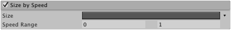
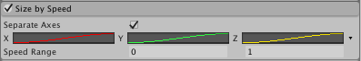

#Size by Speed 模块

在此模块中可创建能够根据速度（每秒的距离单位）改变大小的粒子。

 

##属性

|**_属性_** |**_功能_** |
|:---|:---|
|__Separate Axes__ |在每个轴上独立控制粒子大小。 |
|__Size__ |通过曲线定义粒子在速度范围内的大小。 |
|__Speed Range__ |大小曲线映射到的速度范围的下限和上限（超出范围的速度将映射到曲线的端点）。 |

##详细信息

某些情况下需要能够根据速度改变大小的粒子。例如，发生爆炸时，您可能希望小碎片的加速度高于更大的碎片。使用 __Size By Speed__ 并结合简单的斜坡曲线（此曲线可随粒子大小减小使粒子速度按比例增加），即可实现这样的效果。请注意，此模块不应与 __Limit Velocity Over Lifetime__ 模块一起使用，除非您希望粒子在减速时改变其大小。

__Speed Range__ 指定 X（宽度）、Y（高度）和 Z（深度）形状适用的值范围。仅当大小处于其中一种曲线模式时才应用 Speed Range。快速的粒子将使用曲线右端的值缩放，而较慢的粒子将使用曲线左侧的值。例如，如果指定 10 到 100 之间的 Speed Range：

* 低于 10 的速度将设置粒子大小与曲线的最左边相对应。
* 高于 100 的速度将设置粒子大小与曲线的最右边相对应。
* 10 到 100 之间的速度会将粒子大小设置为由曲线上与速度对应的点确定。在此示例中，速度为 55 将根据曲线的中点设置粒子大小。

##非均匀粒子缩放

 

您可以指定粒子的宽度、高度和深度大小如何分别随速度变化。在 __Size by Speed__ 模块中，选中 __Separate Axes__ 复选框，然后选择粒子的 X（宽度）、Y（高度）和 Z（深度）如何受粒子速度的影响。请注意，Z 仅用于网格粒子。
