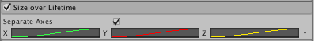

#Size over Lifetime 模块

许多效果涉及根据曲线改变粒子大小，这些设置可在此模块中进行。

 

##属性

|**_属性_** |**_功能_** |
|:---|:---|
|__Separate Axes__ |在每个轴上独立控制粒子大小。 |
|__Size__ |通过一条曲线定义粒子的大小在其生命周期内如何变化。 |

##详细信息

一些粒子通常会在远离发射点时发生大小变化，比如表示气体、火焰或烟雾的粒子。例如，随着时间的推移，烟雾往往会消散并占据更大的体积。为实现此目的，可将烟雾粒子的曲线设置为向上坡道曲线，随着粒子的存活时间而增加。此外还可使用 __Color Over Lifetime__ 模块在烟雾蔓延时淡化烟雾，从而进一步增强此效果。

对于燃料燃烧产生的火球，火焰粒子在发射后会趋于膨胀，但后期随着燃料用完和火焰消散而逐渐消失和收缩。在这种情况下，曲线会有一个先上升再下降到较小大小的“驼峰”。

##非均匀粒子缩放

 

您可以指定粒子的宽度、高度和深度如何在生命周期内分别变化。在 __Size over Lifetime__ 模块中，选中 __Separate Axes__ 复选框，然后更改 X（宽度）、Y（高度）和 Z（深度）。请注意，Z 仅用于网格粒子。

