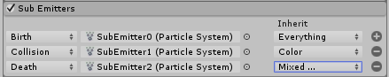

#Sub Emitters 模块

在此模块中可设置子发射器。这些子发射器是在粒子生命周期的某些阶段在粒子位置处创建的附加粒子发射器。

 

##属性

|**_属性_** |**_功能_** |
|:---|:---|
|__Sub Emitters__|配置一个子发射器列表，并选择它们的触发条件以及它们从父粒子继承的属性。 |

##详细信息

许多类型的粒子都会在其生命周期的不同阶段产生一些效果，而这也可使用粒子系统来实现。例如，子弹离开枪管时可能伴随着一缕烟尘，火球可能会在撞击时爆炸。您可以使用子发射器来创建诸如此类的效果。

子发射器是在场景中创建的或来自[预制件](Prefabs.html)的普通粒子系统对象。这意味着子发射器还可以有自己的子发射器（这种类型的布置对于像烟花这样的复杂效果很有用）。但是，虽然使用子发射器生成大量粒子非常容易，但这可能非常耗费资源。

要触发子发射器，可使用以下条件：

* __Birth__：粒子的创建时间。
* __Collision__：粒子与对象发生碰撞的时间。
* __Death__：粒子的销毁时间。
* __Trigger__：粒子与触发碰撞体相互作用的时间。
* __Manual__：仅在通过脚本进行请求时触发。请参阅 [ParticleSystem.TriggerSubEmitter](../ScriptReference/ParticleSystem.TriggerSubEmitter.html)。

请注意，__Collision__、__Trigger__、__Death__ 和 __Manual__ 事件只能使用 [Emission](PartSysEmissionModule.html) 模块中的爆发发射。

此外，还可使用 __Inherit__ 选项将属性从父粒子转移到每个新创建的粒子。可转移属性包括大小、旋转、颜色和生命周期。要控制速度的继承方式，请在子发射器系统上配置 [Inherit Velocity](PartSysInheritVelocity.html) 模块。

* 2018-03-28  Page amended with limited [editorial review](DocumentationEditorialReview.html)

* 在 [2018.1](https://docs.unity3d.com/2018.1/Documentation/Manual/30_search.html?q=newin20181) 版中的 Sub Emitters 模块的条件列表中添加了“Trigger”和“Manual”条件 NewIn20181

