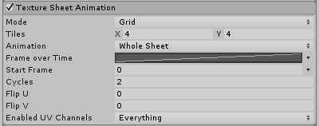
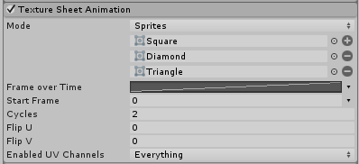

# Texture Sheet Animation 模块

粒子的图形不必是静止图像。此模块允许您将纹理视为可作为动画帧进行播放的一组单独子图像。

## Grid 模式属性

 

| __属性__| __功能__ |
|:---|:---| 
| __Mode 弹出菜单__| 选择 __Grid__ 模式。 |
| __Tiles__| 纹理在 X（水平）和 Y（垂直）方向上划分的区块数量。 |
| __Animation__| Animation 模式可设置为 __Whole Sheet__ 或 __Single Row__（即精灵图集的每一行代表一个单独的动画序列）。 |
| __Random Row__| 随机从精灵图集选择一行以生成动画。仅当 __Animation__ 模式设置为 __Single Row__ 时，此选项才可用。 |
| __Row__| 从精灵图集选择特定行以生成动画。仅当选择 __Single Row__ 模式且禁用 __Random Row__ 时，此选项才可用。 |
| __Frame over Time__| 通过一条曲线指定动画帧随着时间的推移如何增加。 |
| __Start Frame__| 允许指定粒子动画应从哪个帧开始（对于在每个粒子上随机定相动画非常有用）。 |
| __Cycles__| 动画序列在粒子生命周期内重复的次数。 |
| __Flip U__| 按一定的粒子比例水平镜像纹理。较高的值会翻转更多的粒子。 |
| __Flip V__| 按一定的粒子比例垂直镜像纹理。较高的值会翻转更多的粒子。 |
| __Enabled UV Channels__| 允许具体指定粒子系统影响的 UV 流。 |

## Sprite 模式属性

 

| __属性__| __功能__ |
|:---|:---| 
| __Mode 弹出菜单__| 选择 __Sprites__ 模式。 |
| __Frame over Time__| 通过一条曲线指定动画帧随着时间的推移如何增加。 |
| __Start Frame__| 允许指定粒子动画应从哪个帧开始（对于在每个粒子上随机定相动画非常有用）。 |
| __Cycles__| 动画序列在粒子生命周期内重复的次数。 |
| __Flip U__| 按一定的粒子比例水平镜像纹理。较高的值会翻转更多的粒子。 |
| __Flip V__| 按一定的粒子比例垂直镜像纹理。较高的值会翻转更多的粒子。 |
| __Enabled UV Channels__| 允许具体指定粒子系统影响的 UV 流。 |

## 详细信息

粒子动画通常比角色动画更简单，细节级别更低。在可单独看到粒子的系统中，动画可用于表现动作或移动。例如，火焰可能会闪烁，成群的昆虫可能振动或颤抖，好像在拍打翅膀。在粒子形成单个连续实体（如云团）的情况下，动画粒子有助于增添能量和运动效果。

您可以使用 __Single Row__ 模式为粒子创建单独的动画序列，并通过脚本在动画之间切换。这对于创建变体或在碰撞后切换到不同动画非常有用。__Random Row__ 选项非常适合用于打破粒子系统中明显的规律性（例如，一组火焰对象全部一遍又一遍重复完全相同的闪烁动画）。此选项也用于每行的单个帧，从而生成具有随机图形的粒子。此选项可用于打破诸如云之类的对象中的规则性，或者用于从单个系统产生不同类型的碎片或其他对象。例如，一把大口径枪可能会发射出一堆钉子、螺栓、球和其他飞弹，汽车碰撞效果可能会导致发射出弹簧、汽车油漆、螺钉和其他金属部件。

UV 翻转是为效果添加更多视觉多样性而无需创建其他纹理的好方法。

从 Mode 下拉选单中选择 __Sprites__ 选项，可以定义要为每个粒子显示的精灵列表，而不是使用纹理上的一组常规帧。使用此模式可以利用精灵的许多功能，例如精灵打包器 (Sprite Packer)、自定义轴心和每个精灵帧的不同大小。Sprite Packer 可帮助在不同粒子系统之间共享材质，方法是将纹理整理成图集，从而通过动态批处理 (Dynamic Batching) 提高性能。使用此模式时需要注意一些限制。最重要的一点，附加到粒子系统的所有精灵必须共享相同的纹理。通过使用多模式精灵 (Multiple Mode Sprite) 或使用 Sprite Packer 即可实现此目的。如果为每个精灵使用自定义轴心点，请注意不能在它们的帧之间进行混合，因为每个帧之间的几何体会有所不同。仅支持简单精灵，而不支持 9 切片精灵。另外请注意，网格粒子不支持自定义轴心以及变化的精灵大小。
  

---

*  2017-05-30  Page amended with limited [editorial review](DocumentationEditorialReview.html)

* 在 Unity [2017.1](../Manual/30_search.html?q=newin20171) 中更改了 Texture Sheet Animation 模块的功能 NewIn20171
