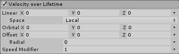

#Velocity over Lifetime 模块

__Velocity over Lifetime__ 模块可控制粒子在其生命周期内的速度。

 

##属性

|**属性** |**功能** |
|:---|:---|
|__Linear X, Y, Z__ |粒子在 X、Y 和 Z 轴上的线性速度。 |
|__Space__ |指定 __Linear X, Y, Z__ 轴是参照本地空间还是世界空间。 |
|__Orbital X, Y, Z__ |粒子围绕 X、Y 和 Z 轴的轨道速度。 |
|__Offset X, Y, Z__ |轨道中心的位置，适用于轨道运行粒子。 |
|__Radial__ |粒子远离/朝向中心位置的径向速度。 |
|__Speed Modifier__ |在当前行进方向上/周围向粒子的速度应用一个乘数。 |

##详细信息

要创建在特定方向上漂移的粒子，请使用 Linear X、Y 和 Z 曲线。

要创建围绕中心位置旋转的粒子效果，请使用 __Orbital__ 速度值。此外，可使用 __Radial__ 速度值推动粒子朝向或远离中心位置。您可以使用 __Offset__ 值为每个粒子定义自定义的旋转中心。

还可以使用此模块调整粒子系统中的粒子速度，而不影响粒子的方向，方法是将所有上述值保留为零，仅修改 __Speed Modifier__ 值。

---

* 2018-03-28  Page amended with limited [editorial review](DocumentationEditorialReview.html)

* 在 [2017.3](https://docs.unity3d.com/2017.3/Documentation/Manual/30_search.html?q=newin20173) 版中向 Velocity over Lifetime 模块添加了 Speed Modifier 属性 NewIn20173

* 在 [2018.1](https://docs.unity3d.com/2018.1/Documentation/Manual/30_search.html?q=newin20181) 版中向 Velocity over Lifetime 模块添加了 Orbital XYZ、Offset XYZ 和 Radial 属性 NewIn20181

