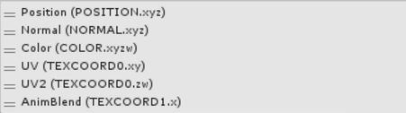

# 粒子系统顶点流和标准着色器支持

如果习惯编写自己的着色器，请使用添加到[渲染器模块](../ScriptReference/ParticleSystemRenderer.html)的方式配置粒子系统，从而将更多数据传入自定义着色器。

有许多内置[数据流](../ScriptReference/ParticleSystemVertexStreams.html)可供选择，例如速度、大小和中心位置。除了能够创建强大的自定义着色器之外，这些流还可以带来大量其他好处：

*使用 [Tangent](../ScriptReference/ParticleSystemVertexStream.Tangent.html) 流来支持法线贴图粒子。
* 可以删除 Color，然后添加 Tangent [UV2](../ScriptReference/ParticleSystemVertexStream.UV2.html) 和 [AnimBlend](../ScriptReference/ParticleSystemVertexStream.AnimBlend.html) 流以便在粒子上使用标准着色器。
* 需要轻松执行翻页动画的线性纹理混合，请添加 UV2 和 AnimBlend 流，并附加粒子/动画 Alpha 混合着色器 (Particles/Anim Alpha Blended Shader)（请参阅下面的示例截屏，了解如何对其进行设置）。


此外还有两个完全自定义的每粒子数据流（[ParticleSystemVertexStreams.Custom1](../ScriptReference/ParticleSystemVertexStreams.Custom1.html) 和 [ParticleSystemVertexStreams.Custom2](../ScriptReference/ParticleSystemVertexStreams.Custom2.html)），可通过脚本填充。请使用数据数组调用 [SetCustomParticleData](../ScriptReference/ParticleSystem.SetCustomParticleData.html) 和 [GetCustomParticleData](../ScriptReference/ParticleSystem.GetCustomParticleData.html) 以便使用它们。有两种方式使用它们：

* 通过将您自己的数据附加到粒子来驱动脚本中的自定义行为；例如，将“生命”值附加到每个粒子。
* 通过添加两个自定义流中的其中一个流将此数据传入着色器，就像将任何其他流发送到着色器一样（请参阅 [ParticleSystemRenderer.EnableVertexStreams](../ScriptReference/ParticleSystemRenderer.EnableVertexStreams.html)）。为了详细说明第一个示例，自定义的生命值属性现在也可以驱动某种视觉效果，以及驱动基于脚本的游戏逻辑。

添加顶点流时，Unity 会在每一项旁边的括号中提供一些信息，用于在着色器中读取正确的数据：


 

括号中的每一项对应于一个顶点着色器输入，应在着色器中指定。以下是此配置的正确输入结构。

````
			struct appdata_t {
							float4 vertex : POSITION;
							float3 normal : NORMAL;
							fixed4 color : COLOR;
							float4 texcoords : TEXCOORD0;
							float texcoordBlend : TEXCOORD1;
						};
````
请注意，UV 和 UV2 均传递到 TEXCOORD0 的不同部分中，因此我们对两者使用单个声明。要访问着色器中的每一个，应使用 xy 和 zw 标示字母。这样即可有效地打包顶点数据。

以下是一个翻页动画着色器的示例。它使用默认输入（__Position__、__Normal__、__Color__、__UV__），但还为第二个 UV 流 (__UV2__) 和翻页动画帧信息 (__AnimBlend__) 使用了两个额外的流。

 

````
Shader "Particles/Anim Alpha Blended" {
Properties {
	_TintColor ("Tint Color", Color) = (0.5,0.5,0.5,0.5)
	_MainTex ("Particle Texture", 2D) = "white" {}
	_InvFade ("Soft Particles Factor", Range(0.01,3.0)) = 1.0
}

Category {
	Tags { "Queue"="Transparent" "IgnoreProjector"="True" "RenderType"="Transparent" "PreviewType"="Plane" }
	Blend SrcAlpha OneMinusSrcAlpha
	ColorMask RGB
	Cull Off Lighting Off ZWrite Off

	SubShader {
		Pass {
		
			CGPROGRAM
			#pragma vertex vert
			#pragma fragment frag
			#pragma target 2.0
			#pragma multi_compile_particles
			#pragma multi_compile_fog
			
			#include "UnityCG.cginc"

			sampler2D _MainTex;
			fixed4 _TintColor;
			
			struct appdata_t {
				float4 vertex : POSITION;
				fixed4 color : COLOR;
				float4 texcoords : TEXCOORD0;
				float texcoordBlend : TEXCOORD1;
				UNITY_VERTEX_INPUT_INSTANCE_ID
			};

			struct v2f {
				float4 vertex : SV_POSITION;
				fixed4 color : COLOR;
				float2 texcoord : TEXCOORD0;
				float2 texcoord2 : TEXCOORD1;
				fixed blend : TEXCOORD2;
				UNITY_FOG_COORDS(3)
				#ifdef SOFTPARTICLES_ON
				float4 projPos : TEXCOORD4;
				#endif
				UNITY_VERTEX_OUTPUT_STEREO
			};
			
			float4 _MainTex_ST;

			v2f vert (appdata_t v)
			{
				v2f o;
				UNITY_SETUP_INSTANCE_ID(v);
				UNITY_INITIALIZE_VERTEX_OUTPUT_STEREO(o); 
				o.vertex = UnityObjectToClipPos(v.vertex);
				#ifdef SOFTPARTICLES_ON
				o.projPos = ComputeScreenPos (o.vertex);
				COMPUTE_EYEDEPTH(o.projPos.z);
				#endif
				o.color = v.color * _TintColor;
				o.texcoord = TRANSFORM_TEX(v.texcoords.xy,_MainTex);
				o.texcoord2 = TRANSFORM_TEX(v.texcoords.zw,_MainTex);
				o.blend = v.texcoordBlend;
				UNITY_TRANSFER_FOG(o,o.vertex);
				return o;
			}

			sampler2D_float _CameraDepthTexture;
			float _InvFade;
			
			fixed4 frag (v2f i) : SV_Target
			{
				#ifdef SOFTPARTICLES_ON
				float sceneZ = LinearEyeDepth (SAMPLE_DEPTH_TEXTURE_PROJ(_CameraDepthTexture, UNITY_PROJ_COORD(i.projPos)));
				float partZ = i.projPos.z;
				float fade = saturate (_InvFade * (sceneZ-partZ));
				i.color.a *= fade;
				#endif
				
				fixed4 colA = tex2D(_MainTex, i.texcoord);
				fixed4 colB = tex2D(_MainTex, i.texcoord2);
				fixed4 col = 2.0f * i.color * lerp(colA, colB, i.blend);
				UNITY_APPLY_FOG(i.fogCoord, col);
				return col;
			}
			ENDCG 
		}
	}	
}
}


````

也可以将表面着色器与此系统一起使用，但还有一些需要注意的事项：

* 表面函数的输入结构与顶点着色器的输入结构不同。需要提供自定义的顶点着色器输入结构。请参阅下面示例中名为 `appdata_particles` 的结构。
* 构建表面着色器时，会自动处理名称以某些标记开头的变量。最明显的就是 `uv`。为防止自动处理在此处引起问题，请务必为 UV 输入指定不同的名称（例如，“texcoord”）。

下面的示例与第一个示例具有相同的功能，但位于表面着色器中：

````
Shader "Particles/Anim Alpha Blend Surface" {
    Properties {
        _Color ("Color", Color) = (1,1,1,1)
        _MainTex ("Albedo (RGB)", 2D) = "white" {}
        _Glossiness ("Smoothness", Range(0,1)) = 0.5
        _Metallic ("Metallic", Range(0,1)) = 0.0
    }
    SubShader {
        Tags {"Queue"="Transparent" "RenderType"="Transparent"}
        Blend SrcAlpha OneMinusSrcAlpha
        ZWrite off
        LOD 200
        
        CGPROGRAM
        // 这是基于物理的标准光照模型，并对所有光照类型启用阴影
        #pragma surface surf Standard alpha vertex:vert

        // 使用 Shader Model 3.0 目标以获得更美观的光照
        #pragma target 3.0

        sampler2D _MainTex;

         struct appdata_particles {
            float4 vertex : POSITION;
            float3 normal : NORMAL;
            float4 color : COLOR;
            float4 texcoords : TEXCOORD0;
            float texcoordBlend : TEXCOORD1;
            };


        struct Input {
            float2 uv_MainTex;
            float2 texcoord1;
            float blend;
            float4 color;
        };


        void vert(inout appdata_particles v, out Input o) {
            UNITY_INITIALIZE_OUTPUT(Input,o);
            o.uv_MainTex = v.texcoords.xy;
            o.texcoord1 = v.texcoords.zw;
            o.blend = v.texcoordBlend;
            o.color = v.color;
          }


        half _Glossiness;
        half _Metallic;
        fixed4 _Color;


        void surf (Input IN, inout SurfaceOutputStandard o) {
            fixed4 colA = tex2D(_MainTex, IN.uv_MainTex);
            fixed4 colB = tex2D(_MainTex, IN.texcoord1);
            fixed4 c = 2.0f * IN.color * lerp(colA, colB, IN.blend) * _Color;
                 
            o.Albedo = c.rgb;
            // Metallic 和 Smoothness 来自滑动条变量
            o.Metallic = _Metallic;
            o.Smoothness = _Glossiness;
            o.Alpha = c.a;
        }
        ENDCG
    }
    FallBack "Diffuse"
}

````
----

* <span class="page-edit">2017-05-15  Page amended with no [editorial review](DocumentationEditorialReview.html)
</span>

