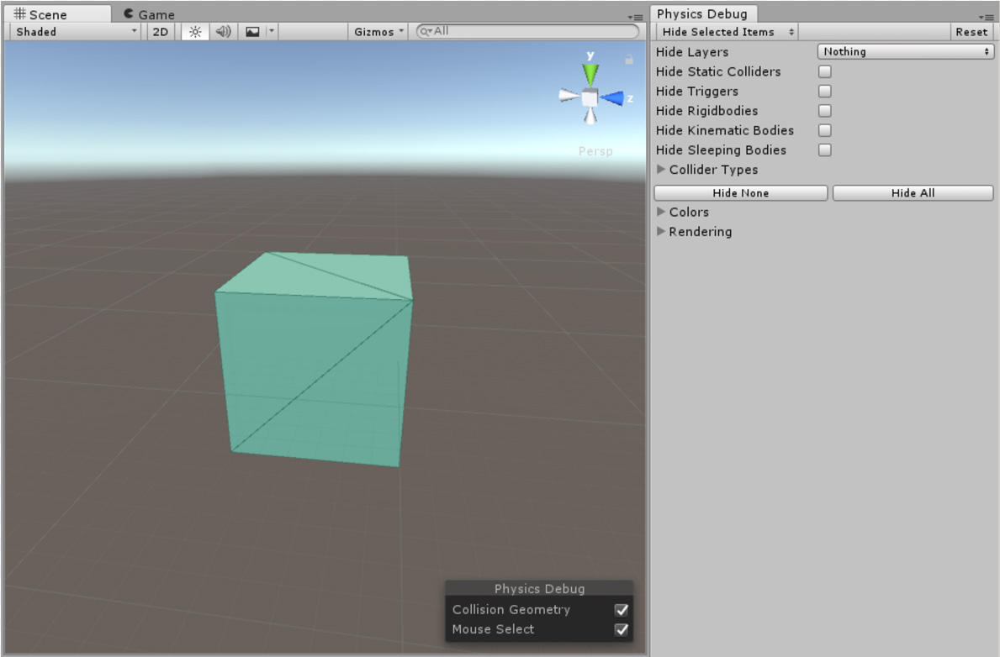
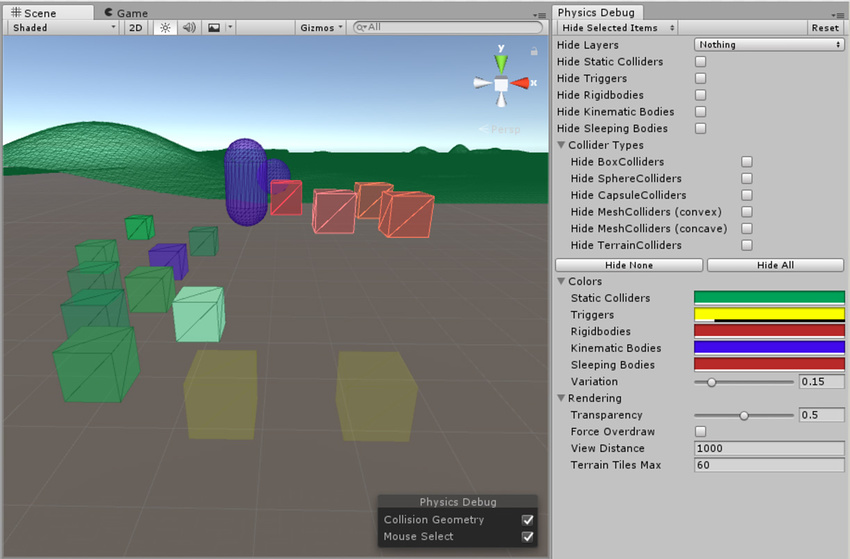
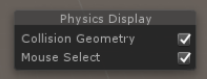

#物理调试可视化

物理调试可视化工具 (Physics Debug Visualiser) 可用于快速检查[场景](CreatingScenes.html)中的[碰撞体](CollidersOverview.html)几何体，并分析常见的基于物理的情形。该工具提供了游戏对象之间是否应相互碰撞的可视化表示。当场景中有许多碰撞体时，或者[渲染](class-MeshRenderer.html)和[碰撞网格](class-MeshCollider.html)不同步的情况下，这会很有用。

有关改善项目物理性能的详细指导，请参阅有关 [Physics Profiler](ProfilerPhysics.html) 的文档。

要在 Unity Editor 中打开 Physics Debug 窗口，请选择 __Window__ > __Physics Debugger__。

通过此窗口可以自定义视觉设置，并指定要在可视化工具中显示或隐藏的游戏对象类型。

默认模式为 __Hide Selected Items__。这意味着每项都出现在可视化工具中，必须勾选每项的复选框才能隐藏该项。要将此模式更改为 __Show Selected Items__，请使用窗口顶部的下拉选单。这意味着可视化工具中不显示任何项，必须勾选每项的复选框才能显示该项。

| __属性__| __功能__ |
|:---|:---| 
| __Reset__| 单击此按钮可将 Physics Debug 窗口重置为默认设置。 |
| __Hide Layers__| 使用下拉菜单来确定是否显示选定[层](Layers.html)中的碰撞体。 |
| __Hide Static Colliders__| 勾选此复选框可从可视化中删除静态碰撞体（不含任何刚体组件的碰撞体）。 |
| __Hide Triggers__| 勾选此复选框可从可视化中删除也是触发器的碰撞体。 |
| __Hide Rigidbodies__| 勾选此复选框可从可视化中删除[刚体组件](class-Rigidbody.html)。 |
| __Hide Kinematic Bodies__| 勾选此复选框可从可视化中删除包含__运动__刚体组件（不受物理引擎控制）的碰撞体。请参阅有关[刚体组件](RigidbodiesOverview.html)的文档以了解更多详细信息。 |
| __Hide Sleeping Bodies__| 勾选此复选框可从可视化中删除包含__睡眠__刚体组件（当前无法与物理引擎互动）的碰撞体。请参阅有关[刚体组件：睡眠](RigidbodiesOverview.html)的文档以了解更多详细信息。 |
| __Collider Types__| 使用以下选项可从物理可视化中删除特定碰撞体类型。 |
|&amp;#160;&amp;#160;&amp;#160;&amp;#160;Hide   &amp;#160;&amp;#160;&amp;#160;&amp;#160;BoxColliders| 勾选此复选框可从可视化中删除[盒型碰撞体](class-BoxCollider.html)。 |
|&amp;#160;&amp;#160;&amp;#160;&amp;#160;Hide  &amp;#160;&amp;#160;&amp;#160;&amp;#160;SphereColliders| 勾选此复选框可从可视化中删除[球形碰撞体](class-SphereCollider.html)。 |
|&amp;#160;&amp;#160;&amp;#160;&amp;#160;Hide  &amp;#160;&amp;#160;&amp;#160;&amp;#160;CapsuleColliders| 勾选此复选框可从可视化中删除[胶囊碰撞体](class-CapsuleCollider.html)。 |
|&amp;#160;&amp;#160;&amp;#160;&amp;#160;Hide  &amp;#160;&amp;#160;&amp;#160;&amp;#160;MeshColliders  &amp;#160;&amp;#160;&amp;#160;&amp;#160;(convex)| 勾选此复选框可从可视化中删除**凸面**[网格碰撞体](class-MeshCollider.html)。 |
|&amp;#160;&amp;#160;&amp;#160;&amp;#160;Hide  &amp;#160;&amp;#160;&amp;#160;&amp;#160;MeshColliders  &amp;#160;&amp;#160;&amp;#160;&amp;#160;(concave)| 勾选此复选框可从可视化中删除**凹面**[网格碰撞体](class-MeshCollider.html)。 |
|&amp;#160;&amp;#160;&amp;#160;&amp;#160;Hide  &amp;#160;&amp;#160;&amp;#160;&amp;#160;TerrainColliders| 勾选此复选框可从可视化中删除[地形碰撞体](class-TerrainCollider.html)。 |
| __Hide None__| 单击 __Hide None__ 可清除所有过滤条件并在可视化中显示所有碰撞体类型。 |
| __Hide All__| 单击 __Hide All__ 可启用所有过滤条件并从可视化中移除所有碰撞体类型。 |
| __Colors__| 使用以下设置可定义 Unity 在可视化中显示物理组件的方式。 |
|&amp;#160;&amp;#160;&amp;#160;&amp;#160;Static  &amp;#160;&amp;#160;&amp;#160;&amp;#160;Colliders| 使用此颜色选择器可定义用何种颜色在可视化中指示静态碰撞体（不含任何刚体组件的碰撞体）。 |
|&amp;#160;&amp;#160;&amp;#160;&amp;#160;Triggers| 使用此颜色选择器可定义用何种颜色在可视化中指示也是触发器的碰撞体。 |
|&amp;#160;&amp;#160;&amp;#160;&amp;#160;刚体| 使用此颜色选择器可定义用何种颜色在可视化中指示刚体组件。 |
|&amp;#160;&amp;#160;&amp;#160;&amp;#160;Kinematic  &amp;#160;&amp;#160;&amp;#160;&amp;#160;Bodies| 使用此颜色选择器可定义用何种颜色在可视化中指示__运动__刚体组件（不受物理引擎控制）。请参阅有关[刚体组件](RigidbodiesOverview.html)的文档以了解更多详细信息。 |
|&amp;#160;&amp;#160;&amp;#160;&amp;#160;Sleeping  &amp;#160;&amp;#160;&amp;#160;&amp;#160;Bodies| 使用此颜色选择器可定义用何种颜色在可视化中指示__睡眠__刚体组件（当前无法与物理引擎互动）。请参阅有关[刚体组件：睡眠](RigidbodiesOverview.html)的文档以了解更多详细信息。 |
|&amp;#160;&amp;#160;&amp;#160;&amp;#160;Variation| 使用滑动条设置介于 0 和 1 之间的值。此设置用于定义所选颜色与随机颜色混合的程度。使用此设置可按颜色直观区分碰撞体以及查看游戏对象的结构。  |
| __Rendering__| 使用这些设置可定义 Unity 渲染和显示物理可视化的方式。 |
|&amp;#160;&amp;#160;&amp;#160;&amp;#160;Transparency| 使用滑动条设置 0 到 1 之间的值。此设置用于定义可视化中绘制的碰撞几何体的透明度。 |
|&amp;#160;&amp;#160;&amp;#160;&amp;#160;Force  &amp;#160;&amp;#160;&amp;#160;&amp;#160;Overdraw| 正常渲染几何体有时可能让碰撞体变得模糊（例如，地板下面的网格碰撞体平面）。勾选 __Force Overdraw__ 复选框可让可视化渲染器在渲染几何体上绘制碰撞体几何体。 |
|&amp;#160;&amp;#160;&amp;#160;&amp;#160;View  &amp;#160;&amp;#160;&amp;#160;&amp;#160;Distance| 用于设置可视化的视图距离。 |
|&amp;#160;&amp;#160;&amp;#160;&amp;#160;Terrain  &amp;#160;&amp;#160;&amp;#160;&amp;#160;Tiles Max| 用于设置可视化中地形区块的最大数量。 |

覆盖面板具有更多选项：

| __属性__| __功能__ |
|:---|:---| 
| __Collision Geometry__| 勾选此复选框可启用碰撞几何体可视化。 |
| __Mouse Select__| 勾选此复选框可启用鼠标悬停突出显示和鼠标选择功能。如果在可视化工具中有大型游戏对象相互阻碍，此功能可能很有用。 |

### 性能分析

可以使用“物理调试”来分析和解决游戏中的物理活动问题。可以自定义在可视化工具中可见的碰撞体或刚体组件类型，从而有助于找到活动源。最有帮助的两个做法是：

**仅查看激活的刚体组件**：要仅查看处于激活状态并因此使用 CPU/GPU 资源的刚体组件，请勾选 __Hide Static Colliders__ 和 __Hide Sleeping Bodies__。

**仅查看非凸面网格碰撞体：**非凸面（基于三角形）网格碰撞体附加的刚体组件即将与另一个刚体或碰撞体发生碰撞时，往往会产生最多的接触。要仅可视化非凸面网格碰撞体，请将窗口设置为 __Show Selected Items__ 模式，单击 __Select None__ 按钮，然后勾选 __Show MeshColliders (concave)__ 复选框。

### 脚本 API 参考

请参阅 Unity Scripting API 参考中的以下内容：

* [PhysicsDebugWindow](../ScriptReference/PhysicsDebugWindow.html)

* [PhysicsVisualizationSettings](../ScriptReference/PhysicsVisualizationSettings.html)

  

---------

*  2017-06-01  Page amended with [editorial review](DocumentationEditorialReview.html)

*  物理调试可视化是 Unity 5.6 中的新增功能
