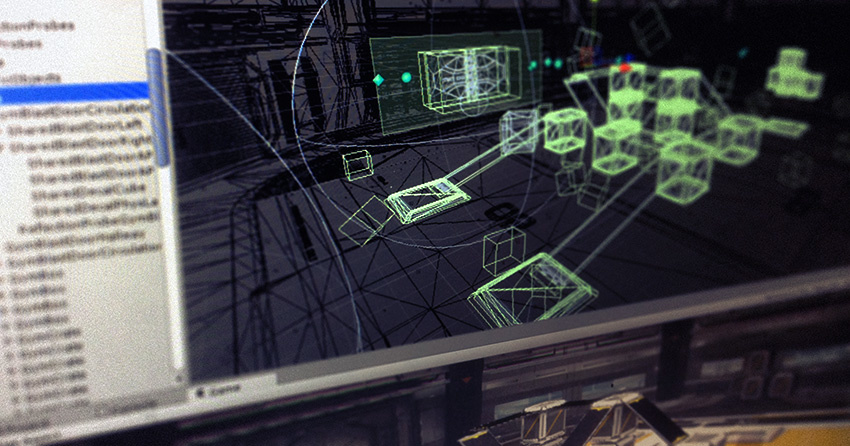

#物理系统

 

要产生令人信服的物理行为，游戏中的对象必须正确加速并受到碰撞、重力和其他作用力的影响。Unity 的内置物理引擎提供了处理物理模拟的组件。只需几个参数设置，就可以创建逼真的被动对象（即，对象将因碰撞和跌落而移动，但不会自动开始移动）。通过使用脚本控制物理特性，即可为对象提供一辆车、一台机器甚至一块布产生的动力学效应。本部分将概述 Unity 中的主要物理组件，并提供进一步阅读的链接。

__注意：__Unity 中实际上有两个独立的物理引擎：一个用于 3D 物理系统，一个用于 2D 物理系统。两个引擎的主要概念是相同的（除了 3D 中多了一个维度），但它们是使用不同的组件实现的。例如，3D 物理有__刚体__组件，而 2D 物理则有类似的 __2D 刚体__。

**相关教程**：<a href="https://unity3d.com/learn/tutorials/topics/physics">物理系统 (Physics)</a>；[物理系统最佳实践 (Physics Best Practices)](http://unity3d.com/learn/tutorials/modules/intermediate/physics/physics-best-practices?playlist=30089)

请参阅<a href="https://support.unity3d.com/hc/en-us/sections/201851913-Physics">知识库的物理系统 (Physics) 部分</a>了解故障排除方法、提示和技巧。
