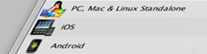

#特定于平台的信息

 

本部分介绍 Unity 支持的多种非桌面平台和 Web 平台的特定信息。

请注意，许多平台（如 PlayStation、Xbox 和 Wii）仅在安装后才能在机器本地使用特定于平台的文档。要查找此文档，请打开 Unity Editor，并导航到 **Help > Unity Manual**。

**相关教程：**[移动和触控 (Mobile & Touch)](http://unity3d.com/learn/tutorials/topics/mobile-touch)

请参阅[知识库的 Editor 部分](https://support.unity3d.com/hc/en-us/categories/201964166-Unity-Editor)了解故障排除、提示和技巧信息。
