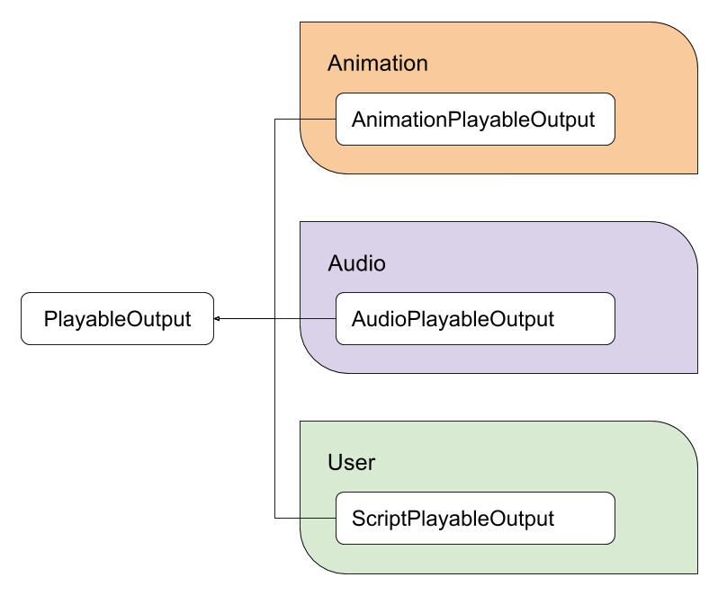

#PlayableGraph

PlayableGraph 定义一组绑定到 GameObject 或[组件](Components.html)的可播放输出项。PlayableGraph 还定义一组可播放项及其依赖关系。图 1 提供了一个示例。

PlayableGraph 负责管理可播放项及其输出的生命周期。使用 PlayableGraph 可创建、连接和销毁可播放项。

在图 1 中，显示 PlayableGraph 时，为了紧凑，从图形节点的名称中移除了“Playable”一词。例如，名为“AnimationClipPlayable”的节点显示为“AnimationClip”。

 

可播放项是一种继承 IPlayable 接口的 C# 结构体。它用于定义其与其他可播放项的关系。同样，可播放项输出是继承 IPlayableOutput 接口的 C# 结构体，用于定义 PlayableGraph 的输出。

图 2 显示了最常见的核心可播放项类型。图 3 显示了核心可播放项输出类型。

可播放项核心类型和可播放项输出类型以 C# 结构的形式实现，从而避免为[收集垃圾而分配内存](UnderstandingAutomaticMemoryManagement.html)。

“Playable”是所有可播放项的基本类型，这意味着您总是可以隐式将一个可播放项转换为 Playable。相反的情况并不成立，如果将“Playable”显式转换为不兼容类型，则会抛出异常。它还定义能在可播放项上执行的所有基本方法。要访问特定于类型的方法，您需要将可播放项转换为相应类型。

`PlayableOutput` 也是如此，它是所有可播放项输出的基本类型，定义了基本方法。

注意：`Playable` 和 `PlayableOutput` 未暴露大量方法。但“PlayableExtensions”和“PlayableOutputExtensions”静态类提供了扩展方法。

所有非抽象可播放项都有一个公有静态方法 `Create()`，该方法创建相应类型的可播放项。“Create()”方法始终将 PlayableGraph 作为其第一个参数，该图拥有新创建的可播放项。某些类型的可播放项可能需要其他参数。非抽象可播放项输出还会暴露 `Create()` 方法。

有效的可播放项输出应链接到可播放项。如果可播放项输出未链接到可播放项，则可播放项输出不执行任何操作。要将可播放项输出链接到可播放项，请使用 `PlayableOutput.SetSourcePlayable()` 方法。对于该特定可播放项输出，链接的可播放项充当可播放项树的根。

要将两个可播放项连接在一起，请使用 `PlayableGraph.Connect()` 方法。请注意，某些可播放项不能有输入。

使用 `PlayableGraph.Create()` 静态方法来创建 PlayableGraph。

使用 `PlayableGraph.Play()` 方法来播放 PlayableGraph。

使用 `PlayableGraph.Stop()` 方法来停止播放 PlayableGraph。

使用 `PlayableGraph.Evaluate()` 方法来评估 PlayableGraph 在特定时间的状态。

使用 `PlayableGraph.Destroy()` 方法来手动销毁 PlayableGraph。此方法会自动销毁 PlayableGraph 创建的所有可播放项和可播放项输出。必须手动调用此销毁方法来销毁 PlayableGraph，否则 Unity 会发出一条错误消息。

---

* 2017-07-04  Page published with limited [editorial review](DocumentationEditorialReview.html)

* Unity [2017.1](../Manual/30_search.html?q=newin20171) 中的新功能 NewIn20171
 
 
